Here is the fully merged and comprehensive **Software Requirements Specification (SRS)** for the Kindergarten School Management Application. This version includes the system architecture, full database schema (ERD), REST API specs, and the **Complete Full CRUD GraphQL API Specification** across all core modules.

---

# Software Requirements Specification (SRS)

## Kindergarten School Management Application - Backend Services

**Version:** 1.1 (Includes Full System CRUD)
**Date:** May 17, 2026

---

## 1. Introduction

### 1.1 Purpose

This SRS outlines the backend system architecture, database design, and application programming interfaces (APIs) for the Kindergarten School Management Application. It serves as the primary blueprint for backend engineers to implement the core business logic, data persistence, and communication layers.

### 1.2 Scope

The backend system encompasses data modeling, user authentication, media storage handling, and the execution of core business processes including academic year configuration, class management, enrollment, daily operations (attendance, reports), and student assessments.

### 1.3 System Overview & Tech Stack

* **Language/Framework:** Go (Golang)
* **Database:** PostgreSQL
* **API Paradigm:** Hybrid (REST for Auth/Media, GraphQL for Relational CRUD)
* **Authentication:** JWT (JSON Web Tokens) with Secure HTTP-Only Refresh Cookies
* **File Storage:** AWS S3 or MinIO (Object Storage)
* **Push Notifications:** Firebase Cloud Messaging (FCM) integration

---

## 2. Overall Description

### 2.1 User Roles & Permissions

1. **Admin:** Full system access. Manages academic years, global curriculum, teacher assignments, student enrollment, and generates secure parent registration codes.
2. **Teacher:** Scoped access to assigned classes. Manages daily attendance, submits daily reports (with media), and logs skill assessments for enrolled students.
3. **Parent:** Scoped access to linked children only (status APPROVED). Views daily reports, attendance records, semester assessments, and semester reports. Lists their registered children via `getParentChildren`. All parent queries enforce access control via JWT-based GraphQL middleware ensuring data isolation.

### 2.2 Core Architectural Decisions

* **Academic Year Root:** The system uses the `AcademicYear` as the root configuration entity. All classes, enrollments, and skill configurations cascade from this to prevent data bleeding between years. Academic Years follow a 4-state lifecycle: DRAFT → ACTIVE → CLOSED → ARCHIVED. Creating an Academic Year automatically generates 2 semesters.
* **Teacher Multi-Class Support:** Teachers can be assigned to multiple classes simultaneously within an academic year.
* **Soft Deletes & Auditability:** All core entities utilize `deleted_at` for soft deletion to preserve historical integrity. Critical entities track `created_by` and `updated_by` for strict audit trails.
* **Parent Registration (Two Modes):** 1) Legacy code-based: parents use an Admin-generated `unique_registration_code` to link to a pre-existing student. 2) Self-service: parents create their account, register their child, and submit for admin review (student created in `PENDING` status).
* **Student Status Lifecycle:** Students transition from PENDING → ACTIVE/REJECTED → ARCHIVED. Rejected students can be resubmitted (→ PENDING). Archived is a final state.

---

## 3. Database Architecture (ERD)

Below is the complete, normalized Entity Relationship Diagram (ERD) mapping out the relational data structures, including full attributes and audit fields.

```mermaid
erDiagram
    Roles ||--o{ Users : "defines"
    Users ||--|| Profiles : "has one"
    Users ||--o{ ParentStudentLinks : "parent linked via"
    Users ||--o{ TeacherAssignments : "teacher assigned via"
    Users ||--o{ MediaAssets : "uploads"
    Users ||--o{ DeviceTokens : "registers"
    Users ||--o{ Notifications : "receives"

    AcademicYears ||--o{ Classes : "configures"
    AcademicYears ||--o{ SkillCategories : "configures"
    AcademicYears ||--o{ Semesters : "configures"

    Semesters ||--o{ Assessments : "scopes"
    Semesters ||--o{ Attendance : "scopes"
    Semesters ||--o{ DailyReports : "scopes"
    Semesters ||--o{ SemesterReports : "scopes"

    AcademicYears ||--o{ Assessments : "scopes"
    AcademicYears ||--o{ Attendance : "scopes"
    AcademicYears ||--o{ DailyReports : "scopes"
    AcademicYears ||--o{ SemesterReports : "scopes"
    
    Classes ||--o{ TeacherAssignments : "has"
    Classes ||--o{ StudentEnrollments : "has"
    Classes ||--o{ Attendance : "logs"
    Classes ||--o{ DailyReports : "generates"

    Students ||--o{ ParentStudentLinks : "linked to parent"
    Students ||--o{ StudentEnrollments : "enrolled in"
    Students ||--o{ Assessments : "receives"
    Students ||--o{ SemesterReports : "receives"
    Students ||--o{ Attendance : "has"

    SkillCategories ||--o{ Skills : "contains"
    Skills ||--o{ Assessments : "evaluated in"

    %% Full Attribute Definitions
    Roles {
        uuid id PK
        string name "ADMIN, TEACHER, PARENT"
        string description
    }

    Users {
        uuid id PK
        string email UK
        string password_hash
        uuid role_id FK
        string refresh_token_hash
        datetime created_at
        datetime updated_at
        datetime deleted_at "Soft Delete"
    }

    Profiles {
        uuid id PK
        uuid user_id FK
        string first_name
        string last_name
        string phone
        string gender "nullable"
        string birth_place "nullable"
        date birth_date "nullable"
        string address "nullable"
        string religion "nullable"
        string nationality "nullable"
        string marital_status "nullable"
        string employee_number "nullable"
        date join_date "nullable"
        string position "nullable"
        string education_level "nullable"
        string major "nullable"
        string status "nullable"
        string photo_url "nullable"
        datetime created_at
        datetime updated_at
    }

    AcademicYears {
        uuid id PK
        string name
        date start_date
        date end_date
        string status "DRAFT, ACTIVE, CLOSED, ARCHIVED"
        datetime created_at
        datetime updated_at
        datetime deleted_at "Soft Delete"
    }

    Semesters {
        uuid id PK
        uuid academic_year_id FK
        string name
        date start_date
        date end_date
        datetime created_at
        datetime updated_at
        datetime deleted_at "Soft Delete"
    }

    Classes {
        uuid id PK
        uuid academic_year_id FK
        string name
        int capacity
        datetime created_at
        datetime updated_at
        datetime deleted_at "Soft Delete"
    }

    Students {
        uuid id PK
        string first_name
        string last_name
        date dob
        string unique_registration_code UK
        string status "PENDING, ACTIVE, REJECTED, ARCHIVED"
        datetime created_at
        datetime updated_at
        datetime deleted_at "Soft Delete"
        uuid created_by FK "Audit"
        uuid updated_by FK "Audit"
    }

    ParentStudentLinks {
        uuid id PK
        uuid parent_user_id FK
        uuid student_id FK
        string relationship_type
        datetime created_at
    }

    TeacherAssignments {
        uuid id PK
        uuid teacher_user_id FK
        uuid class_id FK
        date assigned_date
        datetime created_at
    }

    StudentEnrollments {
        uuid id PK
        uuid student_id FK
        uuid class_id FK
        date enrolled_date
        datetime created_at
        datetime updated_at
        datetime deleted_at "Soft Delete"
    }

    SkillCategories {
        uuid id PK
        uuid academic_year_id FK
        string name
        string description
        datetime created_at
        datetime updated_at
        datetime deleted_at "Soft Delete"
    }

    Skills {
        uuid id PK
        uuid category_id FK
        string name
        string description
        datetime created_at
        datetime updated_at
        datetime deleted_at "Soft Delete"
    }

    Assessments {
        uuid id PK
        uuid student_id FK
        uuid skill_id FK
        int score "0-4 scale"
        text remarks
        uuid assessed_by FK
        uuid semester_id FK
        uuid academic_year_id FK
        datetime created_at
        datetime updated_at
        datetime deleted_at "Soft Delete"
        uuid created_by FK "Audit"
        uuid updated_by FK "Audit"
    }

    Attendance {
        uuid id PK
        uuid student_id FK
        uuid class_id FK
        date date
        string status "PRESENT, ABSENT, EXCUSED, LATE"
        text remarks
        uuid marked_by FK
        uuid semester_id FK
        uuid academic_year_id FK
        datetime created_at
        datetime updated_at
        datetime deleted_at "Soft Delete"
        uuid created_by FK "Audit"
        uuid updated_by FK "Audit"
    }

    DailyReports {
        uuid id PK
        uuid class_id FK
        date date
        text summary
        uuid submitted_by FK
        uuid semester_id FK
        uuid academic_year_id FK
        datetime created_at
        datetime updated_at
        datetime deleted_at "Soft Delete"
    }

    SemesterReports {
        uuid id PK
        uuid student_id FK
        uuid class_id FK
        uuid semester_id FK
        uuid academic_year_id FK
        text summary_remarks
        string status "DRAFT, APPROVED, PUBLISHED"
        datetime created_at
        datetime updated_at
        datetime deleted_at "Soft Delete"
    }

    MediaAssets {
        uuid id PK
        uuid uploader_user_id FK
        string entity_type "DAILY_REPORT, STUDENT_PHOTO"
        uuid entity_id "Polymorphic"
        string s3_url
        string file_name
        string mime_type
        datetime created_at
    }

    DeviceTokens {
        uuid id PK
        uuid user_id FK
        string fcm_token
        string device_name
        datetime created_at
        datetime updated_at
    }

    Notifications {
        uuid id PK
        uuid user_id FK
        string title
        text body
        string type
        boolean is_read
        string entity_type "nullable"
        uuid entity_id "nullable"
        datetime created_at
    }
```



---

## 4. REST API Specifications (Edge & Media)

REST is exclusively used for endpoints requiring specific HTTP behavior, such as cookie manipulation for authentication and multipart form-data streams for file uploads.

### 4.1 Authentication Service

* **Endpoint:** `POST /api/v1/auth/login`
* **Behavior:** Validates credentials. Returns an Access Token (JWT) in the JSON payload. Sets a Refresh Token as an `HttpOnly`, `Secure`, `SameSite=Strict` cookie.
* **Request:** `{ "email": "teacher@school.edu", "password": "securepassword123" }`
* **Response (200 OK):**
```json
{
  "status": "success",
  "data": {
    "accessToken": "eyJhbGciOiJIUzI1...",
    "user": { "id": "usr-123", "role": "TEACHER", "firstName": "Jane", "lastName": "Doe" }
  }
}
```

* **Endpoint:** `POST /api/v1/auth/refresh`
* **Behavior:** Uses the Secure HttpOnly refresh token cookie to issue a new Access Token.
* **Response (200 OK):**
```json
{
  "status": "success",
  "data": { "accessToken": "eyJhbGciOiJIUzI1..." }
}
```

* **Endpoint:** `POST /api/v1/auth/logout`
* **Behavior:** Invalidates the refresh token in the DB and clears the HttpOnly cookie.
* **Response (200 OK):**
```json
{
  "status": "success",
  "data": null
}
```

* **Endpoint:** `POST /api/v1/auth/forgot-password`
* **Behavior:** Initiates the password reset flow by sending an email with a reset token.

* **Endpoint:** `POST /api/v1/auth/reset-password`
* **Behavior:** Resets the password using the token provided via email.


### 4.2 Media Upload Service

* **Endpoint:** `POST /api/v1/media/upload`
* **Headers:** `Authorization: Bearer <token>`, `Content-Type: multipart/form-data`
* **Behavior:** Streams payload to S3, returns a polymorphic MediaAsset ID that can be linked in subsequent GraphQL mutations (e.g., Daily Reports).
* **Request (Form-Data):** `file`: [Binary File Payload], `entityType`: "DAILY_REPORT"
* **Response (201 Created):**
```json
{
  "status": "success",
  "data": { "mediaAssetId": "media-999", "url": "https://s3.bucket.url/daily_reports/photo1.jpg" }
}
```

### 4.3 Notifications Service

* **Endpoint:** `POST /api/v1/notifications/register-device`
* **Headers:** `Authorization: Bearer <token>`
* **Behavior:** Registers an FCM device token for the authenticated user to receive push notifications.
* **Request:** `{ "fcmToken": "eXamPleT0k3n...", "deviceName": "iPhone 14" }`
* **Response (200 OK):**
```json
{
  "status": "success",
  "data": null
}
```


---

## 5. GraphQL API Specifications (Full System CRUD)

*All requests traverse `POST /query` with `Authorization: Bearer <token>`. A JWT GraphQL middleware validates the token on every request and injects `userID`, `role`, and `email` into the request context. Resolvers use context values to enforce role-based access control — parent-scoped queries validate student-parent link before returning data.*

### 5.1 User & Profile Management

**Create User (Admin)**

* **Request:** `mutation CreateUser($input: CreateUserInput!) { createUser(input: $input) { id email role profile { firstName lastName phone } } }`

**Get Users (List with Pagination & Role Filter)**

* **Request:** `query GetUsers($role: String, $limit: Int, $offset: Int) { getUsers(role: $role, limit: $limit, offset: $offset) { totalCount items { id email role profile { firstName lastName } } } }`

**Update User Profile**

* **Request:** `mutation UpdateUserProfile($userId: ID!, $input: UpdateProfileInput!) { updateUserProfile(userId: $userId, input: $input) { id profile { firstName phone } } }`

**Delete User (Soft Delete)**

* **Request:** `mutation SoftDeleteUser($userId: ID!) { softDeleteUser(userId: $userId) { success message } }`

### 5.2 Parent & Student Registration Workflow

**Types**

* `type Student { id: ID! firstName: String! lastName: String! dob: Date! uniqueRegistrationCode: String! status: String! createdAt: DateTime! updatedAt: DateTime! }`
* `input StudentInput { firstName: String! lastName: String! dob: Date! }`
* `input UpdateStudentInput { firstName: String lastName: String dob: Date }`
* `input ParentRegistrationInput { email: String! password: String! firstName: String! lastName: String! phone: String! relationshipType: String! }`
* `input ParentRegisterStudentInput { email: String! password: String! firstName: String! lastName: String! phone: String! childFirstName: String! childLastName: String! childDOB: Date! relationshipType: String! }`
* `input ReviewRegistrationInput { status: String! }`
* `type RegistrationResponse { success: Boolean! message: String! student: Student }`

**Create Student (Admin — Generates Unique Registration Code)**

* **Request:** `mutation CreateStudent($input: StudentInput!) { createStudent(input: $input) { id firstName lastName uniqueRegistrationCode status } }`

**Get Students (List/Search)**

* **Request:** `query GetStudents($searchQuery: String) { getStudents(searchQuery: $searchQuery) { id firstName lastName dob uniqueRegistrationCode status } }`

**Update Student**

* **Request:** `mutation UpdateStudent($studentId: ID!, $input: UpdateStudentInput!) { updateStudent(studentId: $studentId, input: $input) { id firstName lastName dob status } }`

**Resubmit Student (Admin — REJECTED → PENDING)**

* **Request:** `mutation ResubmitStudent($studentId: ID!) { resubmitStudent(studentId: $studentId) { id status } }`

**Delete Student (Soft Delete — ARCHIVED is final state)**

* **Request:** `mutation SoftDeleteStudent($studentId: ID!) { softDeleteStudent(studentId: $studentId) { success } }`

**Secure Parent Registration (Links Parent to Student Code — Legacy)**

* **Request:** `mutation RegisterParent($code: String!, $input: ParentRegistrationInput!) { registerParentWithCode(code: $code, input: $input) { success message student { id firstName } } }`

**Parent Registers with Child (Self-Service — Creates Account + Child in One Step)**

* **Request:** `mutation ParentRegisterStudent($input: ParentRegisterStudentInput!) { parentRegisterStudent(input: $input) { success message student { id firstName lastName status } } }`
* **Behavior:** Creates parent user account, parent profile, student (status=PENDING), and parent-student link in a single transaction. The student is created in `PENDING` status awaiting admin review.

**Get Parent's Children (Parent — Returns Only APPROVED Children with Enrollment Info)**

* **Request:** `query GetParentChildren($academicYearId: ID) { getParentChildren(academicYearId: $academicYearId) { student { id firstName lastName dob status } enrollment { id enrolledDate class { id name } } academicYear { id name } } }`
* **Behavior:** Returns only students linked to the authenticated parent with `status = "APPROVED"`, enriched with current enrollment (class) and academic year. If `academicYearId` is provided, filters children enrolled in that specific academic year.

**Get Pending Registrations (Admin)**

* **Request:** `query GetPendingRegistrations { getPendingRegistrations { id firstName lastName dob status } }`

**Review Parent Registration (Admin — Approve or Reject)**

* **Request (Approve):** `mutation ReviewParentRegistration($studentId: ID!, $input: ReviewRegistrationInput!) { reviewParentRegistration(studentId: $studentId, input: { status: "APPROVED" }) { id firstName lastName status } }`
* **Request (Reject):** `mutation ReviewParentRegistration($studentId: ID!, $input: ReviewRegistrationInput!) { reviewParentRegistration(studentId: $studentId, input: { status: "REJECTED" }) { id firstName lastName status } }`

**Enroll Student in Class (Admin — Manual Step After Approval)**

* **Request:** `mutation EnrollStudent($classId: ID!, $studentId: ID!) { enrollStudent(classId: $classId, studentId: $studentId) { id enrolledDate } }`

### 5.3 Academic Year & Class Setup

**Create Academic Year (Creates in DRAFT State + Auto-creates 2 Semesters — Admin)**

* **Request:** `mutation CreateAcademicYear($input: CreateAcademicYearInput!) { createAcademicYear(input: $input) { id name startDate endDate status } }`

**Get All Academic Years (List Active & Inactive)**

* **Request:** `query GetAcademicYears { getAcademicYears { id name startDate endDate status } }`

**Get Comprehensive Academic Year Data**

* **Request:** `query GetAcademicYearCompleteData($academicYearId: ID!) { getAcademicYear(id: $academicYearId) { id name startDate endDate status classes { id name capacity teacherAssignment { id assignedDate teacher { id profile { firstName lastName } } } enrollments { id enrolledDate student { id firstName lastName uniqueRegistrationCode } } } skillCategories { id name description skills { id name description } } } }`

**Get Academic Year By ID**

* **Request:** `query GetAcademicYear($id: ID!) { getAcademicYear(id: $id) { id name startDate endDate status } }`

**Create Class (Admin — Optional Academic Year Link)**

* **Request:** `mutation CreateClass($input: CreateClassInput!) { createClass(input: $input) { id name capacity academicYearId } }`

**Bulk Setup Academic Year (Admin)**

* **Request:** `mutation BulkSetupAcademicYear($academicYearId: ID!, $input: BulkSetupInput!) { bulkSetupAcademicYear(academicYearId: $academicYearId, input: $input) { success message classesCreated skillsCreated totalStudentsEnrolled } }`

**Clone Academic Year (Clones classes, skills, and categories from previous year)**

* **Request:** `mutation CloneAcademicYear($sourceYearId: ID!, $targetYearId: ID!) { cloneAcademicYear(sourceYearId: $sourceYearId, targetYearId: $targetYearId) { success classesCreated skillsCreated } }`

**Update Academic Year**

* **Request:** `mutation UpdateAcademicYear($id: ID!, $input: UpdateAcademicYearInput!) { updateAcademicYear(id: $id, input: $input) { id status } }`

**Set Academic Year Status**

* **Request:** `mutation SetAcademicYearStatus($id: ID!, $status: String!) { setAcademicYearStatus(id: $id, status: $status) { id status } }`

**Delete Academic Year (Soft Delete)**

* **Request:** `mutation DeleteAcademicYear($id: ID!) { deleteAcademicYear(id: $id) { success } }`

**Get Classes (By Academic Year)**

* **Request:** `query GetClasses($academicYearId: ID!) { getClasses(academicYearId: $academicYearId) { id name capacity teacherAssignment { teacher { profile { firstName } } } enrolledCount } }`

**Update Class**

* **Request:** `mutation UpdateClass($classId: ID!, $input: UpdateClassInput!) { updateClass(classId: $classId, input: $input) { id name capacity } }`

**Assign Teacher to Class**

* **Request:** `mutation AssignTeacherToClass($classId: ID!, $teacherId: ID!) { assignTeacher(classId: $classId, teacherId: $teacherId) { id assignedDate } }`

**Enroll/Unenroll Student**

* **Request (Enroll):** `mutation EnrollStudent($classId: ID!, $studentId: ID!) { enrollStudent(classId: $classId, studentId: $studentId) { id enrolledDate } }`
* **Request (Unenroll):** `mutation UnenrollStudent($enrollmentId: ID!) { unenrollStudent(enrollmentId: $enrollmentId) { success } }`

### 5.4 Curriculum (Skills & Categories)

**Create Skill Category (Admin)**

* **Request:** `mutation CreateSkillCategory($academicYearId: ID!, $input: CreateSkillCategoryInput!) { createSkillCategory(academicYearId: $academicYearId, input: $input) { id name description } }`

**Create Skill (Admin)**

* **Request:** `mutation CreateSkill($categoryId: ID!, $input: CreateSkillInput!) { createSkill(categoryId: $categoryId, input: $input) { id name description } }`

**Get Curriculum**

* **Request:** `query GetCurriculum($academicYearId: ID!) { getSkillCategories(academicYearId: $academicYearId) { id name description skills { id name description } } }`

**Update Skill Category / Skill**

* **Request:** `mutation UpdateSkillCategory($categoryId: ID!, $input: UpdateSkillCategoryInput!) { updateSkillCategory(categoryId: $categoryId, input: $input) { id name } }`
* **Request:** `mutation UpdateSkill($skillId: ID!, $input: UpdateSkillInput!) { updateSkill(skillId: $skillId, input: $input) { id name description } }`

**Delete Skill (Soft Delete)**

* **Request:** `mutation DeleteSkill($skillId: ID!) { deleteSkill(skillId: $skillId) { success } }`

### 5.5 Daily Operations (Attendance & Reports)

**Mark Daily Attendance**

* **Request:** `mutation MarkAttendance($classId: ID!, $records: [AttendanceRecordInput!]!) { markDailyAttendance(classId: $classId, records: $records) { success date submittedBy } }`

**Update Attendance**

* **Request:** `mutation UpdateAttendance($attendanceId: ID!, $status: String!, $remarks: String) { updateAttendance(attendanceId: $attendanceId, status: $status, remarks: $remarks) { id status } }`

**Get Attendance by Class & Date**

* **Request:** `query GetClassAttendance($classId: ID!, $date: Date!) { getClassAttendance(classId: $classId, date: $date) { id student { id firstName } status remarks } }`

**Get Attendance By Student And Date Range**

* **Request:** `query GetAttendanceByStudentAndDateRange($studentId: ID!, $startDate: Date!, $endDate: Date!) { getAttendanceByStudentAndDateRange(studentId: $studentId, startDate: $startDate, endDate: $endDate) { id date status } }`

**Get Student Attendance (Parent)**
* **Request:** `query GetStudentAttendance($studentId: ID!, $academicYearId: ID!) { getStudentAttendance(studentId: $studentId, academicYearId: $academicYearId) { id date status remarks class { id name } } }`
* **Behavior:** Returns attendance records for a specific student filtered by academic year. Parent role can only access their own children. Admin/Teacher roles can access any student.

**Submit Daily Report**

* **Request:** `mutation CreateDailyReport($classId: ID!, $summary: String!) { createDailyReport(classId: $classId, summary: $summary) { id success message } }`

**Get Daily Reports by Class (Pagination)**

* **Request:** `query GetDailyReports($classId: ID!, $limit: Int, $offset: Int) { getDailyReports(classId: $classId, limit: $limit, offset: $offset) { id date summary submittedBy { profile { firstName } } } }`

**Update / Delete Daily Report**

* **Request:** `mutation UpdateDailyReport($reportId: ID!, $input: UpdateDailyReportInput!) { updateDailyReport(reportId: $reportId, input: $input) { id summary } }`
* **Request:** `mutation DeleteDailyReport($reportId: ID!) { deleteDailyReport(reportId: $reportId) { success } }`

### 5.6 Assessments & Semester Reports

**Types**

* `type Assessment { id: ID! studentId: ID! skillId: ID! skill: Skill! score: Int! remarks: String semesterId: ID! academicYearId: ID! createdAt: DateTime! updatedAt: DateTime! }`
* `input AssessmentInput { studentId: ID! skillId: ID! score: Int! remarks: String semesterId: ID! academicYearId: ID! }`
* `input UpdateAssessmentInput { score: Int remarks: String }`
* `type Semester { id: ID! academicYearId: ID! name: String! startDate: Date! endDate: Date! createdAt: DateTime! updatedAt: DateTime! }`
* `type AttendanceCounts { present: Int! absent: Int! excused: Int! late: Int! }`
* `type SkillAverage { skillId: ID! skillName: String! totalScore: Int! count: Int! average: Float! }`
* `input CreateSemesterInput { academicYearId: ID! name: String! startDate: Date! endDate: Date! }`
* `type SemesterReport { id: ID! studentId: ID! classId: ID! semesterId: ID! summaryRemarks: String status: String! student: Student class: Class attendanceCounts: AttendanceCounts skillAverages: [SkillAverage!] createdAt: DateTime! updatedAt: DateTime! }`
* `input SemesterReportInput { studentId: ID! classId: ID! semesterId: ID! summaryRemarks: String academicYearId: ID! }`
* `type PaginatedSemesterReports { totalCount: Int! items: [SemesterReport!]! }`

**Create Semester** *(Admin/Teacher — validates no date overlap within academic year)*

* **Request:** `mutation CreateSemester($input: CreateSemesterInput!) { createSemester(input: $input) { id name startDate endDate } }`

**Get Semesters** *(By Academic Year)*

* **Request:** `query GetSemesters($academicYearId: ID!) { getSemesters(academicYearId: $academicYearId) { id name startDate endDate } }`

**Log Skill Assessment (Teacher)**

* **Request:** `mutation CreateAssessment($input: AssessmentInput!) { createAssessment(input: $input) { id studentId skillId score skill { id name } semesterId academicYearId } }`

**Get Assessments by Student & Academic Year**

* **Request:** `query GetStudentAssessments($studentId: ID!, $academicYearId: ID!) { getStudentAssessments(studentId: $studentId, academicYearId: $academicYearId) { id studentId skillId skill { id name } score remarks semesterId academicYearId } }`

**Update / Delete Assessment**

* **Request:** `mutation UpdateAssessment($assessmentId: ID!, $input: UpdateAssessmentInput!) { updateAssessment(assessmentId: $assessmentId, input: $input) { id score } }`
* **Request:** `mutation DeleteAssessment($assessmentId: ID!) { deleteAssessment(assessmentId: $assessmentId) { success } }`

**Create Semester Report (Draft)**

* **Request:** `mutation CreateSemesterReport($input: SemesterReportInput!) { createSemesterReport(input: $input) { id studentId semesterId status } }`

**Publish / Update Semester Report Status**

* **Request:** `mutation UpdateSemesterReportStatus($reportId: ID!, $status: String!) { updateSemesterReportStatus(reportId: $reportId, status: $status) { id status } }`

**Get Semester Reports (Archived — Paginated)** *Returns stored semester reports enriched with attendance counts and skill score averages computed from assessments within each semester's date range.*

* **Request:** `query GetSemesterReportsPagination($studentId: ID!, $academicYearId: ID!, $limit: Int, $offset: Int) { getSemesterReportsPagination(studentId: $studentId, academicYearId: $academicYearId, limit: $limit, offset: $offset) { totalCount items { id semesterId status student { id firstName lastName } class { id name } attendanceCounts { present absent excused late } skillAverages { skillId skillName totalScore count average } summaryRemarks } } }`

**Get Active Semester Report (Live)** *Returns live-computed progress for the current ongoing semester. No stored report — attendance counts and skill averages are computed on the fly. Returns nil if no semester is currently active.*

* **Request:** `query GetSemesterReportsActive($studentId: ID!, $academicYearId: ID!) { getSemesterReportsActive(studentId: $studentId, academicYearId: $academicYearId) { semesterId status student { id firstName lastName } class { id name } attendanceCounts { present absent excused late } skillAverages { skillId skillName totalScore count average } } }`

### 5.7 Analytics & Dashboards

**Get Attendance Analytics (By class/academic year)**
* **Request:** `query GetAttendanceAnalytics($academicYearId: ID!, $classId: ID) { getAttendanceAnalytics(academicYearId: $academicYearId, classId: $classId) { presentRate absentRate } }`

**Get Assessment Completion Analytics**
* **Request:** `query GetAssessmentCompletionAnalytics($academicYearId: ID!) { getAssessmentCompletionAnalytics(academicYearId: $academicYearId) { completionPercentage } }`

**Get Student Progress Summary**
* **Request:** `query GetStudentProgressSummary($studentId: ID!, $academicYearId: ID!) { getStudentProgressSummary(studentId: $studentId, academicYearId: $academicYearId) { totalSkills assessedSkills } }`

**Get Teacher Activity Summary**
* **Request:** `query GetTeacherActivitySummary($teacherId: ID!, $academicYearId: ID!) { getTeacherActivitySummary(teacherId: $teacherId, academicYearId: $academicYearId) { attendanceMarked reportsSubmitted } }`

### 5.8 Notifications (GraphQL CRUD)

**Get Notifications (Paginated)**
* **Request:** `query GetNotifications($limit: Int, $offset: Int) { getNotifications(limit: $limit, offset: $offset) { items { id title body isRead } totalCount } }`

**Mark Notification Read**
* **Request:** `mutation MarkNotificationRead($id: ID!) { markNotificationRead(id: $id) { id isRead } }`

**Mark All Notifications Read**
* **Request:** `mutation MarkAllNotificationsRead { markAllNotificationsRead { success } }`

### 5.9 Student Promotion

**Promote Students (Bulk promote to next class)**
* **Request:** `mutation PromoteStudents($input: PromoteStudentsInput!) { promoteStudents(input: $input) { success promotedCount } }`

**Get Promotion Preview**
* **Request:** `query GetPromotionPreview($sourceClassId: ID!) { getPromotionPreview(sourceClassId: $sourceClassId) { eligibleStudents { id firstName lastName } } }`

### 5.10 Parent Monitoring & Access Control

**JWT GraphQL Middleware**

A required middleware intercepts all `/query` requests before they reach gqlgen. It extracts the `Authorization: Bearer <token>` header, validates the JWT, and injects three values into the Go `context.Context`:
* `"userID"` (string) — the authenticated user's ID
* `"role"` (string) — `"ADMIN"`, `"TEACHER"`, or `"PARENT"`
* `"email"` (string) — the user's email

Requests without a valid token receive a **401 Unauthorized** response before any resolver is called.

**Role-Based Enforcement Pattern**

Every resolver that accesses student-scoped data MUST check the caller's role:

| Role | Behavior |
|------|----------|
| ADMIN | Full access — no student-parent validation performed |
| TEACHER | Read access to all classes. Write access restricted to assigned classes only (validated via `teacher_assignments` table). |
| PARENT | Restricted — must validate student belongs to parent via `parent_student_links` and student status is `APPROVED` |

**Protected Queries (Parent Role)**

The following existing queries enforce parent-child access isolation when called with role=`PARENT`:
* `getStudentAssessments(studentId, academicYearId)` — validated
* `getSemesterReportsPagination(studentId, academicYearId)` — validated
* `getSemesterReportsActive(studentId, academicYearId)` — validated
* `getStudentAttendance(studentId, academicYearId)` — validated
* `getDailyReports(classId, limit, offset)` — validated

If a parent attempts to access a student that is not linked and APPROVED, the resolver returns a **403 Forbidden** error.

**Types**

```graphql
type ParentChild {
  student: Student!
  enrollment: StudentEnrollment
  academicYear: AcademicYear
}
```

**Queries**

```graphql
getParentChildren(academicYearId: ID): [ParentChild!]!
getStudentAttendance(studentId: ID!, academicYearId: ID!): [AttendanceRecord!]!
```

---

## 6. Security & Non-Functional Requirements (NFR)

1. **Security & Auth:**
* Passwords must be hashed using `bcrypt` or `Argon2` before DB insertion.
* GraphQL resolvers must check the Context for the active JWT role and validate permissions (e.g., Teachers can only query/mutate data for their assigned `class_id`).


2. **Data Integrity:**
* Direct `DELETE` SQL commands are prohibited on core tables. All deletes must execute as `UPDATE table SET deleted_at = NOW()`.


3. **Performance:**
* GraphQL queries must implement DataLoader (or equivalent pattern in Go) to prevent N+1 query performance issues, especially when fetching the `GetAcademicYearCompleteData` hierarchy.


4. **Notifications:**
* FCM notification triggers (like `SubmitDailyReport`) must not block the main HTTP response thread. They should be offloaded to a background worker queue (e.g., RabbitMQ, Redis tasks, or Go Goroutines).

5. **Rate Limiting:**
* API endpoints, especially login and GraphQL queries, must be protected by rate limiting to prevent brute force and DDoS attacks. GraphQL must have query complexity limits.

6. **CORS Policy:**
* The backend must be configured with a strict CORS policy allowing requests only from the verified frontend domains.

7. **Data Privacy:**
* As the system handles data for minors, strict data privacy controls and adherence to relevant data protection regulations (e.g. GDPR equivalent) are mandatory.

8. **Database Migrations:**
* All database schema changes must be managed via a migration tool (e.g., golang-migrate) to ensure versioned, reproducible deployments.