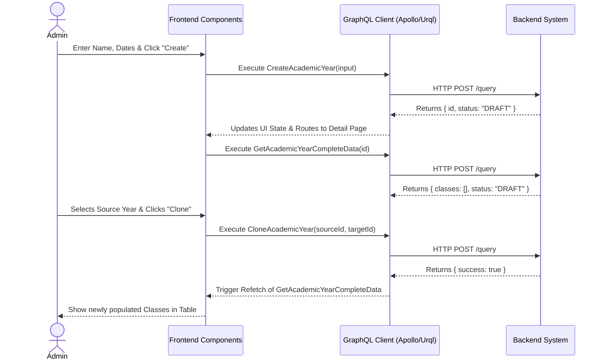

# Academic Year Setup & Rollover Workflow (AI-Optimized)

## 1. Context & Business Rules (Explicit Constraints)
- **Constraint 1 (State Machine):** Academic Year status MUST follow this exact transition path: `DRAFT` → `ACTIVE` → `CLOSED` → `ARCHIVED`. Skipping states is prohibited.
- **Constraint 2 (Semester Auto-creation):** When `CreateAcademicYear` is called, the backend automatically generates exactly 2 `Semester` records. The frontend does NOT need to send a request to create semesters.
- **Constraint 3 (Cloning Rule):** `CloneAcademicYear` can ONLY be executed when the target Academic Year is in the `DRAFT` state. It copies `Classes`, `SkillCategories`, and `Skills` from the `sourceYearId`.
- **Constraint 4 (Active Limitation):** Only ONE Academic Year can have the `status = "ACTIVE"` at any given time. Setting a year to `ACTIVE` automatically requires the backend to validate this (or the frontend must warn the user).

## 2. Exact Data Contracts (GraphQL)

### A. Create Academic Year
**Request (Mutation):**
```graphql
mutation CreateAcademicYear($input: CreateAcademicYearInput!) {
  createAcademicYear(input: $input) {
    id
    name
    startDate
    endDate
    status
  }
}
```
**Input Variables Map:**
```json
{
  "input": {
    "name": "2026/2027", 
    "startDate": "2026-07-01", // Format: YYYY-MM-DD
    "endDate": "2027-06-30"    // Format: YYYY-MM-DD
  }
}
// Note: Backend sets initial status to "DRAFT" automatically.
```

### B. Clone Academic Year
**Request (Mutation):**
```graphql
mutation CloneAcademicYear($sourceYearId: ID!, $targetYearId: ID!) {
  cloneAcademicYear(sourceYearId: $sourceYearId, targetYearId: $targetYearId) {
    success
    classesCreated
    skillsCreated
  }
}
```

### C. Get Complete Data (For Detail Page)
**Request (Query):**
```graphql
query GetAcademicYearCompleteData($id: ID!) {
  getAcademicYear(id: $id) {
    id
    name
    startDate
    endDate
    status
    classes {
      id
      name
      capacity
      teacherAssignment {
        teacher {
          profile {
            firstName
            lastName
          }
        }
      }
    }
  }
}
```

## 3. UI to Data Mapping

| UI Element (Screen) | GraphQL / Data Source | Action / Trigger |
| ------------------- | --------------------- | ---------------- |
| **"Name" Input Box** | `input.name` | Bound to React/Solid state |
| **"Start Date" Picker**| `input.startDate` | Bound to React/Solid state |
| **"Save" Button (Create)** | N/A | Triggers `CreateAcademicYear` |
| **Status Badge** | `getAcademicYear.status` | Render logic based on string value |
| **Class Name (Table Row)** | `classes[i].name` | Rendered from array map |
| **Capacity (Table Row)** | `classes[i].capacity` | Rendered from array map |
| **Teacher (Table Row)** | `classes[i].teacherAssignment.teacher.profile.firstName + " " + lastName` | Conditional render (Fallback to "Unassigned" if null) |
| **"Clone" Button** | N/A | Triggers `CloneAcademicYear(sourceId, currentRoute.id)` |
| **"Activate" Button** | N/A | Triggers `SetAcademicYearStatus(id, "ACTIVE")` |

## 4. API Sequence Diagram



## 5. UI/UX Screen Flow & Component Wireframe

### Components to Build:
1. `<AcademicYearList />` - Fetches and renders all years.
2. `<CreateAcademicYearModal />` - Form using TanStack Form + Zod.
3. `<AcademicYearDetail />` - Parent component for the active route `/:id`.
4. `<CloneDataModal />` - Dialog to select a `sourceYearId`.
5. `<ClassesTable />` - Renders the `classes` array from the GraphQL response.

### Component Wireframe Representation:

```text
=============================================================================
[<Navbar /> component]                                     User: Admin
=============================================================================
[<Sidebar />]      | [<AcademicYearDetail /> component]
> Academic Years   | 
                   | Title: {name}                        Badge: [{status}]
                   | Start: {startDate}  |  End: {endDate}
                   |
                   | [<Tabs /> component]
                   | [Overview (Active)]   [Classes]   [Curriculum]  
                   | --------------------------------------------------------
                   |
                   | [<ActionPanel /> component]
                   | Button: [+ Add Class]   Button: [Clone from Previous Year]
                   |                         (Triggers <CloneDataModal />)
                   |
                   | [<ClassesTable /> component]
                   | --------------------------------------------------------
                   | Class Name         | Capacity       | Teacher
                   | --------------------------------------------------------
                   | {class.name}       | {class.cap}    | {class.teacher...}
                   | --------------------------------------------------------
                   |
                   |                                Button: [Activate Year]
                   |                                (Only visible if DRAFT)
=============================================================================
```
