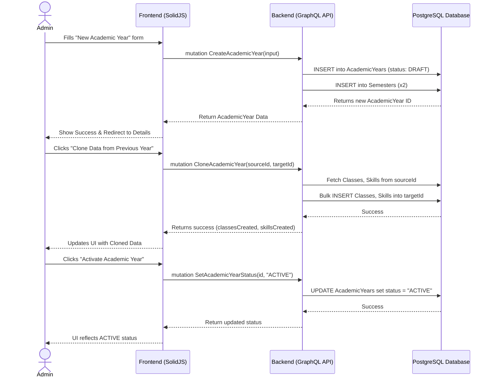

# Academic Year Setup & Rollover Workflow

## 1. Overview
This workflow describes how an Administrator creates a new Academic Year, configures classes and curriculums, transitions the academic year through its states (DRAFT → ACTIVE → CLOSED → ARCHIVED), and rolls over data from a previous year using the cloning feature.

## 2. API / GraphQL List
The following GraphQL queries and mutations are utilized in this workflow:

- `mutation CreateAcademicYear` - Creates a new academic year in `DRAFT` state and auto-creates 2 Semesters.
- `mutation CloneAcademicYear` - Clones classes, skill categories, and skills from a selected previous academic year.
- `mutation SetAcademicYearStatus` - Transitions the status of the year (e.g., DRAFT → ACTIVE, ACTIVE → CLOSED).
- `query GetAcademicYears` - Fetches the list of all academic years.
- `query GetAcademicYearCompleteData` - Fetches full details of a specific year including its classes and curriculum.
- `mutation CreateClass` - Creates a new class manually if cloning is not used.
- `mutation BulkSetupAcademicYear` - Alternative method for bulk setup of classes/skills if not cloning.

## 3. Domain / Table List
The workflow interacts with the following database tables:
- `AcademicYears`
- `Semesters` (Auto-generated from AcademicYears)
- `Classes`
- `SkillCategories`
- `Skills`

## 4. API Sequence Diagram



## 5. UI/UX Screen Flow

1. **Dashboard (`/admin/dashboard`)**
   - User clicks "Academic Years" in the sidebar navigation.
2. **Academic Years List (`/admin/academic-years`)**
   - Displays a table of all academic years.
   - User clicks the primary button: `[+ Create Academic Year]`.
3. **Create Modal/Page**
   - User inputs `Name` (e.g., "2026/2027"), `Start Date`, and `End Date`.
   - Submits form.
4. **Academic Year Detail Page (`/admin/academic-years/:id`)**
   - The status badge shows `DRAFT`.
   - The screen is divided into tabs: `Overview`, `Classes`, `Curriculum`.
   - User clicks the action button `[Clone from Previous Year]`.
   - A modal appears to select the `sourceYearId`. User confirms.
   - Tabs populate with cloned Classes and Skills.
5. **Activation Action**
   - User reviews data and clicks the top-right button `[Activate Year]`.
   - Confirmation dialog appears. Upon confirming, status changes to `ACTIVE`.

## 6. UI Wireframe

```text
+-----------------------------------------------------------------------------+
|  [Logo] Kindergarten Mgt                           User: Admin | [Logout]   |
+-----------------------------------------------------------------------------+
|                  |                                                          |
|  Dashboard       |  Academic Year: 2026/2027                      [ACTIVE]  |
|                  |  ------------------------------------------------------  |
| > Academic Years |  Start: 2026-07-01  |  End: 2027-06-30                   |
|                  |                                                          |
|  Users           |  [Overview]   [Classes (10)]   [Curriculum (25 Skills)]  |
|  Teachers        |  ------------------------------------------------------  |
|  Students        |                                                          |
|  Analytics       |  Action Panel:                                           |
|                  |  [+ Add Class]  [Clone from Previous Year]               |
|                  |                                                          |
|                  |  Class List:                                             |
|                  |  +--------------------+----------------+-------------+   |
|                  |  | Class Name         | Capacity       | Teacher     |   |
|                  |  +--------------------+----------------+-------------+   |
|                  |  | Lion Class A       | 20             | John Doe    |   |
|                  |  | Tiger Class B      | 20             | Unassigned  |   |
|                  |  | Bear Class C       | 15             | Unassigned  |   |
|                  |  +--------------------+----------------+-------------+   |
|                  |                                                          |
|                  |                                       [Close Year...]    |
+-----------------------------------------------------------------------------+
```
