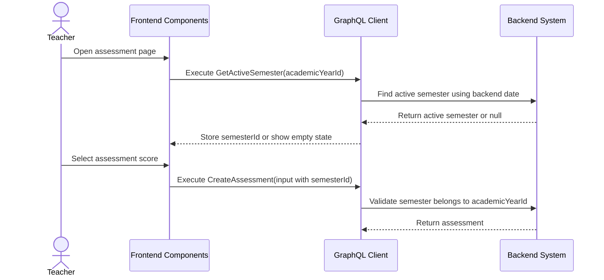

# Active Semester Management Workflow (AI-Optimized)

## 1. Context & Business Rules (Explicit Constraints)
- **Constraint 1 (Auto Creation):** Creating an Academic Year MUST automatically create exactly 2 Semesters.
- **Constraint 2 (Backend Active Query):** Backend MUST expose `getActiveSemester(academicYearId)`. Frontend must not calculate active semester alone.
- **Constraint 3 (Academic Year Scope):** Every semester MUST belong to exactly one academic year.
- **Constraint 4 (No Overlap):** Semesters in the same academic year must not have overlapping date ranges.
- **Constraint 5 (Date Containment):** Semester start and end dates should be inside the academic year start and end dates.
- **Constraint 6 (Operational Dependency):** Attendance, assessments, daily reports, and semester reports must use a valid `semesterId`.
- **Constraint 7 (No Active Semester):** If backend server date does not fall inside any semester, `getActiveSemester` returns null and write workflows should block or require Admin correction.
- **Constraint 8 (Server Date Only):** `getActiveSemester` MUST use backend server date only. Do not add a date argument for MVP.
- **Constraint 9 (Soft Delete Only):** Deleting a semester must set `deleted_at = NOW()`.
- **Constraint 10 (Strict CRUD Rule):** Semester domain MUST implement create, update, delete by id, delete multiple ids, get by id, get all, and get pagination.

## 2. Exact Data Contracts (GraphQL)

### A. Create Semester
```graphql
mutation CreateSemester($input: CreateSemesterInput!) {
  createSemester(input: $input) {
    id
    academicYearId
    name
    startDate
    endDate
  }
}
```

```json
{
  "input": {
    "academicYearId": "uuid-year",
    "name": "Semester 1",
    "startDate": "2026-07-01",
    "endDate": "2026-12-31"
  }
}
```

### B. Update Semester
```graphql
mutation UpdateSemester($semesterId: ID!, $input: UpdateSemesterInput!) {
  updateSemester(semesterId: $semesterId, input: $input) {
    id
    name
    startDate
    endDate
    updatedAt
  }
}
```

### C. Delete Semester By Id
```graphql
mutation DeleteSemester($semesterId: ID!) {
  deleteSemester(semesterId: $semesterId) {
    success
    message
  }
}
```

### D. Delete Multiple Semesters
```graphql
mutation DeleteSemesters($semesterIds: [ID!]!) {
  deleteSemesters(semesterIds: $semesterIds) {
    success
    message
    deletedCount
  }
}
```

### E. Get Semester By Id
```graphql
query GetSemesterById($semesterId: ID!) {
  getSemesterById(semesterId: $semesterId) {
    id
    academicYearId
    name
    startDate
    endDate
  }
}
```

### F. Get Semesters All
```graphql
query GetSemestersAll($academicYearId: ID!) {
  getSemestersAll(academicYearId: $academicYearId) {
    id
    name
    startDate
    endDate
  }
}
```

### G. Get Semesters Pagination
```graphql
query GetSemestersPagination($academicYearId: ID!, $page: Int!, $limit: Int!) {
  getSemestersPagination(academicYearId: $academicYearId, page: $page, limit: $limit) {
    items {
      id
      name
      startDate
      endDate
    }
    pagination {
      page
      limit
      totalItems
      totalPages
      hasNextPage
      hasPreviousPage
    }
  }
}
```

### H. Get Active Semester
```graphql
query GetActiveSemester($academicYearId: ID!) {
  getActiveSemester(academicYearId: $academicYearId) {
    id
    academicYearId
    name
    startDate
    endDate
  }
}
```

**Required Backend Behavior:**
```text
1. Validate academicYearId exists.
2. Use backend server date only.
3. Return semester where:
   semester.academic_year_id = academicYearId
   semester.deleted_at IS NULL
   semester.start_date <= today
   semester.end_date >= today
4. If none found, return null.
5. If more than one found, return validation/configuration error because semesters overlap.
```

## 3. UI to Data Mapping

| UI Element (Screen) | GraphQL / Data Source | Action / Trigger |
| ------------------- | --------------------- | ---------------- |
| **Semesters Tab Table** | `getSemestersAll` | Renders semester list |
| **Active Badge** | `getActiveSemester.id` | Marks current semester row |
| **Semester Name Input** | `input.name` | Sent to create/update semester |
| **Date Pickers** | `input.startDate`, `input.endDate` | Validate no overlap |
| **Teacher Assessment Page** | `getActiveSemester` | Provides `semesterId` for create assessment |
| **Daily Report Page** | `getActiveSemester` | Provides `semesterId` for report records |
| **No Active Semester Empty State** | null active semester | Blocks write workflow |

## 4. API Sequence Diagram



## 5. UI/UX Screen Flow & Component Wireframe

### Components to Build:
1. `<SemestersTab />`
2. `<SemestersTable />`
3. `<EditSemesterDrawer />`
4. `<ActiveSemesterBadge />`
5. `<NoActiveSemesterState />`
6. `useActiveSemesterQuery`

### Component Wireframe Representation:

```text
=============================================================================
[<SemestersTab /> component]                           User: Admin
=============================================================================
Academic Year: {academicYear.name}

[<SemestersTable />]
--------------------------------------------------------
Name          | Start Date  | End Date    | Active | Actions
--------------------------------------------------------
Semester 1    | 2026-07-01  | 2026-12-31  | Yes    | [...]
Semester 2    | 2027-01-01  | 2027-06-30  | No     | [...]
--------------------------------------------------------

[<NoActiveSemesterState />]
No active semester is available for today. Ask Admin to correct semester dates.
=============================================================================
```

## 6. AI Execution Checklist

```text
1. Ensure CreateAcademicYear auto-creates exactly 2 semesters.
2. Implement 7 Semester CRUD operations.
3. Implement getActiveSemester(academicYearId).
4. Use backend server date for active semester calculation.
5. Validate no overlapping semester dates.
6. Validate semester dates are inside academic year dates.
7. Make attendance/assessment/report creation validate semesterId.
8. Add frontend active semester query hook.
9. Show blocking empty state when no active semester exists.
10. Test current date inside semester, outside semester, and overlapping semester config.
```
