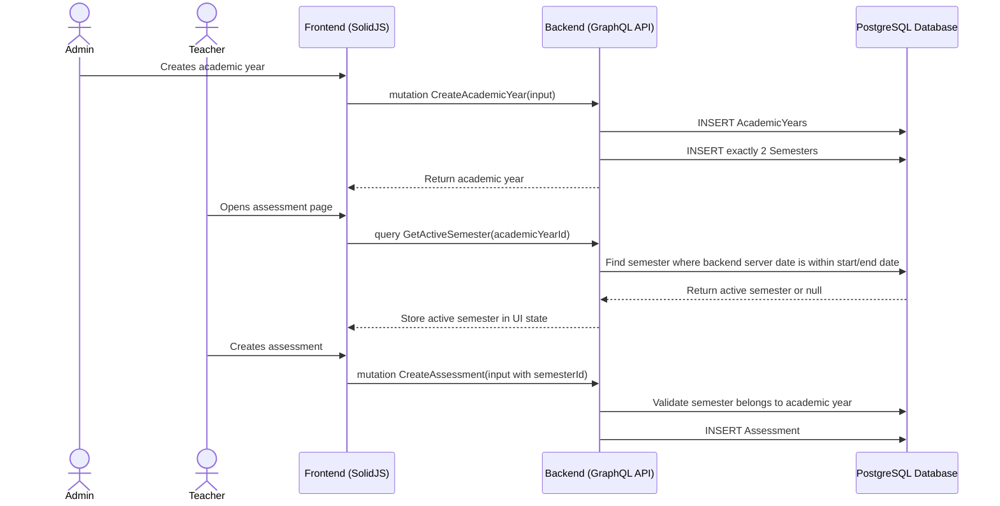

# Active Semester Management Workflow

## 1. Overview
This workflow describes how semesters are created, selected, and exposed to the frontend. Each Academic Year automatically creates exactly two semester records when the academic year is created. The backend must expose an active semester query so the frontend does not infer active semester logic from dates by itself.

The active semester is used by attendance, assessments, daily reports, and semester reports.

## 2. API / GraphQL List
The following GraphQL queries and mutations are utilized in this workflow:

- `mutation CreateSemester` - Creates a semester when manually allowed.
- `mutation UpdateSemester` - Updates semester name or date range.
- `mutation DeleteSemester` - Soft deletes one semester.
- `mutation DeleteSemesters` - Soft deletes multiple semesters.
- `query GetSemesterById` - Fetches one semester.
- `query GetSemestersAll` - Fetches all semesters for an academic year.
- `query GetSemestersPagination` - Fetches paginated semesters.
- `query GetActiveSemester` - Returns the currently active semester for an academic year.

## 3. Domain / Table List
The workflow interacts with the following database tables:

- `AcademicYears` - Root academic scope.
- `Semesters` - Stores semester name, date range, and academic-year link.
- `Assessments` - Uses semester ID.
- `Attendance` - Uses semester ID.
- `DailyReports` - Uses semester ID.
- `SemesterReports` - Uses semester ID.

## 4. API Sequence Diagram



## 5. UI/UX Screen Flow

1. **Academic Year Creation**
   - Admin creates academic year.
   - Backend auto-creates exactly two semesters.
   - Admin can review semesters in academic year detail.

2. **Semester Setup**
   - Admin can update semester names or dates before the year is closed.
   - System must prevent overlapping semester date ranges inside the same academic year.

3. **Active Semester Use**
   - Teacher pages call `GetActiveSemester`.
   - Backend uses server date only; the query does not accept a date override.
   - Assessment and report creation use returned `semesterId`.
   - If there is no active semester, UI shows a blocking empty state.

## 6. UI Wireframe

```text
+-----------------------------------------------------------------------------+
|  [Logo] Kindergarten Mgt                           User: Admin | [Logout]   |
+-----------------------------------------------------------------------------+
|                  |                                                          |
| > Academic Years |  Academic Year: 2026/2027                                |
|                  |  [Overview] [Classes] [Curriculum] [Semesters]           |
|                  |                                                          |
|                  |  +---------------------------------------------------+   |
|                  |  | Semester      | Start Date | End Date   | Status |   |
|                  |  +---------------------------------------------------+   |
|                  |  | Semester 1    | 2026-07-01 | 2026-12-31 | ACTIVE |   |
|                  |  | Semester 2    | 2027-01-01 | 2027-06-30 | -      |   |
|                  |  +---------------------------------------------------+   |
+-----------------------------------------------------------------------------+
```
