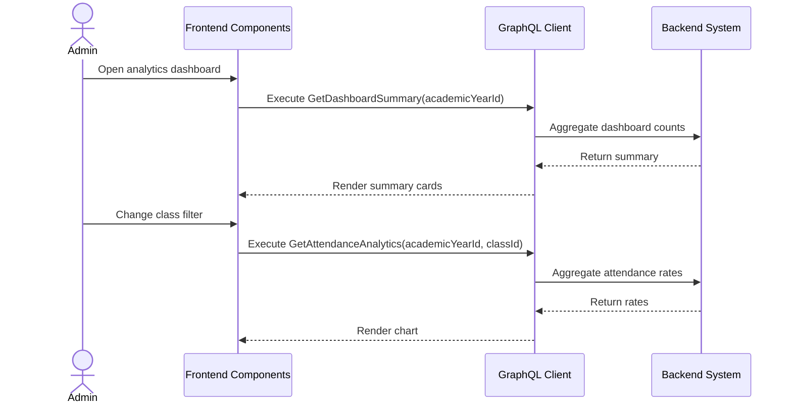

# Analytics Dashboard Workflow (AI-Optimized)

## 1. Context & Business Rules (Explicit Constraints)
- **Constraint 1 (Read Only):** Analytics queries MUST NOT mutate data.
- **Constraint 2 (Academic Year Scope):** Every analytics query MUST accept or infer `academicYearId`.
- **Constraint 3 (Admin Access):** Admin can view all analytics.
- **Constraint 4 (Teacher Limited Access):** If Teacher analytics are exposed, teacher can only view assigned classes unless the specific query is read-only-all allowed by policy.
- **Constraint 5 (Parent No Access):** Parent must not access Admin analytics dashboard.
- **Constraint 6 (No Deleted Rows):** Analytics must ignore soft-deleted rows unless explicitly requested for historical admin audit.
- **Constraint 7 (Performance):** Analytics should use aggregate queries, not load all records into memory.
- **Constraint 8 (Dashboard Summary):** Backend should expose `getDashboardSummary` to reduce frontend aggregation complexity.

## 2. Exact Data Contracts (GraphQL)

### A. Get Dashboard Summary
```graphql
query GetDashboardSummary($academicYearId: ID!) {
  getDashboardSummary(academicYearId: $academicYearId) {
    totalStudents
    totalClasses
    totalTeachers
    attendanceRate
    assessmentCompletionRate
    dailyReportCompletionRate
    semesterReportPublishedRate
  }
}
```

### B. Get Attendance Analytics
```graphql
query GetAttendanceAnalytics($academicYearId: ID!, $classId: ID) {
  getAttendanceAnalytics(academicYearId: $academicYearId, classId: $classId) {
    presentRate
    absentRate
    excusedRate
    lateRate
    totalRecords
  }
}
```

### C. Get Assessment Completion Analytics
```graphql
query GetAssessmentCompletionAnalytics($academicYearId: ID!, $classId: ID) {
  getAssessmentCompletionAnalytics(academicYearId: $academicYearId, classId: $classId) {
    completionPercentage
    expectedAssessments
    completedAssessments
  }
}
```

### D. Get Student Progress Summary
```graphql
query GetStudentProgressSummary($studentId: ID!, $academicYearId: ID!) {
  getStudentProgressSummary(studentId: $studentId, academicYearId: $academicYearId) {
    totalSkills
    assessedSkills
    averageScore
  }
}
```

### E. Get Teacher Activity Summary
```graphql
query GetTeacherActivitySummary($teacherId: ID!, $academicYearId: ID!) {
  getTeacherActivitySummary(teacherId: $teacherId, academicYearId: $academicYearId) {
    attendanceMarked
    reportsSubmitted
    assessmentsCreated
  }
}
```

## 3. UI to Data Mapping

| UI Element (Screen) | GraphQL / Data Source | Action / Trigger |
| ------------------- | --------------------- | ---------------- |
| **Academic Year Filter** | `academicYearId` | Refetch all analytics |
| **Class Filter** | `classId` | Refetch class-scoped analytics |
| **Summary Cards** | `getDashboardSummary` | Render top metrics |
| **Attendance Chart** | `getAttendanceAnalytics` | Render attendance status chart |
| **Assessment Completion Card** | `getAssessmentCompletionAnalytics` | Render completion percentage |
| **Teacher Activity Table** | `getTeacherActivitySummary` | Render teacher metrics |
| **Student Progress Drilldown** | `getStudentProgressSummary` | Render selected student progress |

## 4. API Sequence Diagram



## 5. UI/UX Screen Flow & Component Wireframe

### Components to Build:
1. `<AnalyticsDashboardPage />`
2. `<AnalyticsFilters />`
3. `<DashboardSummaryCards />`
4. `<AttendanceAnalyticsChart />`
5. `<AssessmentCompletionWidget />`
6. `<TeacherActivityTable />`
7. `<StudentProgressDrilldown />`

### Component Wireframe Representation:

```text
=============================================================================
[<AnalyticsDashboardPage /> component]                  User: Admin
=============================================================================
[<AnalyticsFilters />]
Academic Year: [2026/2027 v]     Class: [All v]

[<DashboardSummaryCards />]
[ Students: {n} ] [ Attendance: {rate}% ] [ Assessments: {rate}% ]

[<AttendanceAnalyticsChart />]
Present / Absent / Excused / Late

[<TeacherActivityTable />]
Teacher | Attendance Marked | Reports Submitted | Assessments
=============================================================================
```

## 6. AI Execution Checklist

```text
1. Implement getDashboardSummary.
2. Verify existing analytics queries filter by academicYearId.
3. Add optional classId filters where useful.
4. Enforce Admin access for admin analytics page.
5. Enforce Teacher assignment scope if teacher analytics are shown.
6. Exclude deleted_at rows from normal analytics.
7. Use database aggregate queries.
8. Add frontend dashboard page and chart/table widgets.
9. Test with empty data, partial data, and complete data.
```
