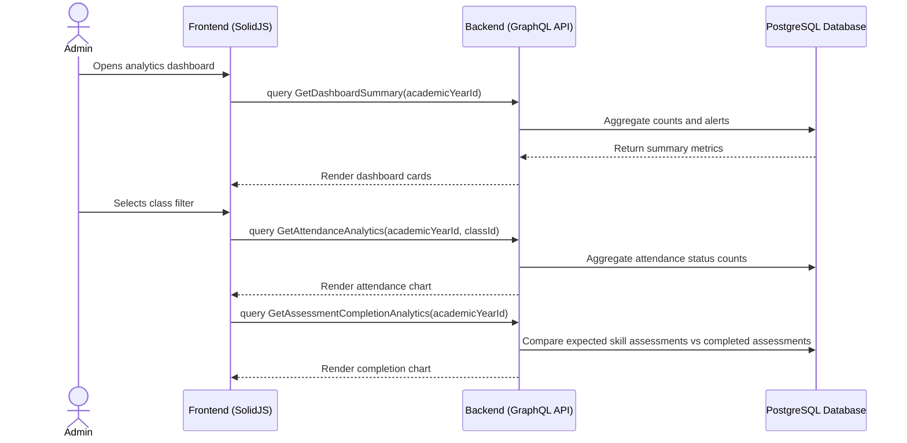

# Analytics Dashboard Workflow

## 1. Overview
This workflow describes how Admin and limited Teacher users view analytics for attendance, teacher activity, assessment completion, and student progress. Analytics are scoped by academic year and optionally by class, teacher, or student.

Analytics are read-only views. They must not mutate academic records.

## 2. API / GraphQL List
The following GraphQL queries are utilized in this workflow:

- `query GetAttendanceAnalytics` - Returns attendance percentages by academic year and optional class.
- `query GetAssessmentCompletionAnalytics` - Returns percentage of completed assessments.
- `query GetStudentProgressSummary` - Returns assessed skill counts for a student.
- `query GetTeacherActivitySummary` - Returns attendance/report activity for a teacher.
- `query GetDashboardSummary` - Returns aggregate dashboard counts and alerts.

## 3. Domain / Table List
The workflow reads from the following database tables:

- `AcademicYears` - Provides dashboard scope.
- `Classes` - Provides class filters.
- `Students` - Provides student counts and progress context.
- `StudentEnrollments` - Provides enrolled counts.
- `Attendance` - Provides attendance analytics.
- `Assessments` - Provides assessment completion and progress.
- `DailyReports` - Provides teacher activity.
- `TeacherAssignments` - Provides teacher scope and class filtering.
- `SemesterReports` - Provides report completion counts.

## 4. API Sequence Diagram



## 5. UI/UX Screen Flow

1. **Admin Analytics (`/admin/analytics`)**
   - Admin selects academic year.
   - Dashboard shows attendance rate, assessment completion, teacher activity, report completion, and enrolled student count.

2. **Filters**
   - Admin can filter by academic year, class, teacher, and date range where supported.
   - Teacher analytics are limited to assigned classes if exposed to Teacher role.

3. **Charts and Tables**
   - Attendance analytics render as summary cards and charts.
   - Teacher activity renders as a table.
   - Assessment completion renders as progress bars or charts.

## 6. UI Wireframe

```text
+-----------------------------------------------------------------------------+
|  [Logo] Kindergarten Mgt                           User: Admin | [Logout]   |
+-----------------------------------------------------------------------------+
|                  |                                                          |
| > Analytics      |  Analytics Dashboard                                     |
|                  |  Academic Year: [2026/2027 v] Class: [All v]             |
|                  |                                                          |
|                  |  [Attendance Rate: 96%] [Assessment Completion: 84%]     |
|                  |  [Students: 120]        [Reports Published: 78%]         |
|                  |                                                          |
|                  |  Attendance Chart                                        |
|                  |  Teacher Activity Table                                  |
+-----------------------------------------------------------------------------+
```
