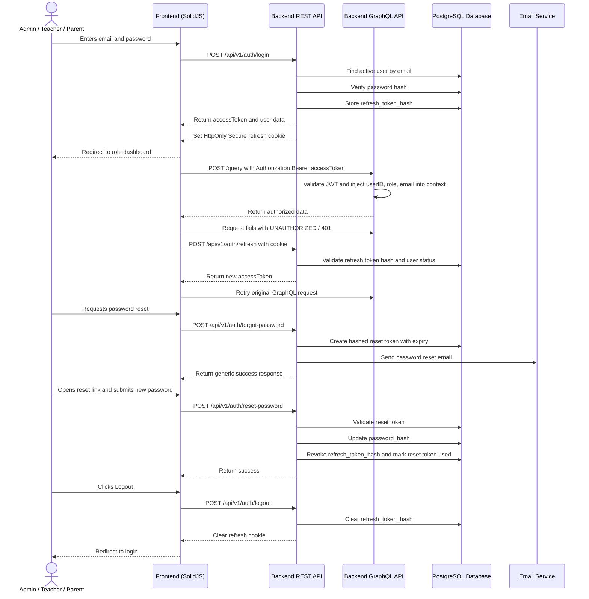

# Authentication & Security Workflow

## 1. Overview
This workflow describes cross-role authentication and session security for Admin, Teacher, and Parent users. It covers login, route authorization, access-token refreshing, password reset through email, and secure logout.

Authentication uses REST endpoints because auth requires HTTP-specific behavior such as secure cookies. Relational application data continues to use GraphQL.

The frontend receives a short-lived access token and stores it in memory. The backend stores the refresh token as a hashed value and sends the raw refresh token only in an `HttpOnly`, `Secure`, `SameSite=Strict` cookie.

## 2. API / REST List
The following REST endpoints are utilized in this workflow:

- `POST /api/v1/auth/login` - Validates email and password, returns access token, user profile, and sets refresh-token cookie.
- `POST /api/v1/auth/refresh` - Reads refresh-token cookie and returns a new access token.
- `POST /api/v1/auth/logout` - Invalidates stored refresh token and clears refresh-token cookie.
- `POST /api/v1/auth/forgot-password` - Starts password reset flow by emailing a secure reset link or code.
- `POST /api/v1/auth/reset-password` - Resets the password using a valid reset token.

GraphQL requests use the access token through:

- `Authorization: Bearer <accessToken>`

## 3. Domain / Table List
The workflow interacts with the following database tables:

- `Users` - Stores email, password hash, role, refresh token hash, and soft-delete state.
- `Roles` - Defines `ADMIN`, `TEACHER`, and `PARENT`.
- `Profiles` - Provides display name and profile metadata after login.
- `PasswordResetTokens` - Stores hashed password reset tokens, expiry time, and used state.
- `DeviceTokens` - Optional cleanup during logout if a user signs out from a device.
- `AuditLogs` - Optional but recommended for login, logout, and password reset security events.

## 4. API Sequence Diagram



## 5. UI/UX Screen Flow

1. **Login Page (`/login`)**
   - User enters `email` and `password`.
   - Frontend calls `POST /api/v1/auth/login`.
   - On success, frontend stores access token in memory and redirects by role:
     - `ADMIN` -> `/admin/dashboard`
     - `TEACHER` -> `/teacher/dashboard`
     - `PARENT` -> `/parent/dashboard`
   - On failure, show a generic invalid credentials message.

2. **Protected App Routes**
   - Frontend guards private routes by checking session state.
   - GraphQL client attaches `Authorization: Bearer <accessToken>`.
   - Backend GraphQL middleware validates JWT and enforces role context.
   - If access token expires, frontend calls refresh endpoint and retries once.

3. **Token Refresh**
   - Refresh happens through `POST /api/v1/auth/refresh`.
   - Refresh token is sent automatically by the browser cookie.
   - If refresh succeeds, frontend updates in-memory access token.
   - If refresh fails, frontend clears session state and redirects to `/login`.

4. **Forgot Password (`/forgot-password`)**
   - User enters email.
   - Frontend calls `POST /api/v1/auth/forgot-password`.
   - Response must be generic even if the email does not exist.
   - User sees "If an account exists, password reset instructions have been sent."

5. **Reset Password (`/reset-password`)**
   - User opens reset link from email.
   - Frontend submits reset token and new password.
   - Backend validates token, updates password hash, invalidates existing refresh token, and marks reset token used.
   - User is redirected to login.

6. **Secure Logout**
   - User clicks logout.
   - Frontend calls `POST /api/v1/auth/logout`.
   - Backend invalidates refresh token and clears cookie.
   - Frontend clears access token and route state.
   - User is redirected to `/login`.

## 6. UI Wireframe

```text
+-----------------------------------------------------------------------------+
|  Kindergarten Mgt                                                            |
+-----------------------------------------------------------------------------+
|                                                                             |
|  Login                                                                      |
|  -------------------------------------------------------------------------  |
|  Email:      [ user@school.com                              ]               |
|  Password:   [ ********                                     ]               |
|                                                                             |
|  [Login]                                                                    |
|                                                                             |
|  Forgot password?                                                           |
+-----------------------------------------------------------------------------+

+-----------------------------------------------------------------------------+
|  Kindergarten Mgt                                                            |
+-----------------------------------------------------------------------------+
|                                                                             |
|  Forgot Password                                                            |
|  -------------------------------------------------------------------------  |
|  Email:      [ user@school.com                              ]               |
|                                                                             |
|  [Send Reset Instructions]                                                   |
+-----------------------------------------------------------------------------+

+-----------------------------------------------------------------------------+
|  Kindergarten Mgt                                                            |
+-----------------------------------------------------------------------------+
|                                                                             |
|  Reset Password                                                             |
|  -------------------------------------------------------------------------  |
|  New Password:      [ ********                              ]               |
|  Confirm Password:  [ ********                              ]               |
|                                                                             |
|  [Reset Password]                                                            |
+-----------------------------------------------------------------------------+
```
