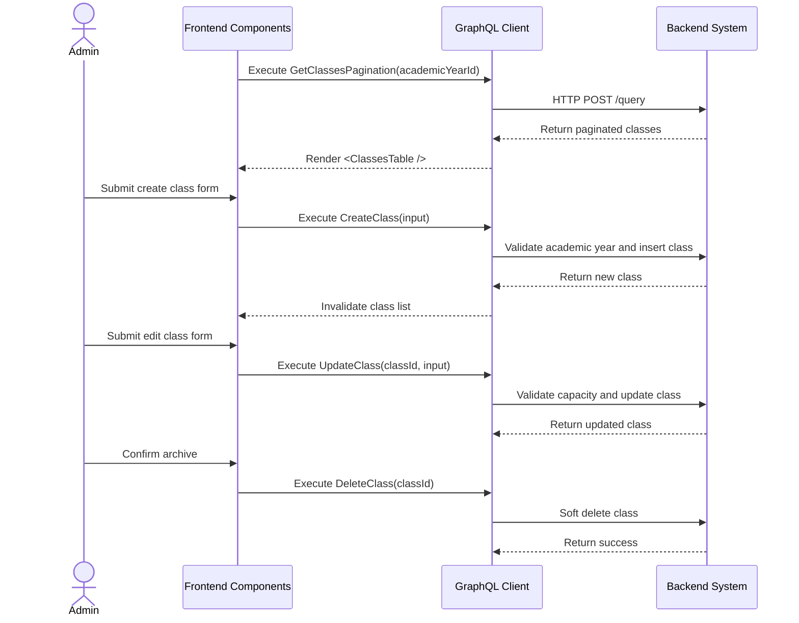

# Class Management Workflow (AI-Optimized)

## 1. Context & Business Rules (Explicit Constraints)
- **Constraint 1 (Academic Year Scope):** Every class MUST belong to exactly one `academicYearId`.
- **Constraint 2 (No Data Leakage):** A class from one academic year must not appear inside another academic year.
- **Constraint 3 (Soft Delete Only):** Deleting a class MUST set `deleted_at = NOW()`. Do not run SQL `DELETE`.
- **Constraint 4 (Capacity Validation):** `capacity` must be greater than or equal to the current enrolled student count.
- **Constraint 5 (Archived Year Rule):** Classes cannot be created or edited inside an `ARCHIVED` academic year.
- **Constraint 6 (Teacher Assignment Separate):** Creating a class does not assign a teacher. Use Teacher Assignment workflow for that.
- **Constraint 7 (Student Enrollment Separate):** Creating a class does not enroll students. Use Student Enrollment workflow for that.
- **Constraint 8 (Strict CRUD Rule):** Class domain MUST implement create, update, delete by id, delete multiple ids, get by id, get all, and get pagination.

## 2. Exact Data Contracts (GraphQL)

### A. Create Class
```graphql
mutation CreateClass($input: CreateClassInput!) {
  createClass(input: $input) {
    id
    academicYearId
    name
    capacity
    createdAt
    updatedAt
  }
}
```

```json
{
  "input": {
    "academicYearId": "uuid-academic-year",
    "name": "Lion Class A",
    "capacity": 20
  }
}
```

### B. Update Class
```graphql
mutation UpdateClass($classId: ID!, $input: UpdateClassInput!) {
  updateClass(classId: $classId, input: $input) {
    id
    name
    capacity
    enrolledCount
    updatedAt
  }
}
```

### C. Delete Class By Id
```graphql
mutation DeleteClass($classId: ID!) {
  deleteClass(classId: $classId) {
    success
    message
  }
}
```

### D. Delete Multiple Classes
```graphql
mutation DeleteClasses($classIds: [ID!]!) {
  deleteClasses(classIds: $classIds) {
    success
    message
    deletedCount
  }
}
```

### E. Get Class By Id
```graphql
query GetClassById($classId: ID!) {
  getClassById(classId: $classId) {
    id
    academicYearId
    name
    capacity
    enrolledCount
    teacherAssignments {
      id
      teacher {
        id
        profile { firstName lastName }
      }
    }
  }
}
```

### F. Get Classes All
```graphql
query GetClassesAll($academicYearId: ID) {
  getClassesAll(academicYearId: $academicYearId) {
    id
    name
    capacity
    enrolledCount
  }
}
```

### G. Get Classes Pagination
```graphql
query GetClassesPagination($academicYearId: ID!, $page: Int!, $limit: Int!, $search: String) {
  getClassesPagination(academicYearId: $academicYearId, page: $page, limit: $limit, search: $search) {
    items {
      id
      name
      capacity
      enrolledCount
      teacherAssignments {
        teacher { profile { firstName lastName } }
      }
    }
    pagination {
      page
      limit
      totalItems
      totalPages
      hasNextPage
      hasPreviousPage
    }
  }
}
```

## 3. UI to Data Mapping

| UI Element (Screen) | GraphQL / Data Source | Action / Trigger |
| ------------------- | --------------------- | ---------------- |
| **Academic Year Context** | route `academicYearId` | Passed to all class queries |
| **Class Name Input** | `input.name` | Sent to `CreateClass` or `UpdateClass` |
| **Capacity Input** | `input.capacity` | Must be >= enrolled count |
| **Class Table** | `getClassesPagination.items` | Render class rows |
| **Assigned Teacher Text** | `teacherAssignments` | Render teacher names or `Unassigned` |
| **Enrolled Count** | `enrolledCount` | Render count and validate capacity |
| **Archive Button** | `classId` | Calls `DeleteClass` |

## 4. API Sequence Diagram



## 5. UI/UX Screen Flow & Component Wireframe

### Components to Build:
1. `<ClassManagementPage />`
2. `<ClassesTable />`
3. `<CreateClassModal />`
4. `<EditClassDrawer />`
5. `<ArchiveClassDialog />`
6. `<ClassCapacityInput />`

### Component Wireframe Representation:

```text
=============================================================================
[<ClassManagementPage /> component]                     User: Admin
=============================================================================
Academic Year: {academicYear.name}
Search: [                    ]                 Button: [+ Add Class]

[<ClassesTable />]
--------------------------------------------------------
Class Name       | Capacity | Enrolled | Teacher      | Actions
--------------------------------------------------------
{name}           | {cap}    | {count}  | {teacher}    | [...]
--------------------------------------------------------

[<CreateClassModal />]
Name:     [ Lion Class A ]
Capacity: [ 20           ]
Button: [Create]
=============================================================================
```

## 6. AI Execution Checklist

```text
1. Implement 7 Class CRUD operations.
2. Always require academicYearId when creating class.
3. Filter class lists by deleted_at IS NULL.
4. Validate academic year is not ARCHIVED before create/update.
5. Calculate enrolledCount from StudentEnrollments.
6. Reject capacity lower than enrolledCount.
7. Soft delete class by setting deleted_at.
8. Add frontend class table, create modal, edit drawer, archive dialog.
9. Test create, update, soft delete, get by id, get all, pagination.
```
