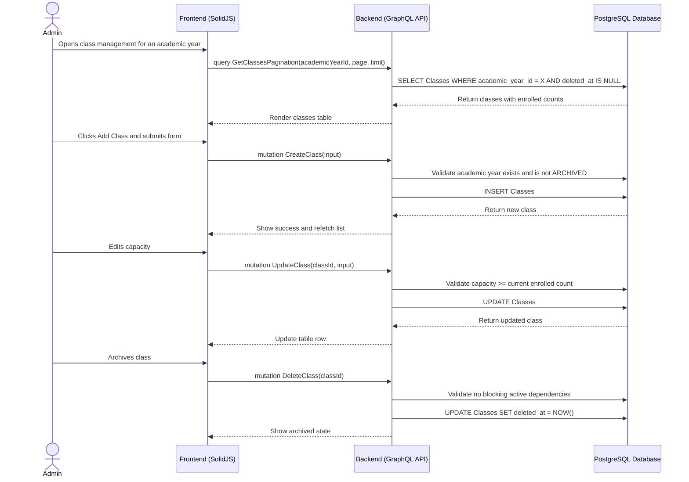

# Class Management Workflow

## 1. Overview
This workflow describes how an Admin creates, edits, archives, and reviews classes inside a specific Academic Year. Classes are scoped to one academic year and are used by teacher assignments, student enrollments, attendance, daily reports, and semester reports.

Class records must be soft-deleted or archived, not physically deleted. Capacity is used by enrollment and promotion workflows to prevent over-enrollment.

## 2. API / GraphQL List
The following GraphQL queries and mutations are utilized in this workflow:

- `mutation CreateClass` - Creates a class inside an academic year.
- `mutation UpdateClass` - Updates class name, capacity, or metadata.
- `mutation DeleteClass` - Soft deletes or archives a class.
- `mutation DeleteClasses` - Soft deletes or archives multiple classes.
- `query GetClassById` - Fetches one class with teacher and enrollment context.
- `query GetClassesAll` - Fetches all active classes, optionally filtered by academic year.
- `query GetClassesPagination` - Fetches paginated classes with search and filters.

## 3. Domain / Table List
The workflow interacts with the following database tables:

- `AcademicYears` - Provides required academic-year scope.
- `Classes` - Stores class name, capacity, and lifecycle data.
- `TeacherAssignments` - Provides assigned teacher context.
- `StudentEnrollments` - Provides enrolled student count.
- `Users` / `Profiles` - Provides teacher display names.

## 4. API Sequence Diagram



## 5. UI/UX Screen Flow

1. **Academic Year Detail (`/admin/academic-years/:id/classes`)**
   - Admin opens the Classes tab for a selected academic year.
   - UI shows class list, capacity, assigned teacher, and enrolled count.

2. **Create Class**
   - Admin clicks `[+ Add Class]`.
   - Admin enters `name` and `capacity`.
   - System creates class under the selected academic year.

3. **Edit Class**
   - Admin opens row actions and selects Edit.
   - Admin can update name and capacity.
   - Capacity cannot be lower than current enrolled student count.

4. **Archive Class**
   - Admin clicks Archive/Delete.
   - Confirmation dialog explains that historical data remains.
   - System soft deletes the class.

## 6. UI Wireframe

```text
+-----------------------------------------------------------------------------+
|  [Logo] Kindergarten Mgt                           User: Admin | [Logout]   |
+-----------------------------------------------------------------------------+
|                  |                                                          |
| > Academic Years |  Academic Year: 2026/2027                                |
|                  |  [Overview] [Classes] [Curriculum]                       |
|                  |  ------------------------------------------------------  |
|                  |  Search: [ Lion                    ]   [+ Add Class]     |
|                  |                                                          |
|                  |  +---------------------------------------------------+   |
|                  |  | Class Name     | Capacity | Enrolled | Teacher | Act | |
|                  |  +---------------------------------------------------+   |
|                  |  | Lion Class A   | 20       | 18       | Jane    | ... | |
|                  |  | Tiger Class B  | 20       | 15       | -       | ... | |
|                  |  +---------------------------------------------------+   |
+-----------------------------------------------------------------------------+
```
