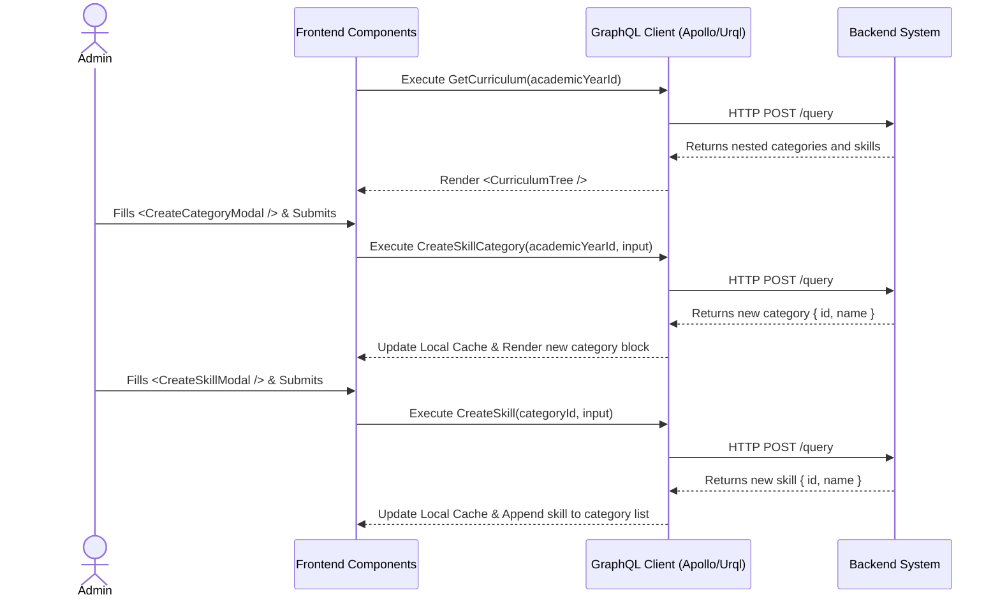

# Curriculum & Skill Configuration Workflow (AI-Optimized)

## 1. Context & Business Rules (Explicit Constraints)
- **Constraint 1 (Scoping):** A `SkillCategory` MUST be tied to exactly one `academic_year_id`. A `Skill` MUST be tied to exactly one `category_id`. Data from one academic year must never leak into another.
- **Constraint 2 (Assessment Impact):** Modifying or soft-deleting a `Skill` does NOT cascade delete past `Assessments`. Historical assessment scores tied to a soft-deleted skill remain intact for record-keeping.
- **Constraint 3 (Soft Delete ONLY):** Deleting a skill triggers `UPDATE skills SET deleted_at = NOW()`.
- **Constraint 4 (Bulk Cloning):** While this workflow handles manual creation, note that the `CloneAcademicYear` mutation (from the Academic Year workflow) can automatically populate this data from a previous year.

## 2. Exact Data Contracts (GraphQL)

### A. Get Curriculum Tree
**Request (Query):**
```graphql
query GetCurriculum($academicYearId: ID!) {
  getSkillCategories(academicYearId: $academicYearId) {
    id
    name
    description
    skills {
      id
      name
      description
    }
  }
}
```

### B. Create Category
**Request (Mutation):**
```graphql
mutation CreateSkillCategory($academicYearId: ID!, $input: CreateSkillCategoryInput!) {
  createSkillCategory(academicYearId: $academicYearId, input: $input) {
    id
    name
    description
  }
}
```
**Input Variables Map:**
```json
{
  "academicYearId": "uuid-of-year",
  "input": {
    "name": "Cognitive Development",
    "description": "Skills related to brain development"
  }
}
```

### C. Create Skill
**Request (Mutation):**
```graphql
mutation CreateSkill($categoryId: ID!, $input: CreateSkillInput!) {
  createSkill(categoryId: $categoryId, input: $input) {
    id
    name
    description
  }
}
```
**Input Variables Map:**
```json
{
  "categoryId": "uuid-of-category",
  "input": {
    "name": "Counts from 1 to 10",
    "description": "Can verbally count sequentially"
  }
}
```

### D. Delete Skill
**Request (Mutation):**
```graphql
mutation DeleteSkill($skillId: ID!) {
  deleteSkill(skillId: $skillId) {
    success
  }
}
```

## 3. UI to Data Mapping

| UI Element (Screen) | GraphQL / Data Source | Action / Trigger |
| ------------------- | --------------------- | ---------------- |
| **Category Header Text** | `getSkillCategories[i].name` | Rendered from Query |
| **Skill Item Text** | `getSkillCategories[i].skills[j].name` | Rendered from Query |
| **"Add Category" Form** | `input.name`, `input.description` | Triggers `CreateSkillCategory` |
| **"Add Skill" Form** | `input.name`, `input.description` | Triggers `CreateSkill` (needs parent `categoryId`) |
| **"Delete" (x) Button** | `skills[j].id` | Triggers `DeleteSkill(skillId)` |

## 4. API Sequence Diagram



## 5. UI/UX Screen Flow & Component Wireframe

### Components to Build:
1. `<CurriculumTab />` - Wrapper component for the `/academic-years/:id` route tab.
2. `<CategoryAccordion />` - Expandable list item for a category.
3. `<SkillListItem />` - Row component for an individual skill.
4. `<CreateCategoryModal />` - Form using TanStack Form + Zod.
5. `<CreateSkillModal />` - Form to create a skill (requires `categoryId` prop).

### Component Wireframe Representation:

```text
=============================================================================
[<AcademicYearDetail /> component active tab: Curriculum]
=============================================================================
Button: [+ Add Skill Category] (Opens <CreateCategoryModal />)

[<CategoryAccordion /> (isExpanded: true)]
  Title: {category.name}                               Button: [Edit]
  -----------------------------------------------------------------
  [<SkillListItem />]
    - {skill.name}                                     [Edit] [Delete]
  [<SkillListItem />]
    - {skill.name}                                     [Edit] [Delete]

  Button: [+ Add Skill to this Category] (Opens <CreateSkillModal />)
-------------------------------------------------------------------

[<CategoryAccordion /> (isExpanded: false)]
  Title: {category.name}                               Button: [Edit]
=============================================================================
```
