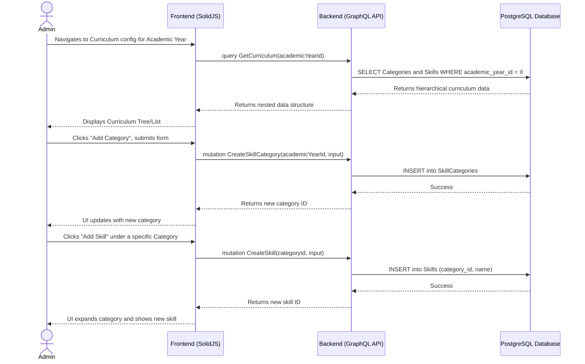

# Curriculum & Skill Configuration Workflow

## 1. Overview
This workflow describes how an Administrator defines the curriculum for a specific Academic Year. It involves creating broad Skill Categories (e.g., "Motor Skills", "Cognitive Development") and then defining specific Skills (e.g., "Can hold a pencil correctly") under those categories. This curriculum configuration is scoped entirely to a single Academic Year to prevent data bleeding between different school years.

## 2. API / GraphQL List
The following GraphQL queries and mutations are utilized in this workflow:

- `query GetCurriculum` - Fetches all Skill Categories and their nested Skills for a specific Academic Year.
- `mutation CreateSkillCategory` - Creates a new top-level category within an Academic Year.
- `mutation UpdateSkillCategory` - Modifies an existing category's name or description.
- `mutation CreateSkill` - Adds a specific skill under a chosen Skill Category.
- `mutation UpdateSkill` - Modifies a skill's name or description.
- `mutation DeleteSkill` - Performs a soft delete on a skill.

## 3. Domain / Table List
The workflow interacts with the following database tables:
- `AcademicYears` (Provides the root ID scope)
- `SkillCategories`
- `Skills`

## 4. API Sequence Diagram



## 5. UI/UX Screen Flow

1. **Academic Year Detail Page (`/admin/academic-years/:id`)**
   - User navigates to the `Curriculum` tab.
2. **Curriculum View**
   - Displays a list or accordions of existing `Skill Categories`.
   - Each category can be expanded to view its associated `Skills`.
   - Primary action button: `[+ Add Skill Category]`.
3. **Add/Edit Category Modal**
   - User inputs `Name` and `Description`.
   - Submits to create or update the category.
4. **Add/Edit Skill Modal**
   - Inside a specific category block, user clicks `[+ Add Skill]`.
   - User inputs `Name` and `Description`.
   - Submits to create or update the skill.
5. **Delete/Archive Action**
   - Next to a skill, user clicks a `[Delete]` icon.
   - Confirmation prompts: "Remove this skill from the curriculum?"
   - Confirmed action removes the skill from the view.

## 6. UI Wireframe

```text
+-----------------------------------------------------------------------------+
|  [Logo] Kindergarten Mgt                           User: Admin | [Logout]   |
+-----------------------------------------------------------------------------+
|                  |                                                          |
|  Dashboard       |  Academic Year: 2026/2027                      [ACTIVE]  |
|                  |  ------------------------------------------------------  |
| > Academic Years |  [Overview]   [Classes]   [Curriculum (Active)]          |
|                  |                                                          |
|  Users           |  Button: [+ Add Skill Category]                          |
|  Teachers        |  ------------------------------------------------------  |
|  Students        |                                                          |
|  Analytics       |  v Cognitive Development (Category)         [Edit]       |
|                  |    - Recognizes primary colors              [Edit] [x]   |
|                  |    - Counts from 1 to 10                    [Edit] [x]   |
|                  |    [+ Add Skill to this Category]                        |
|                  |  ------------------------------------------------------  |
|                  |  > Motor Skills (Category)                  [Edit]       |
|                  |  ------------------------------------------------------  |
|                  |  > Social & Emotional (Category)            [Edit]       |
+-----------------------------------------------------------------------------+
```
