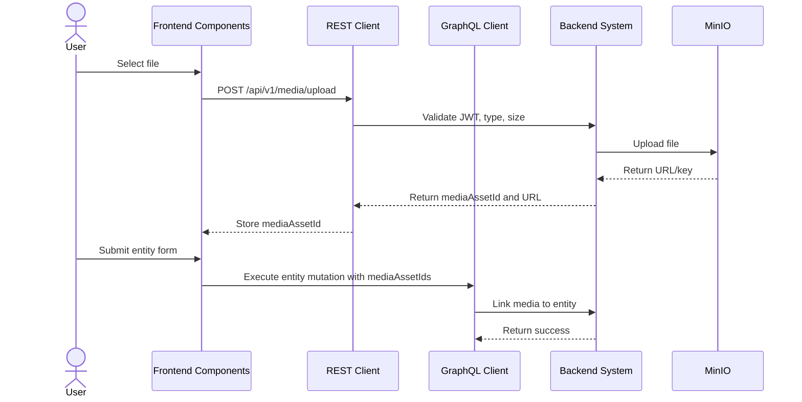

# Media Upload & MinIO Workflow (AI-Optimized)

## 1. Context & Business Rules (Explicit Constraints)
- **Constraint 1 (REST For Upload):** File upload MUST use REST multipart endpoint. Do not upload files through GraphQL.
- **Constraint 2 (Storage Provider):** Store files in MinIO.
- **Constraint 3 (Media DB Record):** Every successful upload MUST create a `MediaAssets` row.
- **Constraint 4 (Uploader Audit):** `MediaAssets.uploader_user_id` MUST come from JWT user ID.
- **Constraint 5 (Supported Types):** Allow only configured safe MIME types such as JPG, PNG, and PDF.
- **Constraint 6 (Size Limit):** Enforce max upload size, default 10 MB unless config says otherwise.
- **Constraint 7 (Entity Linking):** Uploaded media can be linked immediately if `entityType` and `entityId` exist, or linked later using media asset IDs.
- **Constraint 8 (Daily Report Linking):** Daily report photos use `entity_type = "DAILY_REPORT"` and `entity_id = dailyReports.id`.
- **Constraint 9 (URL Return):** Upload response MUST return both `mediaAssetId` and a viewable `url`.
- **Constraint 10 (Strict CRUD Rule):** MediaAsset domain MUST implement create/upload, update/attach, delete by id, delete multiple ids, get by id, get all, and get pagination.

## 2. Exact Data Contracts (REST & GraphQL)

### A. Upload Media
```http
POST /api/v1/media/upload
Authorization: Bearer <accessToken>
Content-Type: multipart/form-data

file: <binary-file>
entityType: "DAILY_REPORT"
entityId: "" optional
```

**Success Response:**
```json
{
  "status": "success",
  "data": {
    "mediaAssetId": "uuid-media",
    "url": "https://minio.example.com/bucket/daily-reports/file.jpg",
    "fileName": "file.jpg",
    "mimeType": "image/jpeg"
  }
}
```

### B. Attach Media Assets
```graphql
mutation AttachMediaAssets($input: AttachMediaAssetsInput!) {
  attachMediaAssets(input: $input) {
    success
    attachedCount
  }
}
```

```json
{
  "input": {
    "entityType": "DAILY_REPORT",
    "entityId": "uuid-report",
    "mediaAssetIds": ["uuid-media-1", "uuid-media-2"]
  }
}
```

### C. Delete Media Asset By Id
```graphql
mutation DeleteMediaAsset($mediaAssetId: ID!) {
  deleteMediaAsset(mediaAssetId: $mediaAssetId) {
    success
    message
  }
}
```

### D. Delete Multiple Media Assets
```graphql
mutation DeleteMediaAssets($mediaAssetIds: [ID!]!) {
  deleteMediaAssets(mediaAssetIds: $mediaAssetIds) {
    success
    message
    deletedCount
  }
}
```

### E. Get Media Asset By Id
```graphql
query GetMediaAssetById($mediaAssetId: ID!) {
  getMediaAssetById(mediaAssetId: $mediaAssetId) {
    id
    entityType
    entityId
    url
    fileName
    mimeType
    createdAt
  }
}
```

### F. Get Media Assets All
```graphql
query GetMediaAssetsAll($entityType: String, $entityId: ID) {
  getMediaAssetsAll(entityType: $entityType, entityId: $entityId) {
    id
    url
    fileName
    mimeType
  }
}
```

### G. Get Media Assets Pagination
```graphql
query GetMediaAssetsPagination($page: Int!, $limit: Int!, $entityType: String) {
  getMediaAssetsPagination(page: $page, limit: $limit, entityType: $entityType) {
    items {
      id
      entityType
      entityId
      url
      fileName
      mimeType
    }
    pagination {
      page
      limit
      totalItems
      totalPages
      hasNextPage
      hasPreviousPage
    }
  }
}
```

## 3. UI to Data Mapping

| UI Element (Screen) | REST / GraphQL Data Source | Action / Trigger |
| ------------------- | -------------------------- | ---------------- |
| **File Input / Dropzone** | local file object | Starts REST upload |
| **Progress Bar** | upload progress event | Shows per-file progress |
| **Thumbnail** | `upload.data.url` | Renders uploaded image |
| **Media Asset IDs** | `upload.data.mediaAssetId` | Stored in form state |
| **Publish Daily Report** | `mediaAssetIds` | Create report then attach media |
| **Retry Button** | failed file | Repeats REST upload |
| **Remove Button** | `mediaAssetId` | Calls `DeleteMediaAsset` if already uploaded |

## 4. API Sequence Diagram



## 5. UI/UX Screen Flow & Component Wireframe

### Components to Build:
1. `<MediaUploader />`
2. `<UploadProgressItem />`
3. `<MediaThumbnail />`
4. `<MediaPreviewGrid />`
5. `<RetryUploadButton />`

### Component Wireframe Representation:

```text
=============================================================================
[<MediaUploader /> component]
=============================================================================
[+ Drop files here]

[<UploadProgressItem />]
file.jpg        80%       [Cancel]
done.jpg        Done      [Remove]
failed.jpg      Failed    [Retry]

[<MediaPreviewGrid />]
[thumbnail] [thumbnail] [thumbnail]
=============================================================================
```

## 6. AI Execution Checklist

```text
1. Implement POST /api/v1/media/upload.
2. Validate JWT on upload.
3. Validate MIME type and max file size.
4. Upload object to MinIO.
5. Insert MediaAssets row with uploader_user_id.
6. Return mediaAssetId and url.
7. Implement attachMediaAssets mutation.
8. Implement MediaAsset CRUD list/get/delete operations.
9. Update daily report create flow to accept or attach mediaAssetIds.
10. Render parent/teacher photos from MediaAssets.url.
11. Test valid image, invalid type, too-large file, and failed MinIO upload.
```
