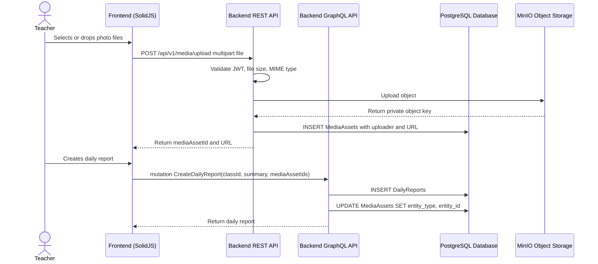

# Media Upload & MinIO Workflow

## 1. Overview
This workflow describes how files are uploaded to private MinIO buckets and linked to application records such as daily reports or profile photos. Media upload uses REST because it requires multipart form-data. Relational linking and retrieval happen through GraphQL and `MediaAssets`.

Teachers upload daily report photos before or during daily report creation. The backend stores the object in MinIO, saves a `MediaAssets` row with the URL, and links the asset to the target entity.

## 2. API / REST and GraphQL List
The following REST endpoints and GraphQL operations are utilized in this workflow:

- `POST /api/v1/media/upload` - Uploads one file to MinIO and creates a `MediaAssets` record.
- `mutation AttachMediaAssets` - Links uploaded media assets to an entity when not linked during upload.
- `mutation DeleteMediaAsset` - Soft deletes or disables one media asset.
- `mutation DeleteMediaAssets` - Soft deletes or disables multiple media assets.
- `query GetMediaAssetById` - Fetches one media asset.
- `query GetMediaAssetsAll` - Fetches media assets by entity type/entity ID.
- `query GetMediaAssetsPagination` - Fetches paginated media assets.

## 3. Domain / Table List
The workflow interacts with the following database tables and services:

- `MediaAssets` - Stores uploader, entity type, entity ID, URL, file name, and MIME type.
- `Users` - Identifies uploader.
- `DailyReports` - Common entity that owns uploaded class photos.
- `Students` - Optional entity for student photos. Student document upload is not included in MVP.
- `MinIO` - Object storage service for uploaded files.

## 4. API Sequence Diagram



## 5. UI/UX Screen Flow

1. **Media Uploader Component**
   - User selects or drags files.
   - UI validates file type and size before upload.
   - Upload progress is shown per file.

2. **Upload To MinIO**
   - Frontend calls `POST /api/v1/media/upload`.
   - Backend uploads file to MinIO.
   - Backend returns `mediaAssetId` and an authorized private/signed `url`.

3. **Attach To Entity**
   - Daily report form stores returned media asset IDs.
   - On submit, `CreateDailyReport` links the media assets to the created report.

4. **Display Media**
   - Parent daily reports and teacher report views render image thumbnails from private/signed `MediaAssets.url` values only after authorization.

## 6. UI Wireframe

```text
+-----------------------------------------------------------------------------+
|  Daily Report Form                                                           |
+-----------------------------------------------------------------------------+
|  Summary                                                                     |
|  [ Today we learned colors and shapes...                                  ]  |
|                                                                             |
|  Photos                                                                      |
|  [+ Drop photos here]                                                        |
|                                                                             |
|  [photo1.jpg  Uploading 80%] [photo2.jpg Done] [photo3.jpg Failed Retry]    |
|                                                                             |
|                                                       [Publish Daily Report] |
+-----------------------------------------------------------------------------+
```
