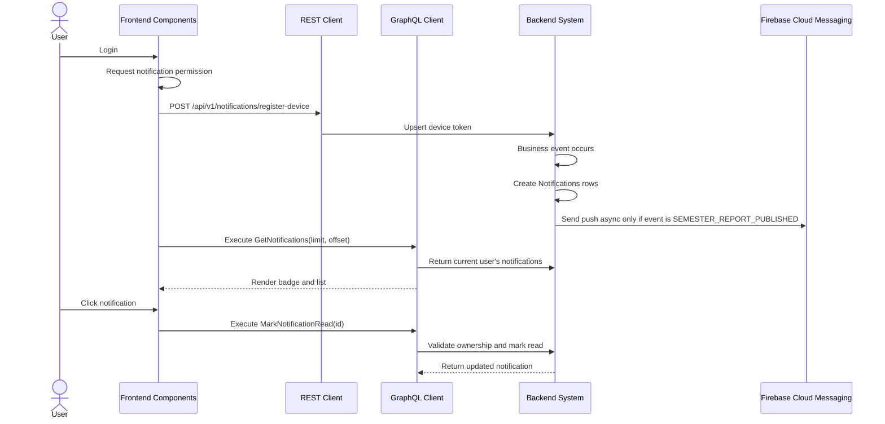

# Notification Management Workflow (AI-Optimized)

## 1. Context & Business Rules (Explicit Constraints)
- **Constraint 1 (User Scoped Reads):** Non-admin users can read only notifications where `Notifications.user_id = JWT userID`.
- **Constraint 2 (Admin All Access):** Admin can query all notifications only through explicit Admin-only operations.
- **Constraint 3 (In-App First):** Backend MUST create a `Notifications` database row for configured notification events.
- **Constraint 4 (Parent Push Scope):** Parent FCM push notifications are sent only for `SEMESTER_REPORT_PUBLISHED` in MVP.
- **Constraint 5 (Async Push):** FCM push sending MUST be asynchronous and must not block business mutations.
- **Constraint 6 (Device Token REST):** Registering device tokens MUST use `POST /api/v1/notifications/register-device`.
- **Constraint 7 (Mark Read Ownership):** User can mark a notification read only if they own it.
- **Constraint 8 (Soft Delete Only):** Delete notification by setting `deleted_at = NOW()` if notification table supports soft delete.
- **Constraint 9 (Entity Reference):** Notifications should store `entityType` and `entityId` when the notification opens a related screen.
- **Constraint 10 (Strict CRUD Rule):** Notification domain MUST implement create, update, delete by id, delete multiple ids, get by id, get all, and get pagination.

## 2. Exact Data Contracts (GraphQL & REST)

### A. Create Notification
```graphql
mutation CreateNotification($input: CreateNotificationInput!) {
  createNotification(input: $input) {
    id
    userId
    title
    body
    type
    isRead
    entityType
    entityId
    createdAt
  }
}
```

### B. Update Notification
```graphql
mutation UpdateNotification($id: ID!, $input: UpdateNotificationInput!) {
  updateNotification(id: $id, input: $input) {
    id
    title
    body
    type
    isRead
  }
}
```

### C. Delete Notification By Id
```graphql
mutation DeleteNotification($id: ID!) {
  deleteNotification(id: $id) {
    success
    message
  }
}
```

### D. Delete Multiple Notifications
```graphql
mutation DeleteNotifications($ids: [ID!]!) {
  deleteNotifications(ids: $ids) {
    success
    message
    deletedCount
  }
}
```

### E. Get Notification By Id
```graphql
query GetNotificationById($id: ID!) {
  getNotificationById(id: $id) {
    id
    title
    body
    type
    isRead
    entityType
    entityId
    createdAt
  }
}
```

### F. Get Notifications All
```graphql
query GetNotificationsAll($userId: ID) {
  getNotificationsAll(userId: $userId) {
    id
    userId
    title
    body
    isRead
    createdAt
  }
}
```

### G. Get Notifications Pagination
```graphql
query GetNotifications($limit: Int, $offset: Int) {
  getNotifications(limit: $limit, offset: $offset) {
    totalCount
    items {
      id
      title
      body
      type
      isRead
      entityType
      entityId
      createdAt
    }
  }
}
```

### H. Mark Notification Read
```graphql
mutation MarkNotificationRead($id: ID!) {
  markNotificationRead(id: $id) {
    id
    isRead
  }
}
```

### I. Mark All Notifications Read
```graphql
mutation MarkAllNotificationsRead {
  markAllNotificationsRead {
    success
  }
}
```

### J. Register Device Token
```http
POST /api/v1/notifications/register-device
Authorization: Bearer <accessToken>
Content-Type: application/json

{
  "fcmToken": "browser-fcm-token",
  "deviceName": "Chrome on Windows"
}
```

## 3. UI to Data Mapping

| UI Element (Screen) | GraphQL / REST Data Source | Action / Trigger |
| ------------------- | -------------------------- | ---------------- |
| **Bell Badge** | `getNotifications.items.isRead` | Count unread notifications |
| **Notification List** | `getNotifications.items` | Render notifications |
| **Notification Click** | `notification.id` | Calls `MarkNotificationRead` |
| **Mark All Read Button** | current user context | Calls `MarkAllNotificationsRead` |
| **Device Permission Prompt** | Browser Notification API | Requests permission after login |
| **FCM Token Registration** | REST endpoint | Sends token to backend |
| **Admin Notification Table** | `getNotificationsAll` or pagination | Admin monitoring only |

## 4. API Sequence Diagram



## 5. UI/UX Screen Flow & Component Wireframe

### Components to Build:
1. `<NotificationBell />`
2. `<NotificationList />`
3. `<NotificationItem />`
4. `<MarkAllNotificationsReadButton />`
5. `<PushNotificationRegistrar />`
6. `<AdminNotificationsPage />`

### Component Wireframe Representation:

```text
=============================================================================
[<NotificationBell /> component]
=============================================================================
Bell Icon     Badge: {unreadCount}

[<NotificationList />]
--------------------------------------------------------
{status} {title}
{body}
{createdAt}
--------------------------------------------------------
Button: [Mark All Read]
=============================================================================
```

## 6. AI Execution Checklist

```text
1. Implement Notification 7 CRUD operations.
2. Implement MarkNotificationRead and MarkAllNotificationsRead.
3. Restrict normal users to their own notifications.
4. Add Admin-only get all/pagination for monitoring.
5. Implement register-device REST endpoint.
6. Create notification rows for daily report, attendance, semester report, registration review, and enrollment events.
7. Send FCM push asynchronously only for semester report published.
8. Keep in-app notification if push fails.
9. Add notification bell and list in frontend.
10. Test ownership: User A cannot read or mark User B notification.
```
