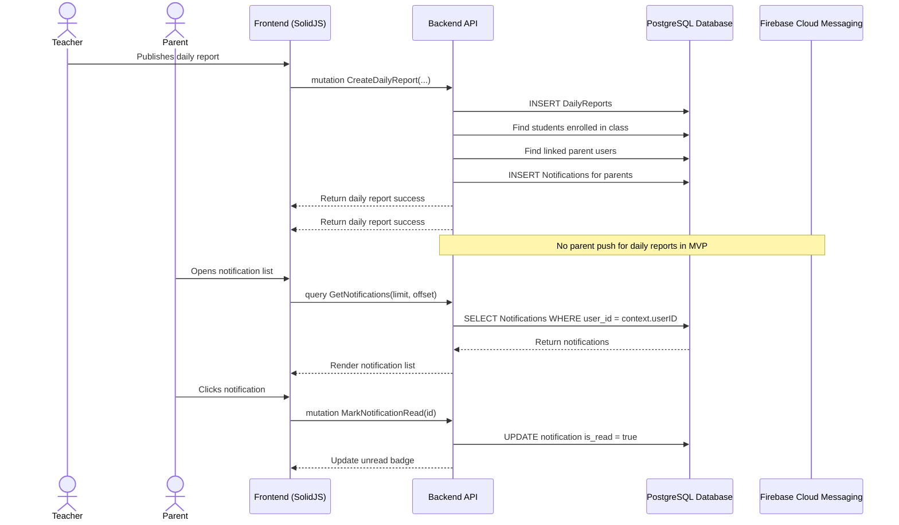

# Notification Management Workflow

## 1. Overview
This workflow describes how the system creates, stores, sends, reads, and manages notifications across Admin, Teacher, and Parent roles. Notifications support in-app notification lists. Push notifications through Firebase Cloud Messaging (FCM) are sent to parents only when semester reports are published in MVP.

The backend creates notification records when important events happen, such as attendance updates, daily report publication, semester report publication, registration approval/rejection, and student enrollment. For MVP, FCM push sending is limited to semester report publication and must be asynchronous.

## 2. API / GraphQL and REST List
The following operations are utilized in this workflow:

- `query GetNotifications` - Fetches notifications for the authenticated user.
- `query GetNotificationById` - Fetches one notification owned by the authenticated user.
- `query GetNotificationsAll` - Admin-only query for all notifications.
- `query GetNotificationsPagination` - Fetches paginated notifications.
- `mutation CreateNotification` - System/Admin creates a notification record.
- `mutation UpdateNotification` - Updates notification metadata.
- `mutation DeleteNotification` - Soft deletes one notification.
- `mutation DeleteNotifications` - Soft deletes multiple notifications.
- `mutation MarkNotificationRead` - Marks one notification as read.
- `mutation MarkAllNotificationsRead` - Marks all current user's notifications as read.
- `POST /api/v1/notifications/register-device` - Registers an FCM device token.

## 3. Domain / Table List
The workflow interacts with the following database tables and services:

- `Notifications` - Stores title, body, type, read state, entity reference, and recipient.
- `DeviceTokens` - Stores FCM tokens for each user/device.
- `Users` - Provides notification recipient identity.
- `ParentStudentLinks` - Finds parents linked to a student.
- `StudentEnrollments` - Finds class/student relationships for notification targeting.
- `Firebase Cloud Messaging` - Sends push notifications.

## 4. API Sequence Diagram



## 5. UI/UX Screen Flow

1. **Notification Trigger**
   - Teacher/Admin performs an action that should notify users.
   - Backend creates `Notifications` rows inside or near the business transaction.
   - Backend schedules async push delivery to FCM device tokens.

2. **Notification Bell**
   - Frontend fetches notifications using TanStack Query polling.
   - Badge shows unread count.

3. **Notification List**
   - User opens notification list.
   - User can click one notification to mark it read.
   - User can click `[Mark All Read]`.

4. **Device Registration**
   - After login, frontend requests browser notification permission.
   - If permission is granted, frontend registers the FCM token through REST.
   - The registered token is used for semester report published push notifications.

## 6. UI Wireframe

```text
+-----------------------------------------------------------------------------+
|  [Logo] Kindergarten Mgt                    [Bell: 3] User: Parent | Logout |
+-----------------------------------------------------------------------------+
|                                                                             |
|  Notifications                                                              |
|  -------------------------------------------------------------------------  |
|  [Unread] New daily report from Lion Class A              2026-08-12 10:00  |
|  [Unread] Attendance marked for Timmy Wijaya              2026-08-12 09:00  |
|  [Read]   Semester report published                       2026-08-10 15:30  |
|                                                                             |
|                                                  [Mark All Read]             |
+-----------------------------------------------------------------------------+
```
