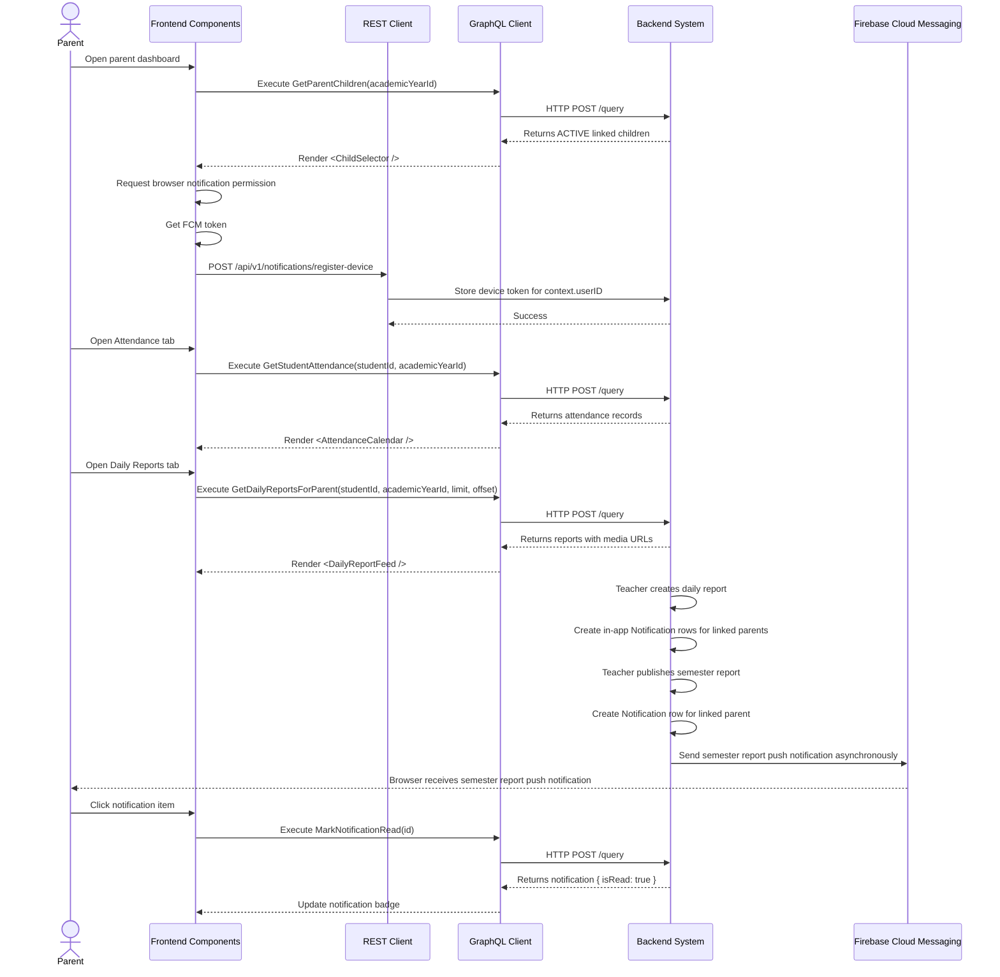

# Parent Monitoring & Engagement Workflow (AI-Optimized)

## 1. Context & Business Rules (Explicit Constraints)
- **Constraint 1 (Parent Ownership):** Parent can only access a child if `ParentStudentLinks.parent_user_id == JWT userID`.
- **Constraint 2 (Visible Child Status):** Parent monitoring screens MUST show only children where `Students.status = "ACTIVE"`. Do NOT use `APPROVED`.
- **Constraint 3 (Academic Year Scope):** Attendance, assessments, daily reports, and semester reports MUST be filtered by `academicYearId`.
- **Constraint 4 (Enrollment Scope):** Daily reports are class-based. Parent can view a daily report only when the selected child is enrolled in that report's `classId` for the selected academic year.
- **Constraint 5 (Published Semester Reports Only):** Parent can view semester reports only when `SemesterReports.status = "PUBLISHED"`.
- **Constraint 6 (Read-Only Parent):** Parent cannot create, update, or delete attendance, assessments, daily reports, semester reports, classes, skills, or enrollments.
- **Constraint 7 (Device Token Registration):** Push notification device registration uses REST, not GraphQL: `POST /api/v1/notifications/register-device`.
- **Constraint 8 (Notification Creation):** Backend creates notification records when teacher/admin actions happen. Parent only reads and marks notifications as read.
- **Constraint 9 (Push Async Rule):** Sending FCM push notifications MUST NOT block the GraphQL mutation response. It should run asynchronously.
- **Constraint 10 (Media URLs):** Daily report photos are stored through MinIO upload flow and displayed to Parent using returned media URLs from `MediaAssets`.
- **Constraint 11 (Parent Push Scope):** Parent push notifications are sent only for `SEMESTER_REPORT_PUBLISHED` in MVP. Attendance and daily report updates can be in-app notifications only.
- **Constraint 12 (Strict CRUD Rule):** Notification and monitoring-related domains must still follow the global 7-operation GraphQL CRUD rule where applicable: create, update, delete by id, delete multiple ids, get by id, get all, get pagination.

## 2. Exact Data Contracts (GraphQL & REST)

### A. Get Parent Children
**Request (Query):**
```graphql
query GetParentChildren($academicYearId: ID) {
  getParentChildren(academicYearId: $academicYearId) {
    student {
      id
      firstName
      lastName
      dob
      status
    }
    enrollment {
      id
      enrolledDate
      class {
        id
        name
      }
    }
    academicYear {
      id
      name
    }
  }
}
```

**Required Backend Behavior:**
```text
1. Read JWT userID from context.
2. Find ParentStudentLinks where parent_user_id = context.userID.
3. Return only linked students with status ACTIVE.
4. If academicYearId is provided, return enrollment data for that year only.
5. Never return students with PENDING, REJECTED, or ARCHIVED status.
```

### B. Get Student Attendance
**Request (Query):**
```graphql
query GetStudentAttendance($studentId: ID!, $academicYearId: ID!) {
  getStudentAttendance(studentId: $studentId, academicYearId: $academicYearId) {
    id
    date
    status
    remarks
    class {
      id
      name
    }
  }
}
```

**Validation Rule:**
```text
If role is PARENT:
- studentId must be linked to context.userID in ParentStudentLinks.
- student.status must be ACTIVE.
- return attendance only for academicYearId.

If not valid:
- return FORBIDDEN.
```

### C. Get Daily Reports For Parent
**Request (Query):**
```graphql
query GetDailyReportsForParent($studentId: ID!, $academicYearId: ID!, $limit: Int, $offset: Int) {
  getDailyReportsForParent(studentId: $studentId, academicYearId: $academicYearId, limit: $limit, offset: $offset) {
    totalCount
    items {
      id
      date
      summary
      class {
        id
        name
      }
      submittedBy {
        id
        profile {
          firstName
          lastName
        }
      }
      mediaAssets {
        id
        url
        fileName
        mimeType
      }
    }
  }
}
```

**Required Backend Behavior:**
```text
1. Validate parent owns student through ParentStudentLinks.
2. Validate student.status = ACTIVE.
3. Find student's enrollment for academicYearId.
4. Use enrollment.classId to fetch DailyReports for that class and academicYearId.
5. Attach MediaAssets where entity_type = DAILY_REPORT and entity_id = daily_report.id.
6. Return paginated result.
```

### D. Get Student Assessments
**Request (Query):**
```graphql
query GetStudentAssessments($studentId: ID!, $academicYearId: ID!) {
  getStudentAssessments(studentId: $studentId, academicYearId: $academicYearId) {
    id
    skillId
    skill {
      id
      name
      category {
        id
        name
      }
    }
    score
    remarks
    semesterId
    academicYearId
  }
}
```

**Validation Rule:**
```text
Parent can only query assessments for their linked ACTIVE children.
```

### E. Get Published Semester Reports
**Request (Query):**
```graphql
query GetSemesterReportsPagination($studentId: ID!, $academicYearId: ID!, $limit: Int, $offset: Int) {
  getSemesterReportsPagination(studentId: $studentId, academicYearId: $academicYearId, limit: $limit, offset: $offset) {
    totalCount
    items {
      id
      semesterId
      status
      summaryRemarks
      attendanceCounts {
        present
        absent
        excused
        late
      }
      skillAverages {
        skillId
        skillName
        totalScore
        count
        average
      }
    }
  }
}
```

**Validation Rule:**
```text
If role is PARENT:
- return only reports where status = PUBLISHED.
- reject access if student is not linked to parent.
```

### F. Register Device Token For Push Notifications
**Request (REST):**
```http
POST /api/v1/notifications/register-device
Content-Type: application/json
Authorization: Bearer <jwt_token>

{
  "fcmToken": "fcm-token-from-browser",
  "deviceName": "Chrome on Windows"
}
```

**Success Response:**
```json
{
  "status": "success",
  "data": null
}
```

**Required Backend Behavior:**
```text
1. Validate JWT.
2. Upsert DeviceTokens by user_id + fcm_token.
3. Store deviceName.
4. Return success.
```

### G. Get Notifications
**Request (Query):**
```graphql
query GetNotifications($limit: Int, $offset: Int) {
  getNotifications(limit: $limit, offset: $offset) {
    totalCount
    items {
      id
      title
      body
      type
      isRead
      entityType
      entityId
      createdAt
    }
  }
}
```

**Validation Rule:**
```text
Return only Notifications where user_id = context.userID.
```

### H. Mark Notification Read
**Request (Mutation):**
```graphql
mutation MarkNotificationRead($id: ID!) {
  markNotificationRead(id: $id) {
    id
    isRead
  }
}
```

**Validation Rule:**
```text
Allow only if notification.user_id = context.userID.
```

### I. Mark All Notifications Read
**Request (Mutation):**
```graphql
mutation MarkAllNotificationsRead {
  markAllNotificationsRead {
    success
  }
}
```

**Validation Rule:**
```text
Update only notifications where user_id = context.userID.
```

## 3. UI to Data Mapping

| UI Element (Screen) | GraphQL / REST Data Source | Action / Trigger |
| ------------------- | -------------------------- | ---------------- |
| **Child Selector** | `getParentChildren` | Sets selected `studentId` and `academicYearId` context |
| **Academic Year Selector** | `getParentChildren.academicYear` or `getAcademicYears` | Refetches child-scoped monitoring queries |
| **Attendance Summary Cards** | `getStudentAttendance` | Count statuses client-side or use backend analytics |
| **Attendance Calendar/List** | `getStudentAttendance[i].date/status/remarks` | Render parent read-only view |
| **Daily Report Feed** | `getDailyReportsForParent.items` | Render paginated daily report list |
| **Daily Report Photos** | `mediaAssets[i].url` | Render image thumbnails from MinIO URLs |
| **Progress Skill Rows** | `getStudentAssessments` | Render grouped progress by skill category |
| **Semester Report Cards** | `getSemesterReportsPagination.items` | Render published reports only |
| **Notification Badge** | `getNotifications.items.isRead` | Count unread notifications |
| **Notification List** | `getNotifications.items` | Render title, body, and timestamp |
| **Notification Click** | `notification.id` | Calls `MarkNotificationRead` |
| **Mark All Read Button** | N/A | Calls `MarkAllNotificationsRead` |
| **Browser Push Permission** | Browser Notifications API | Requests permission after parent login |
| **Device Token Registration** | `POST /api/v1/notifications/register-device` | Sends FCM token to backend |

## 4. API Sequence Diagram



## 5. UI/UX Screen Flow & Component Wireframe

### Components to Build:
1. `<ParentDashboard />` - Parent landing page that loads `GetParentChildren`.
2. `<ChildSelector />` - Lets parent switch between active linked children.
3. `<ParentAttendancePage />` - Loads and displays `GetStudentAttendance`.
4. `<AttendanceSummaryCards />` - Counts attendance statuses.
5. `<AttendanceCalendar />` - Read-only calendar/list of attendance records.
6. `<ParentDailyReportsPage />` - Loads and displays `GetDailyReportsForParent`.
7. `<DailyReportFeed />` - Paginated report feed.
8. `<DailyReportCard />` - Displays date, summary, teacher, class, and media thumbnails.
9. `<ParentProgressPage />` - Loads and displays `GetStudentAssessments`.
10. `<ParentSemesterReportsPage />` - Loads published semester reports only.
11. `<NotificationBell />` - Shows unread count from `GetNotifications`.
12. `<NotificationList />` - Notification dropdown/page.
13. `<PushNotificationRegistrar />` - Requests permission and sends FCM token through REST.

### Component Wireframe Representation:

```text
=============================================================================
[<ParentDashboard /> component]                          User: Parent
=============================================================================
[<ChildSelector />] Child: [Timmy Wijaya v]
Academic Year: [2026/2027 v]

[<AttendanceSummaryCards />]
[ Present: 18 ] [ Absent: 1 ] [ Late: 0 ] [ Excused: 1 ]

[Latest Daily Report]
Date: {dailyReport.date}
Summary: {dailyReport.summary}
Photos: {mediaAssets.map(url => thumbnail)}

[Recent Notifications]
- {notification.title}
- {notification.title}
=============================================================================
```

```text
=============================================================================
[<ParentAttendancePage /> component]                     User: Parent
=============================================================================
[<ChildSelector />] Child: [Timmy Wijaya v]
Month: [August 2026 v]

[<AttendanceSummaryCards />]
[ Present: {count} ] [ Absent: {count} ] [ Late: {count} ] [ Excused: {count} ]

[<AttendanceCalendar />]
--------------------------------------------------------
Date            | Status      | Remarks
--------------------------------------------------------
{date}          | {status}    | {remarks}
--------------------------------------------------------
=============================================================================
```

```text
=============================================================================
[<ParentDailyReportsPage /> component]                   User: Parent
=============================================================================
[<ChildSelector />] Child: [Timmy Wijaya v]
Filter: [This Week v]

[<DailyReportFeed />]
--------------------------------------------------------
[<DailyReportCard />]
Date: {report.date}     Class: {report.class.name}
Teacher: {submittedBy.profile.firstName} {submittedBy.profile.lastName}
Summary:
{report.summary}
Photos:
[thumbnail from mediaAssets[0].url] [thumbnail from mediaAssets[1].url]
--------------------------------------------------------

[PaginationControls]
< Prev      Page {page}      Next >
=============================================================================
```

```text
=============================================================================
[<NotificationBell /> + <NotificationList /> component]  User: Parent
=============================================================================
Bell: [icon] Badge: {unreadCount}

Notification List:
--------------------------------------------------------
{title}
{body}
{createdAt}
Button/Click: Mark as read
--------------------------------------------------------

Button: [Mark All Read]
=============================================================================
```

## 6. AI Execution Checklist

Use this checklist when implementing the workflow:

```text
1. Make sure parent monitoring never checks for student status APPROVED.
   Use ACTIVE only.

2. Implement or verify GetParentChildren:
   - filters by ParentStudentLinks.parent_user_id = context.userID
   - filters Students.status = ACTIVE
   - supports optional academicYearId

3. Implement or verify GetStudentAttendance:
   - validates parent owns student
   - filters by academicYearId
   - returns status, date, remarks, and class

4. Add GetDailyReportsForParent if it does not exist:
   - input: studentId, academicYearId, limit, offset
   - validate parent owns student
   - find student's enrollment class
   - fetch class DailyReports
   - attach MediaAssets MinIO URLs

5. Verify GetStudentAssessments parent access:
   - parent can only view linked ACTIVE children
   - filter by academicYearId

6. Verify GetSemesterReportsPagination parent access:
   - parent can only view linked ACTIVE children
   - parent receives only PUBLISHED reports

7. Implement REST register-device endpoint:
   POST /api/v1/notifications/register-device
   - validate JWT
   - upsert DeviceTokens

8. Implement notification creation triggers:
   - attendance marked
   - daily report created
   - semester report published

9. Send FCM push asynchronously only for semester report published:
   - do not block mutation response
   - still create Notifications row even if FCM send fails

10. Add frontend pages:
    /parent/dashboard
    /parent/attendance
    /parent/progress
    /parent/daily-reports
    /parent/reports
    /parent/notifications

11. Add frontend components:
    ChildSelector
    AttendanceSummaryCards
    AttendanceCalendar
    DailyReportFeed
    DailyReportCard
    NotificationBell
    NotificationList
    PushNotificationRegistrar

12. Test the full path:
    Teacher marks attendance -> Parent sees attendance.
    Teacher creates daily report with MinIO photos -> Parent sees report and photos.
    Backend creates notification -> Parent sees unread badge.
    Semester report published -> Browser receives push notification -> Parent opens notification -> notification becomes read.
```
