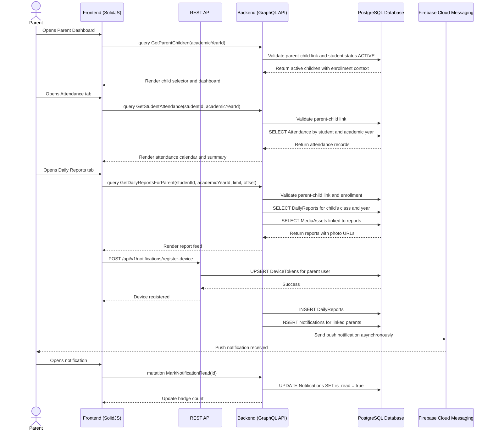

# Parent Monitoring & Engagement Workflow

## 1. Overview
This workflow describes how a Parent monitors an active child after registration approval. The Parent can view attendance records, daily classroom reports, photos, progress summaries, semester reports, and receive push notifications when semester reports are published.

Parent access is strictly scoped to children linked through `ParentStudentLinks` and only children with `status = "ACTIVE"` are visible in monitoring screens. The system must not use `APPROVED` as a student status.

## 2. API / GraphQL List
The following GraphQL queries, mutations, and REST endpoints are utilized in this workflow:

- `query GetParentChildren` - Fetches children linked to the authenticated parent, filtered to `ACTIVE` children only.
- `query GetStudentAttendance` - Fetches attendance records for a selected child and academic year.
- `query GetDailyReportsForParent` - Fetches daily reports visible to the parent for the child's enrolled class.
- `query GetStudentAssessments` - Fetches child assessment records for skill progress display.
- `query GetSemesterReportsPagination` - Fetches published semester reports for the selected child.
- `query GetNotifications` - Fetches parent notifications.
- `mutation MarkNotificationRead` - Marks one notification as read.
- `mutation MarkAllNotificationsRead` - Marks all parent notifications as read.
- `POST /api/v1/notifications/register-device` - Registers a browser/device FCM token for push notifications.

## 3. Domain / Table List
The workflow interacts with the following database tables:

- `Users` - Identifies the authenticated parent.
- `Students` - Stores child data and status.
- `ParentStudentLinks` - Enforces parent-child access ownership.
- `AcademicYears` - Scopes attendance, assessments, and reports.
- `Classes` - Provides child class context through enrollment.
- `StudentEnrollments` - Links active children to classes and academic years.
- `Attendance` - Stores attendance status and remarks.
- `DailyReports` - Stores daily class summaries.
- `MediaAssets` - Stores private MinIO media metadata and authorized private/signed URLs for report photos.
- `Assessments` - Stores skill-based progress data.
- `SemesterReports` - Stores published semester summaries.
- `Notifications` - Stores in-app notification records.
- `DeviceTokens` - Stores FCM tokens for push notifications.

## 4. API Sequence Diagram



## 5. UI/UX Screen Flow

1. **Parent Dashboard (`/parent/dashboard`)**
   - Parent sees only children linked to their account with `status = ACTIVE`.
   - If multiple active children exist, parent selects one child.
   - Dashboard shows attendance summary, latest daily report, unread notification count, and semester report availability.

2. **Attendance Monitoring (`/parent/attendance`)**
   - Parent selects child and academic year.
   - UI displays attendance records as a calendar/list.
   - Summary cards show counts for `PRESENT`, `ABSENT`, `EXCUSED`, and `LATE`.

3. **Daily Reports Feed (`/parent/reports` or `/parent/daily-reports`)**
   - Parent sees a paginated feed of daily reports for the selected child's class.
   - Each report shows date, teacher/class summary, and uploaded photo thumbnails from MinIO URLs.
   - Parent can filter by week/month on the frontend.

4. **Progress Monitoring (`/parent/progress`)**
   - Parent views skill assessment progress grouped by skill category.
   - UI can show latest score, average score, and teacher remarks.

5. **Semester Reports (`/parent/reports`)**
   - Parent can view only semester reports with `status = PUBLISHED`.
   - Draft reports are hidden from Parent.

6. **Push Notifications**
   - Frontend asks browser permission for notifications after Parent logs in.
   - Frontend registers the FCM token through `POST /api/v1/notifications/register-device`.
   - Parent receives push notifications for semester report publishing only.
   - Attendance and daily report updates may appear as in-app notifications, but they do not send push notifications in MVP.
   - Notification list and badge update through polling or TanStack Query refetching.

## 6. UI Wireframe

```text
+-----------------------------------------------------------------------------+
|  [Logo] Kindergarten Mgt                         User: Parent | [Logout]    |
+-----------------------------------------------------------------------------+
|                  |                                                          |
| > Dashboard      |  Parent Dashboard                                        |
|  Attendance      |  Child: [Timmy Wijaya v]     Academic Year: [2026/2027]  |
|  Progress        |  ------------------------------------------------------  |
|  Daily Reports   |  Attendance Summary                                      |
|  Semester Reports|  [Present: 18] [Absent: 1] [Late: 0] [Excused: 1]       |
|  Notifications   |                                                          |
|                  |  Latest Daily Report                                     |
|                  |  Date: 2026-08-12                                       |
|                  |  Summary: Today we learned shapes and practiced sharing. |
|                  |  Photos: [thumb] [thumb] [thumb]                         |
|                  |                                                          |
|                  |  Recent Notifications                                    |
|                  |  - New daily report from Lion Class A                     |
|                  |  - Attendance marked for today                            |
+-----------------------------------------------------------------------------+

+-----------------------------------------------------------------------------+
|  [Logo] Kindergarten Mgt                         User: Parent | [Logout]    |
+-----------------------------------------------------------------------------+
|                  |                                                          |
|  Dashboard       |  Attendance                                              |
| > Attendance     |  Child: [Timmy Wijaya v]     Month: [August 2026 v]      |
|  Progress        |  ------------------------------------------------------  |
|  Daily Reports   |  Calendar/List                                           |
|                  |  2026-08-01  PRESENT                                     |
|                  |  2026-08-02  PRESENT                                     |
|                  |  2026-08-03  ABSENT        Remarks: Sick                 |
|                  |  2026-08-04  EXCUSED       Remarks: Family event         |
+-----------------------------------------------------------------------------+

+-----------------------------------------------------------------------------+
|  [Logo] Kindergarten Mgt                         User: Parent | [Logout]    |
+-----------------------------------------------------------------------------+
|                  |                                                          |
|  Dashboard       |  Daily Reports                                           |
|  Attendance      |  Child: [Timmy Wijaya v]                                 |
| > Daily Reports  |  ------------------------------------------------------  |
|                  |  2026-08-12 | Lion Class A                                |
|                  |  Today we learned shapes and practiced sharing.           |
|                  |  [Photo URL from MinIO] [Photo URL from MinIO]            |
|                  |                                                          |
|                  |  2026-08-11 | Lion Class A                                |
|                  |  Outdoor play and counting activity.                      |
|                  |  [Photo URL from MinIO]                                   |
+-----------------------------------------------------------------------------+
```
