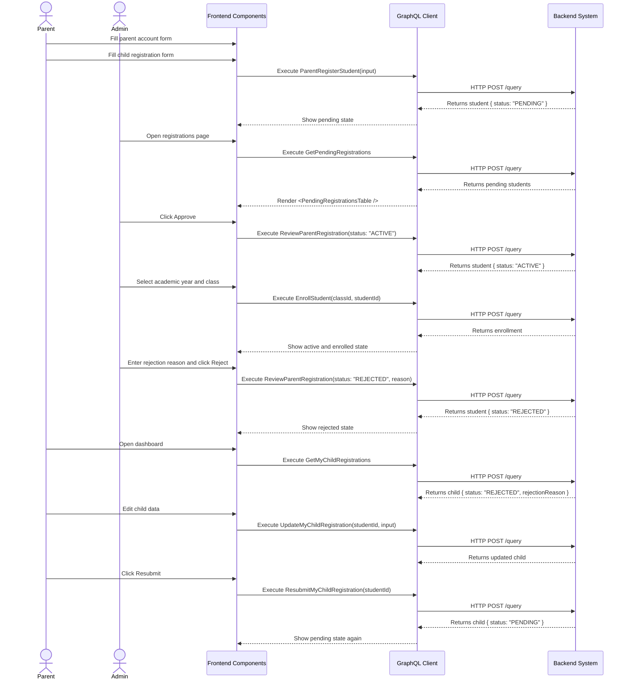

# Parent Self-Service Registration Workflow (AI-Optimized)

## 1. Context & Business Rules (Explicit Constraints)
- **Constraint 1 (Canonical Status Values):** Student registration status MUST use only these values in this workflow: `PENDING`, `ACTIVE`, `REJECTED`, `ARCHIVED`. Do NOT use `APPROVED`. Approval means `status = "ACTIVE"`.
- **Constraint 2 (Initial Status):** `ParentRegisterStudent` MUST create the child student record with `status = "PENDING"`.
- **Constraint 3 (Atomic Creation):** `ParentRegisterStudent` MUST create `Users`, `Profiles`, `Students`, and `ParentStudentLinks` in one database transaction. If one insert fails, all inserts must roll back.
- **Constraint 4 (Review Ownership):** Only Admin can approve or reject child registrations. Parent cannot set a child to `ACTIVE`.
- **Constraint 5 (Resubmission Rule):** Parent can resubmit ONLY when the child status is `REJECTED`. Resubmission changes status from `REJECTED` to `PENDING`.
- **Constraint 6 (Edit Rule):** Parent can edit child registration fields only when status is `PENDING` or `REJECTED`. Parent cannot edit child registration fields when status is `ACTIVE` or `ARCHIVED`.
- **Constraint 7 (Enrollment Rule):** A child can be enrolled into a class only after status becomes `ACTIVE`.
- **Constraint 8 (Access Control):** Parent queries and mutations MUST only access children linked to the JWT `userID` through `ParentStudentLinks`.
- **Constraint 9 (Strict CRUD Rule):** Registration-related domains must still follow the global 7-operation GraphQL CRUD rule where applicable: create, update, delete by id, delete multiple ids, get by id, get all, get pagination.

## 2. Exact Data Contracts (GraphQL)

### A. Parent Registers Account With Child
**Request (Mutation):**
```graphql
mutation ParentRegisterStudent($input: ParentRegisterStudentInput!) {
  parentRegisterStudent(input: $input) {
    success
    message
    student {
      id
      firstName
      lastName
      dob
      status
    }
  }
}
```

**Input Variables Map:**
```json
{
  "input": {
    "email": "parent@email.com",
    "password": "TempPassword123!",
    "firstName": "Sarah",
    "lastName": "Wijaya",
    "phone": "+628123456789",
    "relationshipType": "Mother",
    "childFirstName": "Timmy",
    "childLastName": "Wijaya",
    "childDOB": "2021-05-10"
  }
}
```

**Required Backend Behavior:**
```text
1. Create parent user with role PARENT.
2. Create parent profile.
3. Create student with status PENDING.
4. Create parent-student link.
5. Return student data.
```

### B. Parent Gets Own Child Registrations
**Request (Query):**
```graphql
query GetMyChildRegistrations {
  getMyChildRegistrations {
    student {
      id
      firstName
      lastName
      dob
      status
      rejectionReason
    }
    enrollment {
      id
      enrolledDate
      class {
        id
        name
      }
    }
    academicYear {
      id
      name
    }
  }
}
```

**Access Rule:**
```text
Return only children linked to context.userID through ParentStudentLinks.
```

### C. Parent Updates Rejected Or Pending Child Registration
**Request (Mutation):**
```graphql
mutation UpdateMyChildRegistration($studentId: ID!, $input: UpdateMyChildRegistrationInput!) {
  updateMyChildRegistration(studentId: $studentId, input: $input) {
    id
    firstName
    lastName
    dob
    status
  }
}
```

**Input Variables Map:**
```json
{
  "studentId": "uuid-student",
  "input": {
    "firstName": "Timmy",
    "lastName": "Wijaya",
    "dob": "2021-05-10"
  }
}
```

**Validation Rule:**
```text
Allow update only if:
- student is linked to parent JWT userID
- student.status is PENDING or REJECTED
```

### D. Parent Resubmits Rejected Child Registration
**Request (Mutation):**
```graphql
mutation ResubmitMyChildRegistration($studentId: ID!) {
  resubmitMyChildRegistration(studentId: $studentId) {
    id
    status
  }
}
```

**State Change:**
```text
Before: REJECTED
After:  PENDING
```

**Validation Rule:**
```text
Allow resubmit only if:
- student is linked to parent JWT userID
- student.status is REJECTED
```

### E. Admin Gets Pending Registrations
**Request (Query):**
```graphql
query GetPendingRegistrations {
  getPendingRegistrations {
    id
    firstName
    lastName
    dob
    status
    parent {
      id
      email
      profile {
        firstName
        lastName
        phone
      }
    }
  }
}
```

**Validation Rule:**
```text
Only ADMIN can call this query.
Return only students where status = PENDING.
```

### F. Admin Gets One Registration Detail
**Request (Query):**
```graphql
query GetRegistrationById($studentId: ID!) {
  getRegistrationById(studentId: $studentId) {
    id
    firstName
    lastName
    dob
    status
    rejectionReason
    parent {
      id
      email
      profile {
        firstName
        lastName
        phone
      }
    }
  }
}
```

### G. Admin Reviews Registration
**Request (Mutation):**
```graphql
mutation ReviewParentRegistration($studentId: ID!, $input: ReviewRegistrationInput!) {
  reviewParentRegistration(studentId: $studentId, input: $input) {
    id
    firstName
    lastName
    status
    rejectionReason
  }
}
```

**Approve Input Variables Map:**
```json
{
  "studentId": "uuid-student",
  "input": {
    "status": "ACTIVE",
    "rejectionReason": null
  }
}
```

**Reject Input Variables Map:**
```json
{
  "studentId": "uuid-student",
  "input": {
    "status": "REJECTED",
    "rejectionReason": "Birth date needs correction."
  }
}
```

**Validation Rule:**
```text
Only ADMIN can call this mutation.
Input status must be ACTIVE or REJECTED.
If status is REJECTED, rejectionReason is required.
If status is ACTIVE, rejectionReason must be cleared.
```

### H. Admin Enrolls Active Student
**Request (Mutation):**
```graphql
mutation EnrollStudent($classId: ID!, $studentId: ID!) {
  enrollStudent(classId: $classId, studentId: $studentId) {
    id
    enrolledDate
    student {
      id
      status
    }
    class {
      id
      name
      academicYearId
    }
  }
}
```

**Validation Rule:**
```text
Allow enrollment only if student.status = ACTIVE.
Reject enrollment if student.status = PENDING, REJECTED, or ARCHIVED.
```

## 3. UI to Data Mapping

| UI Element (Screen) | GraphQL / Data Source | Action / Trigger |
| ------------------- | --------------------- | ---------------- |
| **Parent Email Input** | `input.email` | Sent to `ParentRegisterStudent` |
| **Parent Password Input** | `input.password` | Sent to `ParentRegisterStudent` |
| **Parent Name Inputs** | `input.firstName`, `input.lastName` | Sent to `ParentRegisterStudent` |
| **Relationship Dropdown** | `input.relationshipType` | Sent to `ParentRegisterStudent` |
| **Child Name Inputs** | `input.childFirstName`, `input.childLastName` | Sent to `ParentRegisterStudent` |
| **Child DOB Picker** | `input.childDOB` | Sent to `ParentRegisterStudent` in `YYYY-MM-DD` format |
| **Parent Child Status Badge** | `getMyChildRegistrations[i].student.status` | Render `PENDING`, `ACTIVE`, `REJECTED`, or `ARCHIVED` |
| **Rejection Reason Text** | `student.rejectionReason` | Show only when status is `REJECTED` |
| **Edit Child Form** | `UpdateMyChildRegistrationInput` | Enabled only for `PENDING` or `REJECTED` |
| **Resubmit Button** | `student.id` | Calls `ResubmitMyChildRegistration` only when status is `REJECTED` |
| **Admin Pending Table** | `getPendingRegistrations` | Renders students waiting for review |
| **Approve Button** | `student.id` | Calls `ReviewParentRegistration(status: "ACTIVE")` |
| **Reject Button** | `student.id`, `rejectionReason` | Calls `ReviewParentRegistration(status: "REJECTED")` |
| **Academic Year Dropdown** | `getAcademicYears` | Admin selects enrollment year after approval |
| **Class Dropdown** | `getClasses(academicYearId)` | Admin selects class after approval |
| **Approve & Enroll Button** | `studentId`, `classId` | Calls review mutation, then enrollment mutation |

## 4. API Sequence Diagram



## 5. UI/UX Screen Flow & Component Wireframe

### Components to Build:
1. `<ParentRegistrationPage />` - Public route page for creating parent account and child registration.
2. `<ParentRegistrationForm />` - Form using TanStack Form + Zod. Submits to `ParentRegisterStudent`.
3. `<MyChildRegistrations />` - Parent dashboard component. Fetches `GetMyChildRegistrations`.
4. `<RejectedRegistrationEditor />` - Form shown only when child status is `REJECTED`.
5. `<PendingRegistrationsPage />` - Admin page for reviewing pending child registrations.
6. `<PendingRegistrationsTable />` - Admin table for `GetPendingRegistrations`.
7. `<RegistrationReviewDrawer />` - Admin drawer showing parent and child details.
8. `<RejectRegistrationModal />` - Admin modal requiring rejection reason.
9. `<ApproveAndEnrollPanel />` - Admin panel for selecting academic year and class after approval.

### Component Wireframe Representation:

```text
=============================================================================
[<ParentRegistrationPage /> component]                    Public Route
=============================================================================
[<ParentRegistrationForm /> component]

Parent Account
Email:            [                                    ]
Password:         [                                    ]
First Name:       [                                    ]
Last Name:        [                                    ]
Phone:            [                                    ]
Relationship:     [ Mother v                           ]

Child Information
Child First Name: [                                    ]
Child Last Name:  [                                    ]
Date of Birth:    [ YYYY-MM-DD                         ]

Button: [Submit Registration]
=============================================================================
```

```text
=============================================================================
[<MyChildRegistrations /> component]                     User: Parent
=============================================================================
Child: {student.firstName} {student.lastName}             Badge: [{status}]

IF status == "PENDING":
  Text: Waiting for school review

IF status == "ACTIVE":
  Show child monitoring links:
  [Attendance] [Progress] [Daily Reports] [Semester Reports]

IF status == "REJECTED":
  Reason: {student.rejectionReason}
  [<RejectedRegistrationEditor /> component]
  Child First Name: [ {student.firstName} ]
  Child Last Name:  [ {student.lastName}  ]
  Date of Birth:    [ {student.dob}       ]
  Button: [Save Changes]
  Button: [Resubmit]
=============================================================================
```

```text
=============================================================================
[<PendingRegistrationsPage /> component]                  User: Admin
=============================================================================
[<PendingRegistrationsTable /> component]
--------------------------------------------------------
Child Name          | Parent Name         | Status   | Action
--------------------------------------------------------
{child.name}        | {parent.name}       | PENDING  | [Review]
--------------------------------------------------------

[<RegistrationReviewDrawer /> component]
Child:
  Name: {child.firstName} {child.lastName}
  DOB:  {child.dob}

Parent:
  Name:  {parent.profile.firstName} {parent.profile.lastName}
  Email: {parent.email}
  Phone: {parent.profile.phone}

Actions:
  Button: [Reject]  -> opens <RejectRegistrationModal />
  Button: [Approve] -> calls ReviewParentRegistration(status: "ACTIVE")

After Approve:
[<ApproveAndEnrollPanel /> component]
Academic Year: [2026/2027 v]
Class:         [Lion Class A v]
Button: [Enroll Student]
=============================================================================
```

## 6. AI Execution Checklist

Use this checklist when implementing the workflow:

```text
1. Add backend enum/constants:
   PENDING, ACTIVE, REJECTED, ARCHIVED.

2. Make sure no code checks for student status APPROVED.
   Replace APPROVED with ACTIVE for approved child registrations.

3. Implement ParentRegisterStudent as one transaction:
   Users + Profiles + Students + ParentStudentLinks.

4. Add parent query:
   getMyChildRegistrations.

5. Add parent mutations:
   updateMyChildRegistration.
   resubmitMyChildRegistration.

6. Add admin queries:
   getPendingRegistrations.
   getRegistrationById.

7. Add admin mutation:
   reviewParentRegistration.

8. Enforce parent ownership in every parent resolver:
   context.userID must match ParentStudentLinks.parent_user_id.

9. Enforce status rules:
   Parent can edit only PENDING or REJECTED.
   Parent can resubmit only REJECTED.
   Admin can approve only by setting ACTIVE.
   Admin can reject only by setting REJECTED with a reason.
   EnrollStudent requires student.status ACTIVE.

10. Add frontend pages:
    /register-parent
    /parent/dashboard
    /admin/students/registrations

11. Add UI states:
    PENDING: read-only waiting state.
    ACTIVE: show monitoring features.
    REJECTED: show reason, edit form, and resubmit button.

12. Test the full path:
    Parent submits -> Admin rejects -> Parent resubmits -> Admin approves -> Admin enrolls -> Parent sees active child.
```
