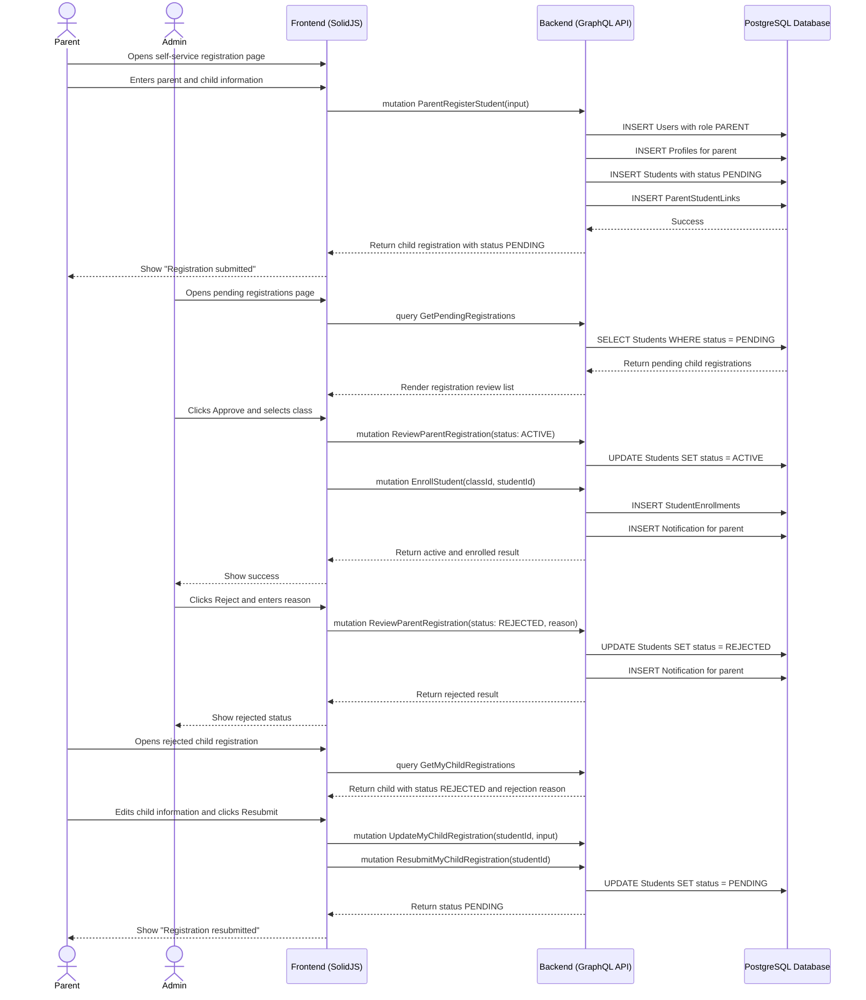

# Parent Self-Service Registration Workflow

## 1. Overview
This workflow describes how a Parent creates their own account, registers a child, waits for Admin review, and resubmits the child registration if it is rejected. The workflow supports a self-service onboarding path while keeping final approval, class assignment, and academic-year placement under Admin control.

The canonical student status lifecycle for this workflow is:

```text
PENDING -> ACTIVE
PENDING -> REJECTED -> PENDING
ACTIVE -> ARCHIVED
```

`ACTIVE` means the child registration has been approved. The system must not use `APPROVED` as a student status.

## 2. API / GraphQL List
The following GraphQL queries and mutations are utilized in this workflow:

- `mutation ParentRegisterStudent` - Creates a parent user account, parent profile, child student record, and parent-student link in one transaction. The child starts as `PENDING`.
- `query GetMyChildRegistrations` - Allows a parent to view their own child registration records and review statuses.
- `mutation UpdateMyChildRegistration` - Allows a parent to edit child data while status is `PENDING` or `REJECTED`.
- `mutation ResubmitMyChildRegistration` - Allows a parent to move a rejected child registration back to `PENDING` after making corrections.
- `query GetPendingRegistrations` - Allows Admin to list child registrations waiting for review.
- `query GetRegistrationById` - Allows Admin to inspect the full child and parent details before review.
- `mutation ReviewParentRegistration` - Allows Admin to approve or reject a child registration. Approval sets student status to `ACTIVE`; rejection sets status to `REJECTED`.
- `mutation EnrollStudent` - Allows Admin to assign an `ACTIVE` child to a class in an academic year.

## 3. Domain / Table List
The workflow interacts with the following database tables:

- `Users` - Stores the parent authentication account.
- `Profiles` - Stores parent profile data.
- `Students` - Stores child data and registration status.
- `ParentStudentLinks` - Links the parent user to the child.
- `AcademicYears` - Provides the academic-year scope for enrollment.
- `Classes` - Provides the target class for `ACTIVE` children.
- `StudentEnrollments` - Stores the `ACTIVE` child's class placement.
- `Notifications` - Notifies the parent about approval, rejection, and enrollment status.

## 4. API Sequence Diagram



## 5. UI/UX Screen Flow

1. **Parent Registration Page (`/register-parent`)**
   - Parent enters account details: `email`, `password`, `firstName`, `lastName`, `phone`, and `relationshipType`.
   - Parent enters child details: `childFirstName`, `childLastName`, `childDOB`.
   - Parent submits the form.
   - System creates parent account and child registration in `PENDING` status.

2. **Parent Dashboard (`/parent/dashboard`)**
   - Parent sees each child registration and its current status.
   - `PENDING` shows "Waiting for school review".
   - `ACTIVE` shows child monitoring features.
   - `REJECTED` shows the rejection reason and a `[Edit & Resubmit]` action.

3. **Admin Pending Registrations (`/admin/students/registrations`)**
   - Admin sees all `PENDING` child registrations.
   - Admin opens a registration detail panel.
   - Admin reviews parent profile and child information.
   - Parent document upload is not included in MVP.

4. **Admin Review Action**
   - Admin clicks `[Approve]` to set status to `ACTIVE`.
   - Admin selects academic year and class, then enrolls the student.
   - Admin clicks `[Reject]` to set status to `REJECTED` and enters a required rejection reason.
   - Parent receives a notification after approval or rejection.

5. **Parent Resubmission**
   - Parent opens a rejected registration.
   - Parent edits allowed child fields.
   - Parent clicks `[Resubmit]`.
   - System changes status from `REJECTED` back to `PENDING`.

## 6. UI Wireframe

```text
+-----------------------------------------------------------------------------+
|  [Logo] Kindergarten Mgt                         Parent Registration         |
+-----------------------------------------------------------------------------+
|                                                                             |
|  Create Parent Account                                                       |
|  -------------------------------------------------------------------------  |
|  Email:            [ parent@email.com                         ]              |
|  Password:         [ ********                                ]              |
|  First Name:       [ Sarah                                   ]              |
|  Last Name:        [ Wijaya                                  ]              |
|  Phone:            [ +628123456789                           ]              |
|  Relationship:     [ Mother v                                ]              |
|                                                                             |
|  Child Information                                                           |
|  -------------------------------------------------------------------------  |
|  Child First Name: [ Timmy                                   ]              |
|  Child Last Name:  [ Wijaya                                  ]              |
|  Date of Birth:    [ 2021-05-10                              ]              |
|                                                                             |
|                                                [Submit Registration]         |
+-----------------------------------------------------------------------------+

+-----------------------------------------------------------------------------+
|  [Logo] Kindergarten Mgt                           User: Admin | [Logout]   |
+-----------------------------------------------------------------------------+
|                  |                                                          |
|  Dashboard       |  Parent Registrations                                    |
|                  |  ------------------------------------------------------  |
|  Academic Years  |  Filter: [PENDING v]                                     |
|  Users           |                                                          |
| > Students       |  +---------------------------------------------------+   |
|    Registrations |  | Child Name     | Parent Name | Status   | Actions |   |
|  Analytics       |  +---------------------------------------------------+   |
|                  |  | Timmy Wijaya   | Sarah W.    | PENDING  | Review  |   |
|                  |  +---------------------------------------------------+   |
|                  |                                                          |
|                  |  Review Panel                                             |
|                  |  Child: Timmy Wijaya                                      |
|                  |  Parent: Sarah Wijaya                                     |
|                  |  Academic Year: [2026/2027 v] Class: [Lion Class A v]     |
|                  |                                                          |
|                  |                 [Reject]              [Approve & Enroll]  |
+-----------------------------------------------------------------------------+

+-----------------------------------------------------------------------------+
|  [Logo] Kindergarten Mgt                          User: Parent | [Logout]   |
+-----------------------------------------------------------------------------+
|                  |                                                          |
| > Dashboard      |  My Child Registrations                                  |
|  Attendance      |  ------------------------------------------------------  |
|  Progress        |  Timmy Wijaya                              [REJECTED]    |
|  Reports         |  Reason: Missing required birth date correction.          |
|                  |                                                          |
|                  |  Child First Name: [Timmy                            ]    |
|                  |  Child Last Name:  [Wijaya                           ]    |
|                  |  Date of Birth:    [2021-05-10                       ]    |
|                  |                                                          |
|                  |                                      [Save & Resubmit]    |
+-----------------------------------------------------------------------------+
```
