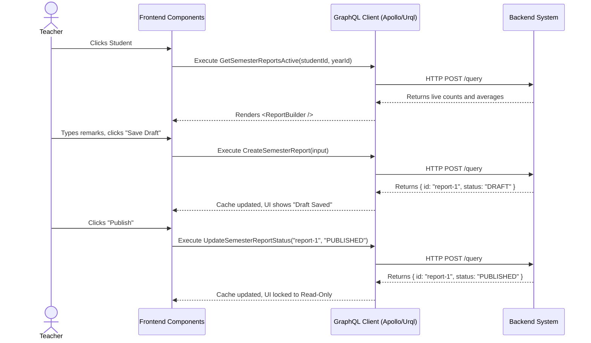

# Semester Reporting Workflow (AI-Optimized)

## 1. Context & Business Rules (Explicit Constraints)
- **Constraint 1 (Live vs Stored Data):** The backend provides two different queries. `GetSemesterReportsActive` computes everything on-the-fly based on current DB records for the active semester. `GetSemesterReportsPagination` returns data for reports that have already been created (Draft or Published).
- **Constraint 2 (Idempotency):** A student can only have ONE `SemesterReport` per `semesterId`. If `CreateSemesterReport` is called when one already exists, the backend should either reject it or update it.
- **Constraint 3 (State Machine):** The report status transitions from `DRAFT` to `PUBLISHED` only. There is no Admin approval step in MVP.
- **Constraint 4 (Access Control):** Parents can ONLY view reports where `status == "PUBLISHED"`. Teachers and Admins can view `DRAFT`. The backend GraphQL middleware enforces this.

## 2. Exact Data Contracts (GraphQL)

### A. View Live Progress
**Request (Query):**
```graphql
query GetSemesterReportsActive($studentId: ID!, $academicYearId: ID!) {
  getSemesterReportsActive(studentId: $studentId, academicYearId: $academicYearId) {
    semesterId
    status
    attendanceCounts {
      present
      absent
      excused
      late
    }
    skillAverages {
      skillId
      skillName
      totalScore
      count
      average
    }
  }
}
```

### B. Create Report (Draft)
**Request (Mutation):**
```graphql
mutation CreateSemesterReport($input: SemesterReportInput!) {
  createSemesterReport(input: $input) {
    id
    status
  }
}
```
**Input Variables Map:**
```json
{
  "input": {
    "studentId": "uuid-student",
    "classId": "uuid-class",
    "semesterId": "uuid-semester",
    "academicYearId": "uuid-year",
    "summaryRemarks": "Excellent term!"
  }
}
```

### C. Publish Report
**Request (Mutation):**
```graphql
mutation UpdateSemesterReportStatus($reportId: ID!, $status: String!) {
  updateSemesterReportStatus(reportId: $reportId, status: $status) {
    id
    status
  }
}
```

## 3. UI to Data Mapping

| UI Element (Screen) | GraphQL / Data Source | Action / Trigger |
| ------------------- | --------------------- | ---------------- |
| **Attendance Tiles**| `getSemesterReportsActive.attendanceCounts` | Render Logic |
| **Skill Avg Text**  | `getSemesterReportsActive.skillAverages[i].average` | Render Logic |
| **Status Badge**    | `getSemesterReportsActive.status` | Render Logic (e.g. `null` means "NO REPORT") |
| **Remarks Textbox** | Local state string | Passed into `input.summaryRemarks` |
| **"Save Draft" Btn**| N/A | Triggers `CreateSemesterReport` |
| **"Publish" Btn**   | N/A | Triggers `UpdateSemesterReportStatus(id, "PUBLISHED")` |

## 4. API Sequence Diagram



## 5. UI/UX Screen Flow & Component Wireframe

### Components to Build:
1. `<ReportRoster />` - Lists students and their report status (queries `GetSemesterReportsPagination` or filters live states).
2. `<ReportBuilder />` - Main component fetching live stats via `GetSemesterReportsActive`.
3. `<AttendanceSummaryWidget />` - Visual display of `attendanceCounts`.
4. `<SkillAveragesList />` - Visual display of `skillAverages`.
5. `<ReportActionPanel />` - Contains the form for `summaryRemarks` and Save/Publish buttons.

### Component Wireframe Representation:

```text
=============================================================================
[<TeacherClassSelector />]                                 User: Teacher
=============================================================================
[<ReportRoster />]         | [<ReportBuilder /> component]
Timmy (DRAFT)              | 
Susie (PUBLISHED)          | Status: [{status || "NO REPORT"}]
Bobby (NO REPORT)          |
                           | [<AttendanceSummaryWidget />]
                           | [ Present: {counts.present} ] [ Absent: {counts.absent} ]
                           |
                           | [<SkillAveragesList />]
                           | {skillAverages.map(s => `* ${s.skillName}: ${s.average}`)}
                           |
                           | [<ReportActionPanel />]
                           | Remarks:
                           | [ textarea bound to {remarks} state                 ]
                           |
                           | Button: [Save Draft]   Button: [Publish to Parents]
=============================================================================
```
