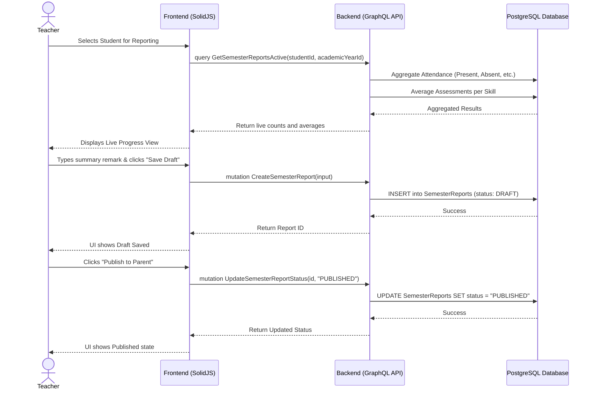

# Semester Reporting Workflow

## 1. Overview
This workflow describes how a Teacher reviews live student progress, generates a formal Semester Report at the end of the term, adds summary remarks, and publishes it for Parent review. The backend dynamically aggregates all attendance records and skill assessments for the semester to present a comprehensive snapshot of the student's performance.

## 2. API / GraphQL List
The following GraphQL queries and mutations are utilized in this workflow:

- `query GetSemesterReportsActive` - Fetches the live, on-the-fly computed progress (attendance counts and average skill scores) for a student in the currently active semester.
- `mutation CreateSemesterReport` - Takes a snapshot of the active data, adds a summary remark, and creates a formal report record in `DRAFT` status.
- `mutation UpdateSemesterReportStatus` - Transitions the report status (e.g., `DRAFT` → `PUBLISHED`).
- `query GetSemesterReportsPagination` - Fetches previously generated (stored) reports, allowing both teachers and parents to view historical data.

## 3. Domain / Table List
The workflow interacts with the following database tables:
- `SemesterReports` (Stores the summary remark, status, and binds to the semester)
- `Semesters` (The time bounding box for the report)
- `Attendance` (Aggregated by backend for counts)
- `Assessments` (Aggregated by backend for skill averages)

## 4. API Sequence Diagram



## 5. UI/UX Screen Flow

1. **Teacher Dashboard (`/teacher/dashboard`)**
   - Teacher selects a class and navigates to the `Semester Reports` tab.
2. **Student Reporting Roster**
   - Displays all students. Shows which students have a `DRAFT`, `PUBLISHED`, or `NO REPORT` for the current semester.
3. **Report Generation Screen**
   - Teacher clicks a student with `NO REPORT` or `DRAFT`.
   - UI displays the aggregated data (e.g., "Present: 80 days, Absent: 2 days", "Cognitive Skills Avg: 3.8/4").
   - Teacher types a final summary in the text area.
   - Teacher can click `[Save Draft]` or `[Publish]`.
4. **Publishing**
   - Clicking `[Publish]` shows a warning: "Once published, parents can immediately view this report. Proceed?"
   - Confirmed action changes status and fires a push notification to the Parent.

## 6. UI Wireframe

```text
+-----------------------------------------------------------------------------+
|  [Logo] Kindergarten Mgt                           User: Teacher | [Logout] |
+-----------------------------------------------------------------------------+
|                  |                                                          |
|  Dashboard       |  Semester Reports                Class: [Lion Class A v] |
|                  |  < Back to Roster                                        |
|  Attendance      |  ------------------------------------------------------  |
|                  |  Student: Timmy Turner        Status: [DRAFT]            |
|  Assessments     |  Semester: Fall 2026                                     |
|                  |  ------------------------------------------------------  |
| > Semester Rep.  |  Attendance Summary:                                     |
|                  |  [Present: 85]  [Absent: 2]  [Late: 1]  [Excused: 0]     |
|                  |                                                          |
|                  |  Skill Progress Averages:                                |
|                  |  - Cognitive Development: 3.5 / 4.0                      |
|                  |  - Motor Skills:          2.8 / 4.0                      |
|                  |                                                          |
|                  |  Teacher's Summary Remarks:                              |
|                  |  [ Timmy has shown excellent progress this term.      ]  |
|                  |  [ He is a joy to have in class.                      ]  |
|                  |                                                          |
|                  |                  [Save as Draft]  [Publish to Parents]   |
+-----------------------------------------------------------------------------+
```
