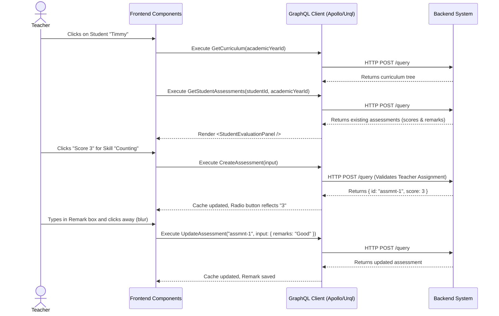

# Student Assessment Workflow (AI-Optimized)

## 1. Context & Business Rules (Explicit Constraints)
- **Constraint 1 (Scoring Scale):** The `score` field is an integer strictly between `0` and `4`. The frontend MUST NOT send numbers outside this range, and the backend MUST reject them.
- **Constraint 2 (Semester Binding):** Assessments are bound to a specific `semesterId`. The frontend needs to know which semester is currently active (e.g., from global state or a `GetActiveSemester` query) to pass it into the `CreateAssessmentInput`.
- **Constraint 3 (Write Access):** The backend MUST validate that the JWT's `userID` is an assigned teacher for the student's class before allowing `CreateAssessment`, `UpdateAssessment`, or `DeleteAssessment`.
- **Constraint 4 (Auto-Save UI):** The UI design dictates that assessments are saved individually when the teacher interacts with the score buttons, rather than using a giant "Submit All" form.

## 2. Exact Data Contracts (GraphQL)

### A. Fetch Context (Curriculum & Existing Scores)
**Request (Query):**
```graphql
query GetCurriculum($academicYearId: ID!) {
  getSkillCategories(academicYearId: $academicYearId) {
    id
    name
    skills {
      id
      name
    }
  }
}

query GetStudentAssessments($studentId: ID!, $academicYearId: ID!) {
  getStudentAssessments(studentId: $studentId, academicYearId: $academicYearId) {
    id
    skillId
    score
    remarks
  }
}
```

### B. Create Assessment (Auto-Save on initial click)
**Request (Mutation):**
```graphql
mutation CreateAssessment($input: AssessmentInput!) {
  createAssessment(input: $input) {
    id
    skillId
    score
  }
}
```
**Input Variables Map:**
```json
{
  "input": {
    "studentId": "uuid-student-123",
    "skillId": "uuid-skill-456",
    "score": 3,
    "remarks": "",
    "semesterId": "uuid-semester-active",
    "academicYearId": "uuid-year-active"
  }
}
```

### C. Update Assessment (Updating score or adding remark)
**Request (Mutation):**
```graphql
mutation UpdateAssessment($assessmentId: ID!, $input: UpdateAssessmentInput!) {
  updateAssessment(assessmentId: $assessmentId, input: $input) {
    id
    score
    remarks
  }
}
```
**Input Variables Map:**
```json
{
  "assessmentId": "uuid-assessment-created-previously",
  "input": {
    "score": 4, 
    "remarks": "Much improved this week"
  }
}
```

## 3. UI to Data Mapping

| UI Element (Screen) | GraphQL / Data Source | Action / Trigger |
| ------------------- | --------------------- | ---------------- |
| **Category Header** | `getSkillCategories[i].name` | Render logic |
| **Skill Name Text** | `getSkillCategories[i].skills[j].name` | Render logic |
| **Score Radio (0-4)** | Maps to `getStudentAssessments.score` via `skillId` match | **If none exists:** Triggers `CreateAssessment`. **If exists:** Triggers `UpdateAssessment` |
| **Remark Textbox**  | Maps to `getStudentAssessments.remarks` | `onBlur` triggers `UpdateAssessment` (only if text changed) |

## 4. API Sequence Diagram



## 5. UI/UX Screen Flow & Component Wireframe

### Components to Build:
1. `<StudentEvaluationPanel />` - Main container that fetches `GetCurriculum` and `GetStudentAssessments`.
2. `<CategoryAccordion />` - UI to group skills.
3. `<SkillEvaluatorRow />` - Component for a single skill. It receives the `Skill` object and an optional `Assessment` object if one exists.
4. `<ScoreSelector />` - Radio group 0-4 inside the row.
5. `<RemarkInput />` - Textarea inside the row handling `onBlur` save mechanics.

### Component Wireframe Representation:

```text
=============================================================================
[<TeacherClassSelector /> component]                       User: Teacher
=============================================================================
[<StudentRosterList />]    | [<StudentEvaluationPanel /> component]
Timmy Turner (Selected)    | 
Susie Derkins              | 
Bobby Tables               | [<CategoryAccordion /> component (Cognitive)]
                           | ------------------------------------------------
                           | [<SkillEvaluatorRow />]
                           | Skill: Recognizes primary colors
                           | [<ScoreSelector />] (0) (1) (2) (3) (o) 
                           | [<RemarkInput />] [+ Add Remark]
                           | ------------------------------------------------
                           | [<SkillEvaluatorRow />]
                           | Skill: Counts from 1 to 10
                           | [<ScoreSelector />] (0) (1) (o) (3) (4)
                           | [<RemarkInput />] [ Needs practice focusing... ]
                           |
                           | [<CategoryAccordion /> component (Motor)]
                           | ------------------------------------------------
=============================================================================
```
