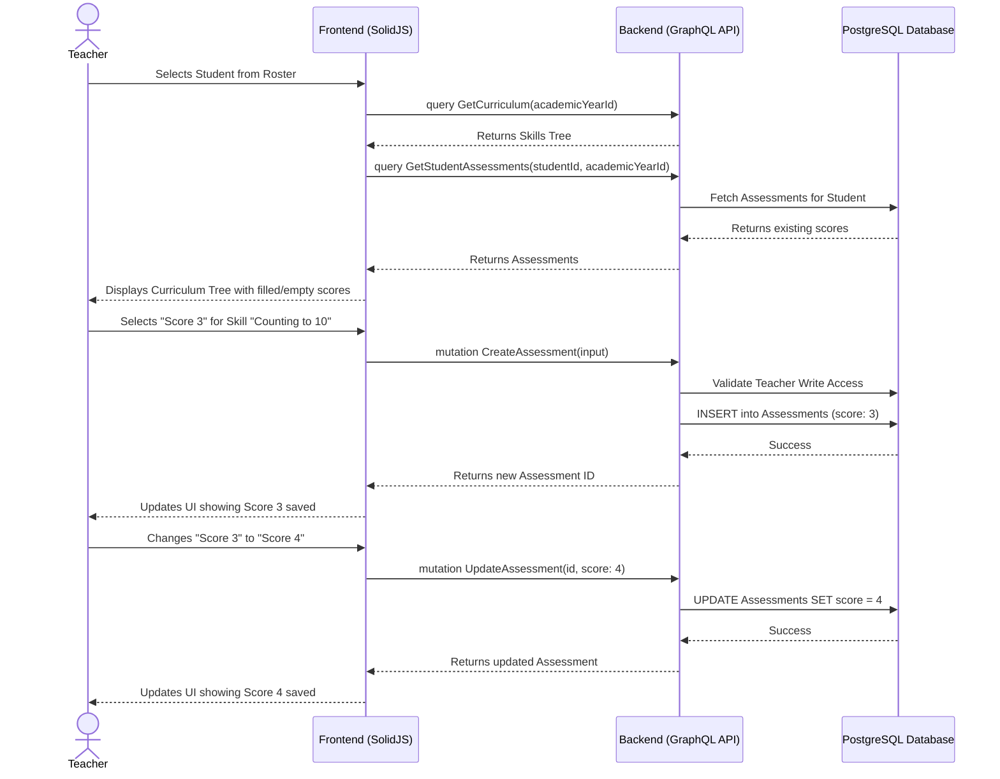

# Student Assessment Workflow

## 1. Overview
This workflow describes how a Teacher evaluates a student against the defined curriculum for an Academic Year. Teachers select a student from their assigned class, view the curriculum tree (Skill Categories and Skills), and input a numeric score (0-4) along with optional remarks. These assessments are accumulated throughout the active semester and form the basis of the final Semester Report.

## 2. API / GraphQL List
The following GraphQL queries and mutations are utilized in this workflow:

- `query GetCurriculum` - Fetches the curriculum (categories and skills) for the current Academic Year.
- `query GetStudentAssessments` - Fetches the existing assessments a specific student has received during the current Academic Year.
- `mutation CreateAssessment` - Logs a new assessment score and remark for a specific skill.
- `mutation UpdateAssessment` - Updates an existing assessment score or remark.
- `mutation DeleteAssessment` - Soft-deletes an assessment if entered in error.

## 3. Domain / Table List
The workflow interacts with the following database tables:
- `Assessments` (Stores the 0-4 score and text remarks)
- `Skills` (The curriculum item being evaluated)
- `SkillCategories` (Grouping for the UI)
- `TeacherAssignments` (Backend validation for write access)
- `Semesters` (Context for the assessment)

## 4. API Sequence Diagram



## 5. UI/UX Screen Flow

1. **Teacher Dashboard (`/teacher/dashboard`)**
   - Teacher selects the class they are currently evaluating.
2. **Assessment Tab (`/teacher/assessments`)**
   - Displays a roster (list of students) for the selected class.
   - Shows a high-level progress bar for each student (e.g., "15/25 skills assessed").
3. **Student Evaluation Screen**
   - Clicking a student opens their detailed evaluation page.
   - The UI shows Accordions for each `Skill Category`.
   - Expanding a category shows the list of `Skills`.
   - Each skill has a rating selector (0 to 4) and a `[+ Add Remark]` button.
4. **Inputting Scores**
   - Clicking a score (e.g., '3') instantly saves the assessment (auto-save behavior) and updates the local state.
   - Clicking `[+ Add Remark]` opens a small text box. Typing and blurring the text box triggers the `UpdateAssessment` mutation to save the remark.

## 6. UI Wireframe

```text
+-----------------------------------------------------------------------------+
|  [Logo] Kindergarten Mgt                           User: Teacher | [Logout] |
+-----------------------------------------------------------------------------+
|                  |                                                          |
|  Dashboard       |  Assessments                     Class: [Lion Class A v] |
|                  |  < Back to Roster                                        |
|  Attendance      |  ------------------------------------------------------  |
|                  |  Student: Timmy Turner        Progress: [====    ] 40%   |
| > Assessments    |                                                          |
|                  |  v Cognitive Development (Category)                      |
|  Daily Reports   |  ------------------------------------------------------  |
|                  |    Recognizes primary colors                             |
|  Semester Rep.   |    Score: (0) (1) (2) (3) (o)   [+ Add Remark]           |
|                  |                                                          |
|                  |    Counts from 1 to 10                                   |
|                  |    Score: (0) (1) (o) (3) (4)                            |
|                  |    Remark: [ Needs practice focusing... ]                |
|                  |                                                          |
|                  |  > Motor Skills (Category)                               |
|                  |  ------------------------------------------------------  |
|                  |  > Social & Emotional (Category)                         |
+-----------------------------------------------------------------------------+
```
