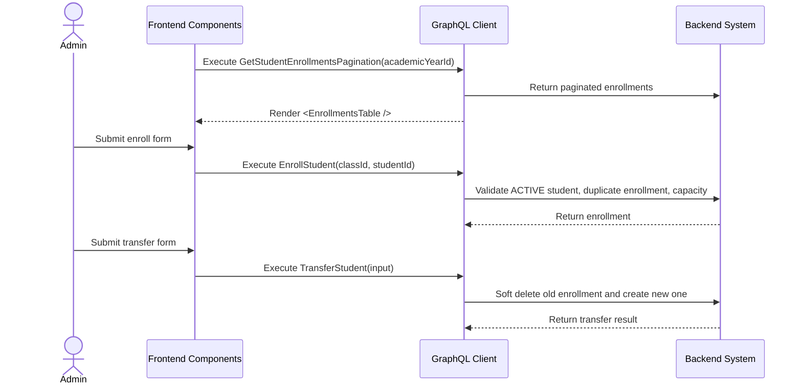

# Student Enrollment & Transfer Workflow (AI-Optimized)

## 1. Context & Business Rules (Explicit Constraints)
- **Constraint 1 (Student Must Be Active):** Student can be enrolled only when `Students.status = "ACTIVE"`. Do NOT use `APPROVED`.
- **Constraint 2 (Class Defines Academic Year):** Enrollment does not store academic year directly unless schema already does. Academic year comes from `Classes.academic_year_id`.
- **Constraint 3 (No Duplicate Active Enrollment):** A student cannot have two active enrollments in the same academic year.
- **Constraint 4 (Capacity Validation):** Before enrollment or transfer, backend must validate `targetClass.currentEnrollments + 1 <= targetClass.capacity`.
- **Constraint 5 (Transfer Preserves History):** Transfer must not edit historical attendance, reports, or assessments. It closes old enrollment and creates a new enrollment.
- **Constraint 6 (Soft Delete Only):** Unenroll must set `deleted_at = NOW()` on `StudentEnrollments`.
- **Constraint 7 (Archived Student Rule):** `ARCHIVED` students cannot be enrolled or transferred.
- **Constraint 8 (Strict CRUD Rule):** StudentEnrollment domain MUST implement create, update, delete by id, delete multiple ids, get by id, get all, and get pagination.

## 2. Exact Data Contracts (GraphQL)

### A. Create Student Enrollment / Enroll Student
```graphql
mutation EnrollStudent($classId: ID!, $studentId: ID!) {
  enrollStudent(classId: $classId, studentId: $studentId) {
    id
    enrolledDate
    student { id firstName lastName status }
    class { id name capacity academicYearId }
  }
}
```

### B. Update Student Enrollment
```graphql
mutation UpdateStudentEnrollment($enrollmentId: ID!, $input: UpdateStudentEnrollmentInput!) {
  updateStudentEnrollment(enrollmentId: $enrollmentId, input: $input) {
    id
    enrolledDate
    updatedAt
  }
}
```

### C. Transfer Student
```graphql
mutation TransferStudent($input: TransferStudentInput!) {
  transferStudent(input: $input) {
    success
    message
    oldEnrollmentId
    newEnrollment {
      id
      student { id firstName lastName }
      class { id name academicYearId }
      enrolledDate
    }
  }
}
```

```json
{
  "input": {
    "studentId": "uuid-student",
    "sourceClassId": "uuid-source-class",
    "targetClassId": "uuid-target-class",
    "transferDate": "2026-09-01"
  }
}
```

### D. Delete Enrollment By Id / Unenroll Student
```graphql
mutation UnenrollStudent($enrollmentId: ID!) {
  unenrollStudent(enrollmentId: $enrollmentId) {
    success
    message
  }
}
```

### E. Delete Multiple Enrollments
```graphql
mutation DeleteStudentEnrollments($enrollmentIds: [ID!]!) {
  deleteStudentEnrollments(enrollmentIds: $enrollmentIds) {
    success
    message
    deletedCount
  }
}
```

### F. Get Enrollment By Id
```graphql
query GetStudentEnrollmentById($enrollmentId: ID!) {
  getStudentEnrollmentById(enrollmentId: $enrollmentId) {
    id
    enrolledDate
    student { id firstName lastName status }
    class { id name academicYearId }
  }
}
```

### G. Get Enrollments All
```graphql
query GetStudentEnrollmentsAll($academicYearId: ID, $classId: ID) {
  getStudentEnrollmentsAll(academicYearId: $academicYearId, classId: $classId) {
    id
    enrolledDate
    student { id firstName lastName }
    class { id name }
  }
}
```

### H. Get Enrollments Pagination
```graphql
query GetStudentEnrollmentsPagination($academicYearId: ID!, $page: Int!, $limit: Int!, $search: String) {
  getStudentEnrollmentsPagination(academicYearId: $academicYearId, page: $page, limit: $limit, search: $search) {
    items {
      id
      enrolledDate
      student { id firstName lastName status }
      class { id name }
    }
    pagination {
      page
      limit
      totalItems
      totalPages
      hasNextPage
      hasPreviousPage
    }
  }
}
```

## 3. UI to Data Mapping

| UI Element (Screen) | GraphQL / Data Source | Action / Trigger |
| ------------------- | --------------------- | ---------------- |
| **Academic Year Dropdown** | `getAcademicYears` | Filters classes and enrollments |
| **Class Dropdown** | `getClassesAll(academicYearId)` | Provides `classId` |
| **Student Dropdown** | active students not enrolled in selected year | Provides `studentId` |
| **Enroll Button** | `studentId`, `classId` | Calls `EnrollStudent` |
| **Transfer Button** | source and target class state | Calls `TransferStudent` |
| **Unenroll Button** | `enrollmentId` | Calls `UnenrollStudent` |
| **Enrollment Table** | `getStudentEnrollmentsPagination.items` | Renders enrollment rows |

## 4. API Sequence Diagram



## 5. UI/UX Screen Flow & Component Wireframe

### Components to Build:
1. `<StudentEnrollmentsPage />`
2. `<EnrollmentsTable />`
3. `<EnrollStudentModal />`
4. `<TransferStudentModal />`
5. `<UnenrollDialog />`
6. `<ClassCapacityIndicator />`

### Component Wireframe Representation:

```text
=============================================================================
[<StudentEnrollmentsPage /> component]                  User: Admin
=============================================================================
Academic Year: [2026/2027 v]              Button: [+ Enroll Student]

[<EnrollmentsTable />]
--------------------------------------------------------
Student          | Class          | Enrolled Date | Actions
--------------------------------------------------------
{student.name}   | {class.name}   | {date}        | [...]
--------------------------------------------------------

[<EnrollStudentModal />]
Student: [Timmy Wijaya v]
Class:   [Lion Class A v]
Capacity: 18 / 20
Button: [Enroll]
=============================================================================
```

## 6. AI Execution Checklist

```text
1. Implement 7 StudentEnrollment CRUD operations.
2. Add TransferStudent mutation.
3. Enroll only ACTIVE students.
4. Prevent duplicate active enrollment in same academic year.
5. Validate class capacity.
6. Transfer by soft deleting old enrollment and creating new enrollment.
7. Never change historical attendance/report/assessment rows during transfer.
8. Add Admin enrollment page, enroll modal, transfer modal, unenroll dialog.
9. Test active, rejected, pending, and archived student enrollment behavior.
```
