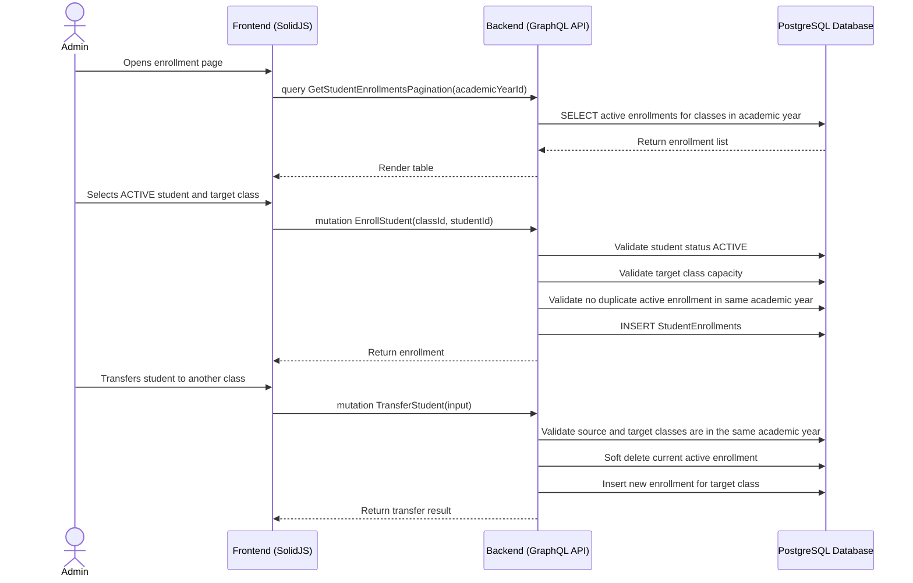

# Student Enrollment & Transfer Workflow

## 1. Overview
This workflow describes how an Admin enrolls an `ACTIVE` student into a class, transfers a student between classes in the same academic year, unenrolls a student, and preserves enrollment history. Enrollment links a student to a class, and the class determines the academic-year scope.

Students from parent self-service registration must be reviewed and set to `ACTIVE` before enrollment. The system must not use `APPROVED` as a student status.

## 2. API / GraphQL List
The following GraphQL queries and mutations are utilized in this workflow:

- `mutation CreateStudentEnrollment` / `mutation EnrollStudent` - Enrolls an active student into a class.
- `mutation UpdateStudentEnrollment` - Updates enrollment metadata when allowed.
- `mutation TransferStudent` - Moves a student from one class to another while preserving history.
- `mutation DeleteStudentEnrollment` / `mutation UnenrollStudent` - Soft deletes one enrollment.
- `mutation DeleteStudentEnrollments` - Soft deletes multiple enrollments.
- `query GetStudentEnrollmentById` - Fetches one enrollment.
- `query GetStudentEnrollmentsAll` - Fetches all active enrollments with filters.
- `query GetStudentEnrollmentsPagination` - Fetches paginated enrollments.

## 3. Domain / Table List
The workflow interacts with the following database tables:

- `Students` - Provides student identity and status.
- `Classes` - Provides target class and capacity.
- `AcademicYears` - Provides academic-year scope through class.
- `StudentEnrollments` - Stores enrollment records.
- `ParentStudentLinks` - Provides parent context for self-service students.
- `Attendance`, `Assessments`, `DailyReports`, `SemesterReports` - Historical data that must remain linked to original class/year records.

## 4. API Sequence Diagram



## 5. UI/UX Screen Flow

1. **Student Enrollment Page (`/admin/students/enrollments`)**
   - Admin selects academic year.
   - UI displays enrolled students, classes, and enrollment dates.

2. **Enroll Student**
   - Admin selects an `ACTIVE` student not yet enrolled in the selected academic year.
   - Admin selects target class.
   - System validates class capacity before creating enrollment.

3. **Transfer Student**
   - Admin selects an enrolled student.
   - Admin selects a target class in the same academic year.
   - Cross-year movement must use the Student Promotion workflow, not transfer.
   - System closes the old enrollment and creates a new enrollment.

4. **Unenroll Student**
   - Admin confirms unenrollment.
   - System soft deletes the enrollment while preserving historical attendance and reports.

## 6. UI Wireframe

```text
+-----------------------------------------------------------------------------+
|  [Logo] Kindergarten Mgt                           User: Admin | [Logout]   |
+-----------------------------------------------------------------------------+
|                  |                                                          |
| > Students       |  Student Enrollments                                     |
|                  |  Academic Year: [2026/2027 v]    [+ Enroll Student]      |
|                  |                                                          |
|                  |  +---------------------------------------------------+   |
|                  |  | Student       | Class        | Enrolled Date | Act |   |
|                  |  +---------------------------------------------------+   |
|                  |  | Timmy Wijaya  | Lion A       | 2026-07-01    | ... |   |
|                  |  | Susie Smith   | Tiger B      | 2026-07-01    | ... |   |
|                  |  +---------------------------------------------------+   |
+-----------------------------------------------------------------------------+
```
