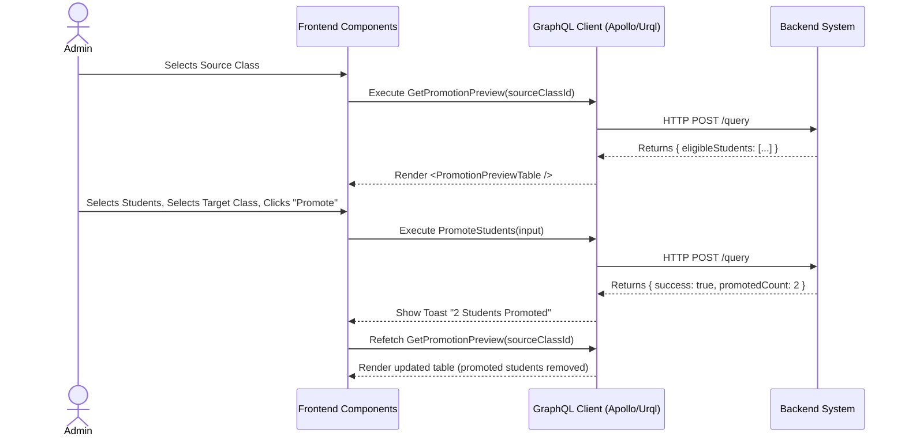

# Student Promotion Workflow (AI-Optimized)

## 1. Context & Business Rules (Explicit Constraints)
- **Constraint 1 (Year State Validation):** Promotions SHOULD ideally occur from a `CLOSED` academic year to a `DRAFT` or `ACTIVE` academic year. The backend should validate that students aren't promoted into an `ARCHIVED` year.
- **Constraint 2 (Enrollment Idempotency):** The backend `PromoteStudents` mutation must ignore or handle gracefully if a student ID is passed that is *already* enrolled in the `targetClassId` (preventing duplicate enrollments).
- **Constraint 3 (No Data Modification):** Promoting a student does NOT alter their past `StudentEnrollments` record. It simply creates a NEW `StudentEnrollments` record linking the student to the `targetClassId`.
- **Constraint 4 (Capacity Limits):** The frontend should display the `capacity` of the target class so the Admin doesn't attempt to over-enroll, though the backend should strictly validate `currentEnrollments + newPromotions <= capacity`.

## 2. Exact Data Contracts (GraphQL)

### A. Get Promotion Preview
**Request (Query):**
```graphql
query GetPromotionPreview($sourceClassId: ID!) {
  getPromotionPreview(sourceClassId: $sourceClassId) {
    eligibleStudents {
      id
      firstName
      lastName
      status
    }
  }
}
```

### B. Promote Students
**Request (Mutation):**
```graphql
mutation PromoteStudents($input: PromoteStudentsInput!) {
  promoteStudents(input: $input) {
    success
    promotedCount
  }
}
```
**Input Variables Map:**
```json
{
  "input": {
    "sourceClassId": "uuid-of-old-class",
    "targetClassId": "uuid-of-new-class",
    "studentIds": [
      "uuid-student-1",
      "uuid-student-2"
    ]
  }
}
```

## 3. UI to Data Mapping

| UI Element (Screen) | GraphQL / Data Source | Action / Trigger |
| ------------------- | --------------------- | ---------------- |
| **Source Year Dropdown** | `getAcademicYears` (Filtered by `CLOSED`) | Sets local state `sourceYearId` |
| **Source Class Dropdown**| `getClasses(academicYearId: sourceYearId)` | Sets local state `sourceClassId`, triggers `GetPromotionPreview` |
| **Target Year Dropdown** | `getAcademicYears` (Filtered by `DRAFT` or `ACTIVE`) | Sets local state `targetYearId` |
| **Target Class Dropdown**| `getClasses(academicYearId: targetYearId)` | Sets local state `targetClassId` |
| **Checkboxes (Per Student)** | Bound to local array `selectedStudentIds` | Adds/Removes `id` from array |
| **"Promote" Button** | N/A | Triggers `PromoteStudents` with `selectedStudentIds` |

## 4. API Sequence Diagram



## 5. UI/UX Screen Flow & Component Wireframe

### Components to Build:
1. `<PromotionSetup />` - Container component for the promotion page.
2. `<YearClassSelector />` - Reusable component with two dropdowns (Year -> Class), used twice (Source and Target).
3. `<PromotionPreviewTable />` - Data table showing `eligibleStudents` with a checkbox column.

### Component Wireframe Representation:

```text
=============================================================================
[<Navbar /> component]                                     User: Admin
=============================================================================
[<Sidebar />]      | [<PromotionSetup /> component]
> Promotion        | 
                   | [<YearClassSelector /> (Source)]  [<YearClassSelector /> (Target)]
                   | Year: [2025/2026]                 Year: [2026/2027]
                   | Class:[Lion Class A]              Class:[Tiger Class B]
                   | --------------------------------------------------------
                   |
                   | [<PromotionPreviewTable /> component]
                   | Target Capacity: {targetClass.capacity} (Current: {targetClass.enrolledCount})
                   | --------------------------------------------------------
                   | Select | Name               | Status
                   | --------------------------------------------------------
                   | [x]    | {student.first...} | {student.status}
                   | [x]    | {student.first...} | {student.status}
                   | [ ]    | {student.first...} | {student.status}
                   | --------------------------------------------------------
                   |
                   | Button: [Promote {selectedCount} Students] 
                   | (Disabled if selectedCount > available capacity)
=============================================================================
```
