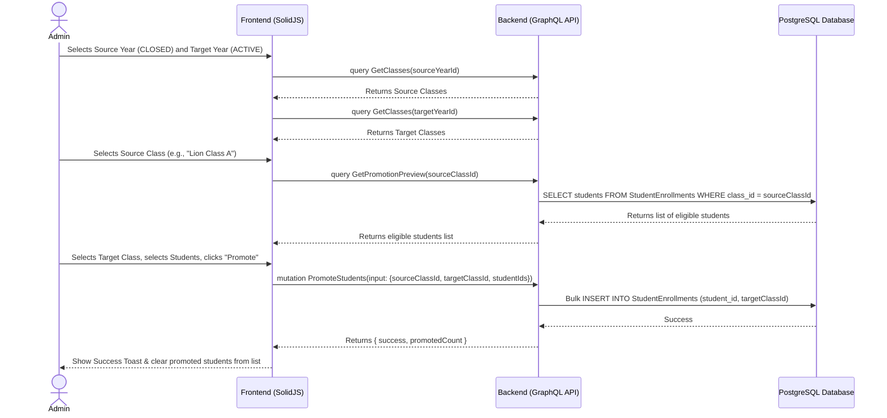

# Student Promotion Workflow

## 1. Overview
This workflow describes how an Administrator promotes students from one class in a closed academic year to a new class in the upcoming academic year. The system provides a "Promotion Preview" to see eligible students, allows the admin to select which students to promote (or hold back), and executes a bulk promotion that creates new enrollment records in the target class.

## 2. API / GraphQL List
The following GraphQL queries and mutations are utilized in this workflow:

- `query GetAcademicYears` - Used to select the source (CLOSED) and target (DRAFT/ACTIVE) academic years.
- `query GetClasses` - Used to fetch classes for both the source and target academic years.
- `query GetPromotionPreview` - Fetches the list of students currently enrolled in the source class who are eligible for promotion.
- `mutation PromoteStudents` - Executes the bulk promotion, creating new `StudentEnrollments` for the selected students in the target class.

## 3. Domain / Table List
The workflow interacts with the following database tables:
- `AcademicYears` (Source year must be CLOSED, Target year must be DRAFT or ACTIVE)
- `Classes` (Source and Target class definitions)
- `Students` (The entities being promoted)
- `StudentEnrollments` (Creating new records linking Students to the Target Class)

## 4. API Sequence Diagram



## 5. UI/UX Screen Flow

1. **Dashboard (`/admin/dashboard`)**
   - User clicks "Student Promotion" in the sidebar navigation or under a tools menu.
2. **Promotion Setup Page**
   - User selects the **Source Academic Year** (Must be CLOSED).
   - User selects the **Source Class**.
   - User selects the **Target Academic Year** (Must be DRAFT or ACTIVE).
   - User selects the **Target Class**.
3. **Promotion Preview Interface**
   - A dual-pane or table interface appears.
   - Left side/Table lists all students in the Source Class.
   - Admin checks the boxes next to students they wish to promote (default: select all).
4. **Execution Action**
   - User clicks `[Promote Selected Students]`.
   - A confirmation dialog appears showing the count: "Promote 18 students to Tiger Class B?"
   - Upon confirmation, a success message appears, and the promoted students are removed from the "Eligible" list to prevent double-promotion.

## 6. UI Wireframe

```text
+-----------------------------------------------------------------------------+
|  [Logo] Kindergarten Mgt                           User: Admin | [Logout]   |
+-----------------------------------------------------------------------------+
|                  |                                                          |
|  Dashboard       |  Student Promotion                                       |
|                  |  ------------------------------------------------------  |
|  Academic Years  |  [Source Configuration]         [Target Configuration]   |
|                  |  Year: [ 2025/2026 (CLOSED) v]  Year: [ 2026/2027 v]     |
|  Users           |  Class:[ Lion Class A       v]  Class:[ Tiger Class B v] |
|  Teachers        |  ------------------------------------------------------  |
| > Students       |                                                          |
|    - Promotion   |  Eligible Students for Promotion:                        |
|  Analytics       |  [x] Select All                 Capacity: 20             |
|                  |  +---------------------------------------------------+   |
|                  |  | [x] Name           | Current Status   | Age       |   |
|                  |  +---------------------------------------------------+   |
|                  |  | [x] Timmy Turner   | ACTIVE           | 5 yrs     |   |
|                  |  | [x] Susie Derkins  | ACTIVE           | 5 yrs     |   |
|                  |  | [ ] Bobby Tables   | ACTIVE (Hold)    | 5 yrs     |   |
|                  |  +---------------------------------------------------+   |
|                  |                                                          |
|                  |                      [Promote 2 Selected Students >]     |
+-----------------------------------------------------------------------------+
```
