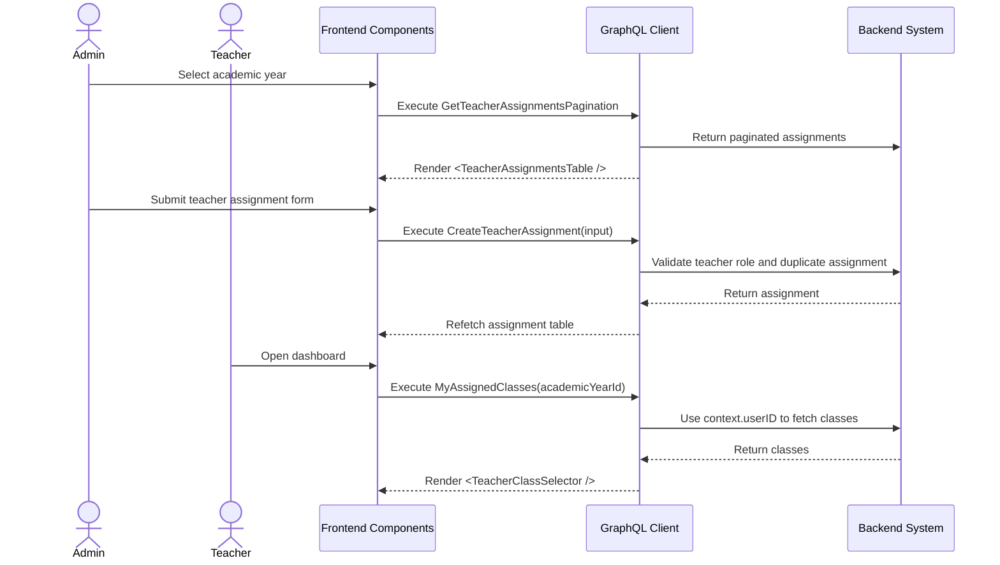

# Teacher Assignment Workflow (AI-Optimized)

## 1. Context & Business Rules (Explicit Constraints)
- **Constraint 1 (Teacher Role):** Assigned user MUST have role `TEACHER`.
- **Constraint 2 (Class Scope):** Assignment belongs to a class. The class belongs to exactly one academic year.
- **Constraint 3 (Multi-Class Support):** One teacher can be assigned to multiple classes in the same academic year.
- **Constraint 4 (Duplicate Prevention):** Do not create duplicate active assignment for the same `teacherUserId + classId`.
- **Constraint 5 (Write Permission Source):** Teacher write access for attendance, assessments, daily reports, and semester reports MUST be validated using `TeacherAssignments`.
- **Constraint 6 (Teacher Self Query):** Backend MUST expose `myAssignedClasses(academicYearId)` for teacher class selection.
- **Constraint 7 (Soft Delete Only):** Removing assignment must soft delete or end assignment. Do not physically delete history.
- **Constraint 8 (Strict CRUD Rule):** TeacherAssignment domain MUST implement create, update, delete by id, delete multiple ids, get by id, get all, and get pagination.

## 2. Exact Data Contracts (GraphQL)

### A. Create Teacher Assignment
```graphql
mutation CreateTeacherAssignment($input: CreateTeacherAssignmentInput!) {
  createTeacherAssignment(input: $input) {
    id
    teacher {
      id
      profile { firstName lastName }
    }
    class {
      id
      name
      academicYearId
    }
    assignedDate
  }
}
```

```json
{
  "input": {
    "teacherUserId": "uuid-teacher-user",
    "classId": "uuid-class",
    "assignedDate": "2026-07-01"
  }
}
```

### B. Update Teacher Assignment
```graphql
mutation UpdateTeacherAssignment($assignmentId: ID!, $input: UpdateTeacherAssignmentInput!) {
  updateTeacherAssignment(assignmentId: $assignmentId, input: $input) {
    id
    assignedDate
    teacher { id profile { firstName lastName } }
    class { id name }
  }
}
```

### C. Delete Teacher Assignment By Id
```graphql
mutation DeleteTeacherAssignment($assignmentId: ID!) {
  deleteTeacherAssignment(assignmentId: $assignmentId) {
    success
    message
  }
}
```

### D. Delete Multiple Teacher Assignments
```graphql
mutation DeleteTeacherAssignments($assignmentIds: [ID!]!) {
  deleteTeacherAssignments(assignmentIds: $assignmentIds) {
    success
    message
    deletedCount
  }
}
```

### E. Get Teacher Assignment By Id
```graphql
query GetTeacherAssignmentById($assignmentId: ID!) {
  getTeacherAssignmentById(assignmentId: $assignmentId) {
    id
    teacher { id email profile { firstName lastName } }
    class { id name academicYearId }
    assignedDate
  }
}
```

### F. Get Teacher Assignments All
```graphql
query GetTeacherAssignmentsAll($academicYearId: ID, $teacherUserId: ID) {
  getTeacherAssignmentsAll(academicYearId: $academicYearId, teacherUserId: $teacherUserId) {
    id
    teacher { id profile { firstName lastName } }
    class { id name }
    assignedDate
  }
}
```

### G. Get Teacher Assignments Pagination
```graphql
query GetTeacherAssignmentsPagination($academicYearId: ID!, $page: Int!, $limit: Int!, $search: String) {
  getTeacherAssignmentsPagination(academicYearId: $academicYearId, page: $page, limit: $limit, search: $search) {
    items {
      id
      teacher { id profile { firstName lastName } }
      class { id name }
      assignedDate
    }
    pagination {
      page
      limit
      totalItems
      totalPages
      hasNextPage
      hasPreviousPage
    }
  }
}
```

### H. My Assigned Classes
```graphql
query MyAssignedClasses($academicYearId: ID) {
  myAssignedClasses(academicYearId: $academicYearId) {
    id
    name
    capacity
    enrolledCount
    academicYear {
      id
      name
      status
    }
  }
}
```

**Required Backend Behavior:**
```text
1. Read teacher user ID from JWT context.
2. Validate role = TEACHER.
3. Return classes where TeacherAssignments.teacher_user_id = context.userID.
4. If academicYearId is provided, filter by that year.
```

## 3. UI to Data Mapping

| UI Element (Screen) | GraphQL / Data Source | Action / Trigger |
| ------------------- | --------------------- | ---------------- |
| **Academic Year Dropdown** | `getAcademicYears` | Filters assignments |
| **Teacher Dropdown** | `getUsers(role: "TEACHER")` | Provides `teacherUserId` |
| **Class Dropdown** | `getClassesAll(academicYearId)` | Provides `classId` |
| **Assign Button** | form state | Calls `CreateTeacherAssignment` |
| **Assignments Table** | `getTeacherAssignmentsPagination.items` | Renders assignments |
| **Remove Button** | `assignmentId` | Calls `DeleteTeacherAssignment` |
| **Teacher Class Selector** | `myAssignedClasses` | Sets selected class in global store |

## 4. API Sequence Diagram



## 5. UI/UX Screen Flow & Component Wireframe

### Components to Build:
1. `<TeacherAssignmentsPage />`
2. `<TeacherAssignmentsTable />`
3. `<AssignTeacherModal />`
4. `<RemoveAssignmentDialog />`
5. `<TeacherClassSelector />`

### Component Wireframe Representation:

```text
=============================================================================
[<TeacherAssignmentsPage /> component]                  User: Admin
=============================================================================
Academic Year: [2026/2027 v]                 Button: [+ Assign Teacher]

[<TeacherAssignmentsTable />]
--------------------------------------------------------
Teacher          | Class          | Assigned Date | Actions
--------------------------------------------------------
{teacher.name}   | {class.name}   | {date}        | [...]
--------------------------------------------------------

[<AssignTeacherModal />]
Teacher: [Jane Doe v]
Class:   [Lion Class A v]
Date:    [2026-07-01]
Button: [Assign]
=============================================================================
```

## 6. AI Execution Checklist

```text
1. Implement 7 TeacherAssignment CRUD operations.
2. Add myAssignedClasses query.
3. Validate assigned user role is TEACHER.
4. Prevent duplicate active teacherUserId + classId assignment.
5. Filter lists by deleted_at IS NULL.
6. Use TeacherAssignments for all teacher write permission checks.
7. Add Admin assignment page.
8. Add TeacherClassSelector using myAssignedClasses.
9. Test teacher with one class and teacher with multiple classes.
```
