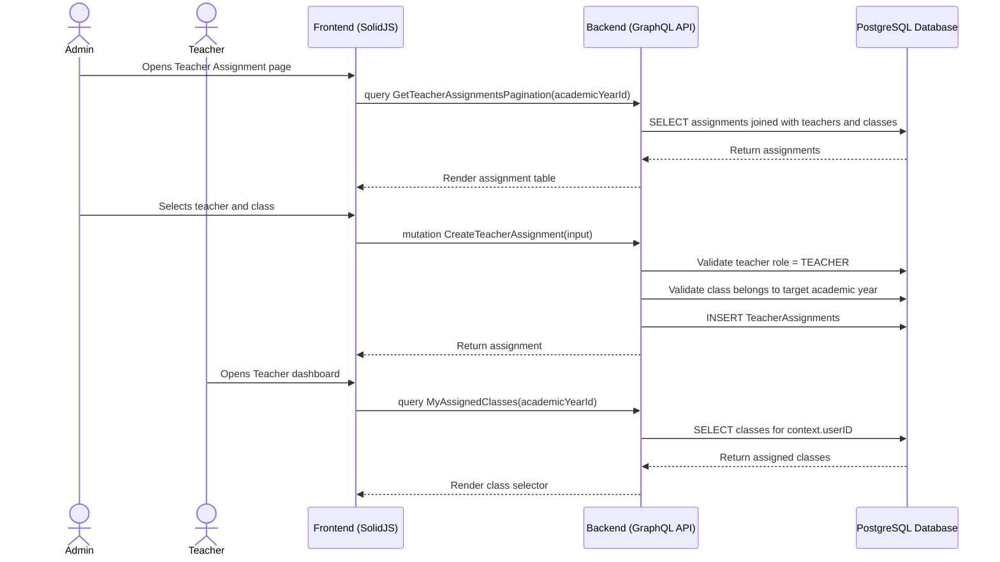

# Teacher Assignment Workflow

## 1. Overview
This workflow describes how an Admin assigns teachers to classes inside an academic year. Teachers can be assigned to multiple classes in the same academic year. Teacher assignments determine write permissions for attendance, assessment, daily report, and semester report workflows.

## 2. API / GraphQL List
The following GraphQL queries and mutations are utilized in this workflow:

- `mutation CreateTeacherAssignment` - Assigns a teacher to a class.
- `mutation UpdateTeacherAssignment` - Updates an assignment, such as replacing teacher or class.
- `mutation DeleteTeacherAssignment` - Soft deletes or ends one assignment.
- `mutation DeleteTeacherAssignments` - Soft deletes multiple assignments.
- `query GetTeacherAssignmentById` - Fetches one assignment.
- `query GetTeacherAssignmentsAll` - Fetches all active assignments with optional filters.
- `query GetTeacherAssignmentsPagination` - Fetches paginated assignments.
- `query MyAssignedClasses` - Allows a teacher to fetch their own assigned classes.

## 3. Domain / Table List
The workflow interacts with the following database tables:

- `Users` - Stores teacher user accounts.
- `Profiles` - Stores teacher display and staff profile fields.
- `Classes` - Stores class records.
- `AcademicYears` - Scopes class assignments.
- `TeacherAssignments` - Links teachers to classes.

## 4. API Sequence Diagram



## 5. UI/UX Screen Flow

1. **Teacher Assignment Page (`/admin/teacher-assignments`)**
   - Admin selects academic year.
   - UI displays teachers, classes, and existing assignments.

2. **Assign Teacher**
   - Admin clicks `[Assign Teacher]`.
   - Admin selects teacher and class.
   - System creates assignment and updates class teacher display.

3. **Reassign / Remove**
   - Admin edits an existing assignment or removes it.
   - Historical records stay intact through soft delete or end-date behavior.

4. **Teacher Class Selector**
   - Teacher dashboard calls `MyAssignedClasses`.
   - Teacher selects one active assigned class for daily workflows.

## 6. UI Wireframe

```text
+-----------------------------------------------------------------------------+
|  [Logo] Kindergarten Mgt                           User: Admin | [Logout]   |
+-----------------------------------------------------------------------------+
|                  |                                                          |
| > Teachers       |  Teacher Assignments                                     |
|                  |  Academic Year: [2026/2027 v]  [+ Assign Teacher]        |
|                  |                                                          |
|                  |  +---------------------------------------------------+   |
|                  |  | Teacher      | Class          | Assigned Date | Act |  |
|                  |  +---------------------------------------------------+   |
|                  |  | Jane Doe     | Lion Class A   | 2026-07-01    | ... |  |
|                  |  | John Smith   | Tiger Class B  | 2026-07-01    | ... |  |
|                  |  +---------------------------------------------------+   |
+-----------------------------------------------------------------------------+
```
