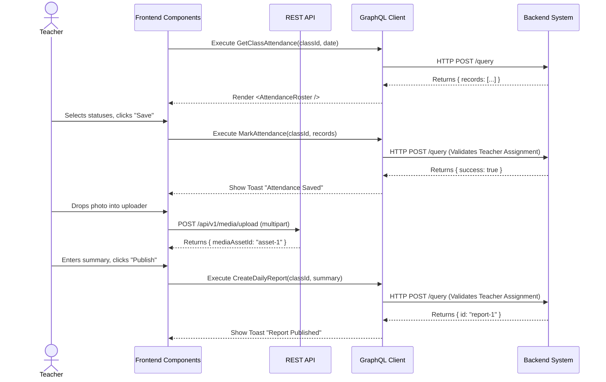

# Teacher Daily Operations Workflow (AI-Optimized)

## 1. Context & Business Rules (Explicit Constraints)
- **Constraint 1 (Write Access Validation):** The backend MUST validate that the JWT's `userID` is actively assigned to the `classId` (via the `TeacherAssignments` table) before executing `MarkAttendance` or `CreateDailyReport`.
- **Constraint 2 (Multi-Class Context):** A teacher can belong to multiple classes. The frontend must store a `selectedClassId` in global state (e.g., TanStack Store) and pass it as an argument to all queries and mutations in this workflow.
- **Constraint 3 (Media Uploads):** Media uploads happen via a REST API `POST` BEFORE the GraphQL mutation. The REST API stores the file in private MinIO storage and returns a `mediaAssetId` plus authorized private/signed URL. The `mediaAssetId` must be passed to the `CreateDailyReport` GraphQL mutation (or updated later) so the backend can link the image to the `DailyReport` entity using polymorphic fields (`entity_type="DAILY_REPORT"`, `entity_id=reportId`).

## 2. Exact Data Contracts (GraphQL & REST)

### A. Upload Media (REST)
**Request (POST /api/v1/media/upload):**
```http
POST /api/v1/media/upload
Content-Type: multipart/form-data
Authorization: Bearer <jwt_token>

file: <binary_data>
entityType: "DAILY_REPORT"
```
**Response (JSON):**
```json
{
  "status": "success",
  "data": {
    "mediaAssetId": "uuid-asset-123",
    "url": "https://minio.example.com/private-signed-url"
  }
}
```

### B. Mark Attendance
**Request (Mutation):**
```graphql
mutation MarkAttendance($classId: ID!, $records: [AttendanceRecordInput!]!) {
  markDailyAttendance(classId: $classId, records: $records) {
    success
    date
  }
}
```
**Input Variables Map:**
```json
{
  "classId": "uuid-of-class",
  "records": [
    { "studentId": "uuid-stu-1", "status": "PRESENT", "remarks": "" },
    { "studentId": "uuid-stu-2", "status": "ABSENT", "remarks": "Sick" }
  ]
}
```

### C. Create Daily Report
**Request (Mutation):**
```graphql
mutation CreateDailyReport($classId: ID!, $summary: String!) {
  createDailyReport(classId: $classId, summary: $summary) {
    id
    success
  }
}
```
*(Note: If the backend schema supports linking media directly during creation, pass `mediaAssetIds: ["uuid-asset-123"]`. Otherwise, the backend must rely on a separate update or the entity ID matching logic).*

## 3. UI to Data Mapping

| UI Element (Screen) | GraphQL / Data Source | Action / Trigger |
| ------------------- | --------------------- | ---------------- |
| **Class Dropdown** | `getClasses` (filtered by teacher) | Sets `selectedClassId` in Global Store |
| **Student Roster** | `getClassAttendance` / Students array | Renders rows for attendance |
| **Status Radio Buttons**| Local state array of `AttendanceRecordInput` | Updates local array |
| **"Save Attendance"** | N/A | Triggers `MarkAttendance` |
| **File Uploader** | N/A | Triggers `POST /api/v1/media/upload` per file. Appends returned IDs to local array. |
| **"Summary" Textbox**| `summary` string state | Bound to React/Solid state |
| **"Publish Report"** | N/A | Triggers `CreateDailyReport` |

## 4. API Sequence Diagram



## 5. UI/UX Screen Flow & Component Wireframe

### Components to Build:
1. `<TeacherClassSelector />` - Updates the global `selectedClassId` store.
2. `<AttendanceRoster />` - Table managing a local array of `AttendanceRecordInput`.
3. `<MediaUploader />` - Handles file selection, REST POST requests, and progress bars.
4. `<DailyReportForm />` - TanStack Form managing the summary string and `mediaAssetIds`.

### Component Wireframe Representation:

```text
=============================================================================
[<Navbar /> component]                                     User: Teacher
=============================================================================
[<Sidebar />]      | [<TeacherClassSelector /> component]
> Daily Ops        | Class: [Lion Class A (id: uuid-class-1) v]
                   |
                   | [<AttendanceRoster /> component]
                   | Date: [Today]                       [Save Attendance]
                   | --------------------------------------------------------
                   | Student              | Status               | Remarks
                   | --------------------------------------------------------
                   | Timmy Turner         | (o)P ( )A ( )E ( )L  | [        ]
                   | Susie Derkins        | ( )P (o)A ( )E ( )L  | [Sick    ]
                   | --------------------------------------------------------
                   |
                   | [<DailyReportForm /> component]
                   | Summary:
                   | [ Textarea for today's summary...                      ]
                   |
                   | [<MediaUploader /> component]
                   | [+ Drag and Drop Photos Here]
                   | [Thumb1 (Done)] [Thumb2 (Done)]
                   |
                   |                             Button: [Publish Report]
=============================================================================
```
