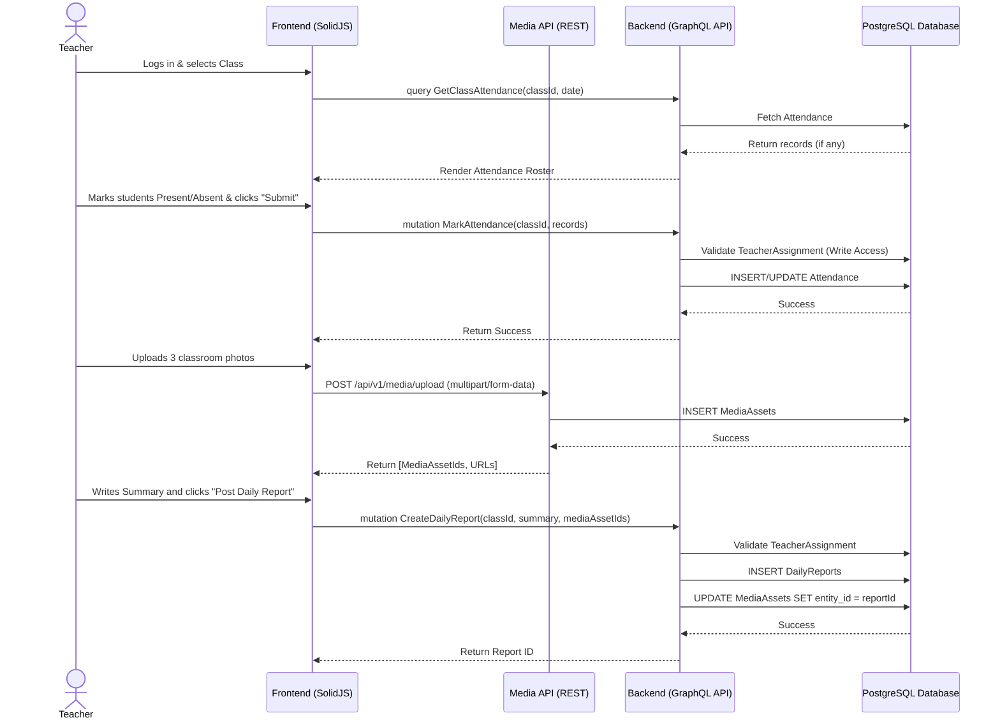

# Teacher Daily Operations Workflow

## 1. Overview
This workflow describes a teacher's daily routine within the system. It covers selecting a class (for teachers assigned to multiple classes), marking daily attendance, uploading classroom photos, and submitting a daily summary report. This data is critical as it immediately feeds into the Parent Monitoring dashboard.

## 2. API / GraphQL List
The following queries, mutations, and REST endpoints are utilized in this workflow:

- `query GetClasses` - Fetches the classes assigned to the authenticated teacher.
- `query GetClassAttendance` - Fetches attendance records for a specific class and date.
- `mutation MarkAttendance` - Submits batch attendance records for the class.
- `mutation UpdateAttendance` - Updates an individual student's attendance if a mistake was made.
- `mutation CreateDailyReport` - Submits the text summary of the day's activities.
- `POST /api/v1/media/upload` (REST) - Uploads photos to the backend/S3 and returns a media asset ID to link to the daily report.

## 3. Domain / Table List
The workflow interacts with the following database tables:
- `TeacherAssignments` (Used implicitly by the backend to validate the teacher has write access)
- `Classes`
- `Attendance`
- `DailyReports`
- `MediaAssets`

## 4. API Sequence Diagram



## 5. UI/UX Screen Flow

1. **Teacher Dashboard (`/teacher/dashboard`)**
   - Teacher logs in.
   - If assigned to multiple classes, a selector is presented: `[Select Class: Lion Class A v]`.
2. **Attendance Tab (`/teacher/attendance`)**
   - By default, shows today's date.
   - Lists all enrolled students in the selected class.
   - Quick toggles for `Present`, `Absent`, `Excused`, `Late`.
   - Teacher clicks `[Save Attendance]`.
3. **Daily Report Tab (`/teacher/daily-reports`)**
   - Text area for "Today's Summary".
   - Drag-and-drop area for photo uploads.
   - Uploading immediately shows thumbnail progress bars.
   - Teacher clicks `[Publish Daily Report]`.
   - A toast appears: "Report published. Parents will be notified."

## 6. UI Wireframe

```text
+-----------------------------------------------------------------------------+
|  [Logo] Kindergarten Mgt                           User: Teacher | [Logout] |
+-----------------------------------------------------------------------------+
|                  |                                                          |
|  Dashboard       |  Daily Operations                Class: [Lion Class A v] |
|                  |  ------------------------------------------------------  |
| > Attendance     |  Date: [Today, Oct 12]                                   |
|                  |                                                          |
|  Assessments     |  Student Name         Status               Remarks       |
|                  |  ------------------------------------------------------  |
|  Daily Reports   |  Timmy Turner         (o) P ( ) A ( ) E    [         ]   |
|                  |  Susie Derkins        ( ) P (o) A ( ) E    [Sick     ]   |
|  Semester Rep.   |  Bobby Tables         (o) P ( ) A ( ) E    [         ]   |
|                  |  ------------------------------------------------------  |
|                  |                               [Save Attendance]          |
|                  |                                                          |
|                  |  ------------------------------------------------------  |
|                  |  Daily Report Summary                                    |
|                  |  [ We learned about colors and played outside...      ]  |
|                  |                                                          |
|                  |  Photos: [+ Upload Photos]                               |
|                  |  [Img 1 (Done)]  [Img 2 (Uploading 80%)]                 |
|                  |                                                          |
|                  |                               [Publish Daily Report]     |
+-----------------------------------------------------------------------------+
```
