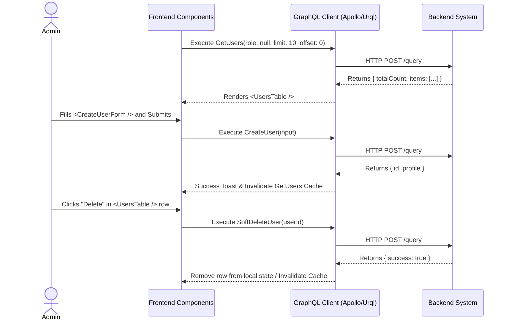

# User & Role Management Workflow (AI-Optimized)

## 1. Context & Business Rules (Explicit Constraints)
- **Constraint 1 (Data Normalization):** User data is split between two tables: `Users` (Auth & Roles) and `Profiles` (Demographics & Role-specific data). A `CreateUser` action MUST insert into both tables within a single transaction.
- **Constraint 2 (Soft Deletes):** Deleting a user MUST NOT run a SQL `DELETE`. It must trigger a soft delete by setting `deleted_at = NOW()` on the `Users` table.
- **Constraint 3 (Role Limitation):** The role field is an ENUM mapped to three specific strings: `"ADMIN"`, `"TEACHER"`, `"PARENT"`.
- **Constraint 4 (Profile Nuances):** Fields like `employee_number` are only relevant if `role == "TEACHER"`, but they reside in the `Profiles` table and are nullable.

## 2. Exact Data Contracts (GraphQL)

### A. Create User (Account + Profile)
**Request (Mutation):**
```graphql
mutation CreateUser($input: CreateUserInput!) {
  createUser(input: $input) {
    id
    email
    role
    profile {
      firstName
      lastName
      phone
    }
  }
}
```
**Input Variables Map:**
```json
{
  "input": {
    "email": "teacher1@school.com",
    "password": "TempPassword123!", 
    "role": "TEACHER",
    "firstName": "Jane",
    "lastName": "Doe",
    "phone": "555-1234",
    "employeeNumber": "TCH-001" // Optional, stored in Profile
  }
}
```

### B. Get Users (Paginated & Filtered)
**Request (Query):**
```graphql
query GetUsers($role: String, $limit: Int, $offset: Int) {
  getUsers(role: $role, limit: $limit, offset: $offset) {
    totalCount
    items {
      id
      email
      role
      profile {
        firstName
        lastName
      }
    }
  }
}
```

### C. Update Profile
**Request (Mutation):**
```graphql
mutation UpdateUserProfile($userId: ID!, $input: UpdateProfileInput!) {
  updateUserProfile(userId: $userId, input: $input) {
    id
    profile {
      firstName
      phone
    }
  }
}
```

### D. Soft Delete User
**Request (Mutation):**
```graphql
mutation SoftDeleteUser($userId: ID!) {
  softDeleteUser(userId: $userId) {
    success
    message
  }
}
```

## 3. UI to Data Mapping

| UI Element (Screen) | GraphQL / Data Source | Action / Trigger |
| ------------------- | --------------------- | ---------------- |
| **"Role" Filter Dropdown** | `role` variable in `GetUsers` | Triggers refetch of `GetUsers` |
| **Table Row: Name** | `items[i].profile.firstName + lastName` | Rendered from `GetUsers` array |
| **Table Row: Email** | `items[i].email` | Rendered from `GetUsers` array |
| **Table Row: Role** | `items[i].role` | Rendered from `GetUsers` array |
| **"Add User" Modal: Form Fields** | Map to `CreateUserInput` | Triggers `CreateUser` |
| **"Edit" Action (in table)** | Opens Drawer | Loads selected user data into form |
| **"Delete" Action (in table)** | N/A | Triggers `SoftDeleteUser(id)` |

## 4. API Sequence Diagram



## 5. UI/UX Screen Flow & Component Wireframe

### Components to Build:
1. `<UserManagementPage />` - Parent component holding state for filters & pagination.
2. `<RoleFilterDropdown />` - Updates the `role` variable for the query.
3. `<UsersTable />` - Renders the `items` array.
4. `<CreateUserModal />` - Contains `<CreateUserForm />` (TanStack Form + Zod).
5. `<UserProfileDrawer />` - Slide-out drawer to view and trigger `UpdateUserProfile`.

### Component Wireframe Representation:

```text
=============================================================================
[<Navbar /> component]                                     User: Admin
=============================================================================
[<Sidebar />]      | [<UserManagementPage /> component]
> Users            | 
                   | Filter: [<RoleFilterDropdown />]     Button: [+ Add User]
                   |                                      (Opens <CreateUserModal />)
                   | 
                   | [<UsersTable /> component]
                   | --------------------------------------------------------
                   | Name               | Email           | Role    | Actions
                   | --------------------------------------------------------
                   | {prof.first+last}  | {email}         | {role}  | [...]
                   | --------------------------------------------------------
                   |
                   | [<PaginationControls /> component]
                   | < Prev      Page 1 of N      Next >
=============================================================================
```
