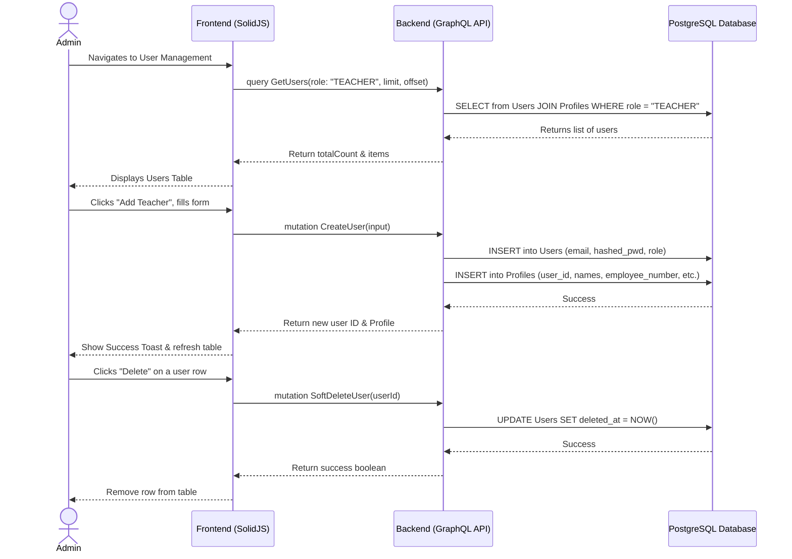

# User & Role Management Workflow

## 1. Overview
This workflow describes how an Administrator manages the users of the system. This includes creating new user accounts (such as Teachers or other Admins), updating their profile information, assigning roles, and performing soft deletes when a user leaves the institution. Parent user accounts are primarily created via the separate Parent Registration workflow, though Admins can view them here.

## 2. API / GraphQL List
The following GraphQL queries and mutations are utilized in this workflow:

- `mutation CreateUser` - Creates a new user account, assigns a role, and initializes their Profile.
- `query GetUsers` - Fetches a paginated list of users, optionally filtered by role.
- `mutation UpdateUserProfile` - Updates the specific fields in a user's Profile (e.g., phone, address, employee number).
- `mutation SoftDeleteUser` - Soft deletes a user account (sets `deleted_at`).

## 3. Domain / Table List
The workflow interacts with the following database tables:
- `Users` (Core authentication & role association)
- `Roles` (Defines ADMIN, TEACHER, PARENT)
- `Profiles` (Extended demographic and role-specific data)

## 4. API Sequence Diagram



## 5. UI/UX Screen Flow

1. **Dashboard (`/admin/dashboard`)**
   - User clicks "Users" or "Teachers" in the sidebar navigation.
2. **Users List (`/admin/users`)**
   - Displays a paginated table of users.
   - Contains a role filter dropdown (All, Admin, Teacher, Parent).
   - User clicks the primary button: `[+ Add User]`.
3. **Add User Modal**
   - User inputs Account Info: `Email`, `Temporary Password`, `Role`.
   - User inputs Profile Info: `First Name`, `Last Name`, `Phone`, `Employee Number` (if Teacher).
   - Submits form.
4. **User Detail / Edit Drawer**
   - Clicking on a row opens a side drawer.
   - User can edit profile details (e.g., updating address or phone number) and click `[Save Profile]`.
5. **Delete Action**
   - In the table row actions or detail drawer, user clicks `[Delete]`.
   - Confirmation dialog appears: "Are you sure? This will remove access immediately."
   - Confirming triggers the soft delete.

## 6. UI Wireframe

```text
+-----------------------------------------------------------------------------+
|  [Logo] Kindergarten Mgt                           User: Admin | [Logout]   |
+-----------------------------------------------------------------------------+
|                  |                                                          |
|  Dashboard       |  User Management                                         |
|                  |  ------------------------------------------------------  |
|  Academic Years  |  Filter By Role: [ Teacher v ]      [+ Add User]         |
|                  |                                                          |
| > Users          |  +---------------------------------------------------+   |
|  Teachers        |  | Name           | Email            | Role    | Act |   |
|  Students        |  +---------------------------------------------------+   |
|  Analytics       |  | Jane Doe       | jane@school.com  | TEACHER | [...] |   |
|                  |  | John Smith     | john@school.com  | TEACHER | [...] |   |
|                  |  | Admin One      | admin@school.com | ADMIN   | [...] |   |
|                  |  +---------------------------------------------------+   |
|                  |                                                          |
|                  |  < Prev  [Page 1 of 3]  Next >                           |
+-----------------------------------------------------------------------------+
```
